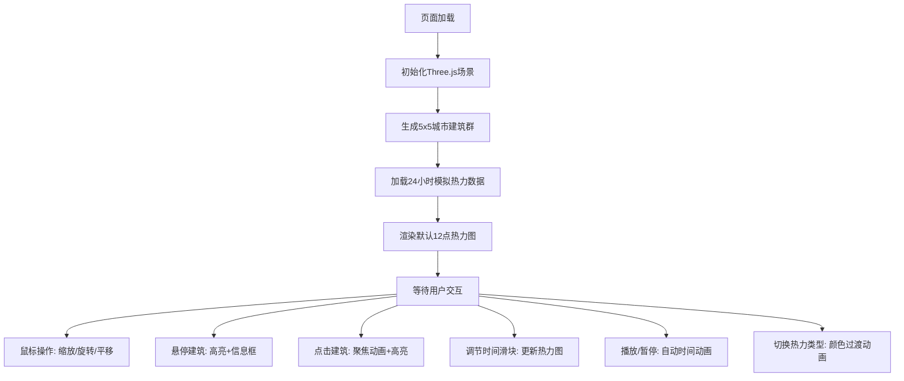

## 1. 产品概述

基于Three.js的3D交互式城市热力图可视化Web应用，让用户通过鼠标操作和参数调节，在三维城市模型上查看不同区域的热力分布（人口密度、能耗水平、交通流量），并支持按时间轴动态播放24小时热力变化。

- 主要用途：城市数据可视化，帮助用户直观理解城市不同区域在不同时间段的热力分布情况
- 目标用户：城市规划人员、数据分析师、决策者、教育工作者
- 产品价值：将抽象的城市数据转化为直观的3D可视化，提升数据理解效率和决策质量

## 2. 核心功能

### 2.1 用户角色
| 角色 | 注册方式 | 核心权限 |
|------|----------|----------|
| 普通用户 | 无需注册，直接访问 | 查看3D城市热力图、交互操作、调节参数、播放时间动画 |

### 2.2 功能模块
1. **3D城市场景**：5x5网格建筑群、地面网格、星光粒子背景、建筑光晕效果
2. **热力图可视化**：建筑颜色映射、顶部粒子柱效果、多类型热力数据切换
3. **时间轴动画**：24小时时间滑块、自动播放/暂停、循环播放
4. **交互控制**：鼠标缩放/旋转/平移、建筑悬停高亮、点击聚焦动画
5. **UI控制面板**：lil-gui参数调节、数字时钟显示、热力类型切换

### 2.3 页面详情
| 页面名称 | 模块名称 | 功能描述 |
|----------|----------|----------|
| 主页面 | 3D城市场景渲染 | 实时渲染25栋建筑组成的5x5网格城市，包含地面、光晕、星光背景 |
| 主页面 | 热力图颜色映射 | 根据热力值（0-1）将建筑颜色从蓝色渐变到橙色再到红色 |
| 主页面 | 粒子柱效果 | 每栋建筑顶部生成与热力值成正比的粒子柱，颜色与热力值对应 |
| 主页面 | 时间轴控制 | 0-23小时滑块，支持手动拖拽和自动播放（每秒1小时） |
| 主页面 | 热力类型切换 | 人口密度、能耗、交通流量三种数据模式切换，带0.5秒颜色过渡动画 |
| 主页面 | 鼠标交互 | 滚轮缩放（8-30单位）、左键旋转（水平360°/垂直-30°到60°）、右键平移 |
| 主页面 | 建筑悬停 | 白色边框高亮，显示建筑ID和热力值信息框 |
| 主页面 | 建筑点击 | 2秒平滑视角过渡，建筑高亮3秒后恢复 |
| 主页面 | UI面板 | 左上角标题、右上角热力类型+时间显示、右下角lil-gui控制面板 |

## 3. 核心流程

用户进入页面后，自动加载3D城市场景，默认显示12点的人口密度热力图。用户可以通过鼠标操作浏览场景，通过右下角控制面板调节时间、切换热力类型、播放动画。鼠标悬停查看建筑详情，点击建筑聚焦查看。

## 4. 用户界面设计

### 4.1 设计风格
- 暗黑科幻风格，纯黑背景#000000
- 主色调：蓝色#0066CC、橙色#FF9900、红色#FF3300
- 建筑颜色随高度从浅蓝#4A90D9渐变到深红#D93A3A
- 字体：现代无衬线字体，白色为主，带发光效果
- UI元素：半透明深灰背景，圆角设计，蓝色发光边框/下划线

### 4.2 页面设计概述
| 页面名称 | 模块名称 | UI元素 |
|----------|----------|--------|
| 主页面 | 标题区域 | 左上角"城市热力图"白色发光字体24px，文字阴影0 0 10px #00AAFF |
| 主页面 | 状态显示 | 右上角热力类型+时间，白色16px字体，底部浅蓝下划线2px |
| 主页面 | 控制面板 | 右下角lil-gui，半透明深灰rgba(20,20,30,0.85)，圆角12px |
| 主页面 | 3D场景 | 居中Canvas，响应式自适应 |
| 主页面 | 悬停信息框 | 半透明黑色rgba(0,0,0,0.7)，圆角8px，白色14px字体 |
| 主页面 | 建筑光晕 | 半透明浅蓝环形渐变Sprite |
| 主页面 | 星光粒子 | 50个随机闪烁白色粒子 |

### 4.3 响应式
- 桌面端优先设计
- 移动端（宽度<768px）：所有UI元素缩放至80%，调整间距优化触控
- 3D Canvas始终全屏自适应

### 4.4 3D场景指导
- **环境**：纯黑背景，深灰网格地面#333333，网格线浅灰#555555
- **光照**：环境光（强度0.4）+ 点光源（强度0.8，位置(10, 20, 10)）
- **相机**：透视相机，初始位置(15, 12, 15)俯视城市中心，fov 60°
- **控制器**：OrbitControls，缩放8-30，旋转水平360°/垂直-30°到60°，右键平移
- **动画**：建筑点击2秒easing过渡、热力类型切换0.5秒颜色渐变、粒子60fps更新
- **后处理**：建筑边缘发光线、底部光晕Sprite、粒子柱效果
- **性能预算**：粒子总数≤5000，每栋建筑粒子≤200，帧率≥55fps（初始）/≥40fps（动画）
