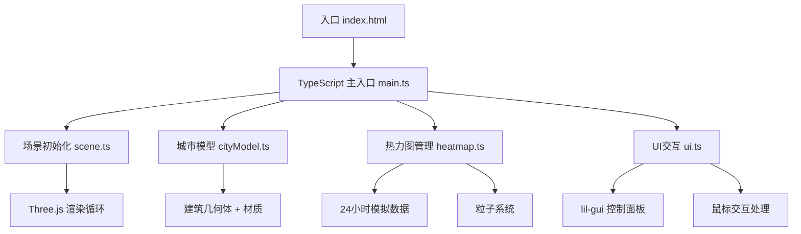

## 1. 架构设计



## 2. 技术描述
- **前端框架**：原生TypeScript + Three.js，无需React/Vue
- **构建工具**：Vite 5.x
- **3D引擎**：Three.js 0.160.x
- **UI库**：lil-gui 0.19.x
- **类型定义**：@types/three 0.160.x
- **语言标准**：ES2020，严格模式TypeScript
- **包管理器**：npm

## 3. 项目结构
```
auto135/
├── index.html              # 入口HTML
├── package.json            # 依赖配置
├── vite.config.js          # Vite配置
├── tsconfig.json           # TypeScript配置
├── src/
│   ├── main.ts             # 应用主入口
│   ├── scene.ts            # 场景初始化（相机、渲染器、光照、控制器）
│   ├── cityModel.ts        # 城市模型生成（5x5建筑群）
│   ├── heatmap.ts          # 热力数据管理（24小时数据、颜色映射、粒子柱）
│   └── ui.ts               # UI交互层（lil-gui控制面板、鼠标交互）
└── .trae/
    └── documents/
        ├── PRD.md
        └── TECH_ARCHITECTURE.md
```

## 4. 模块职责定义

### 4.1 scene.ts
- 导出：`scene`, `camera`, `renderer`, `controls`, `raycaster`, `mouse`
- 职责：
  - 创建PerspectiveCamera（fov: 60, near: 0.1, far: 1000）
  - 创建WebGLRenderer（antialias: true, alpha: true）
  - 添加AmbientLight（强度0.4）和PointLight（强度0.8, 位置(10,20,10)）
  - 创建OrbitControls（minDistance: 8, maxDistance: 30, minPolarAngle: 0.52, maxPolarAngle: 1.57）
  - 创建地面网格（GridHelper, size: 30, divisions: 30）
  - 创建星光粒子系统（50个Points）
  - Raycaster用于鼠标拾取

### 4.2 cityModel.ts
- 导出：`buildingMeshes`, `buildingData`, `updateBuildingColors()`, `highlightBuilding()`, `unhighlightBuilding()`
- 职责：
  - 生成5x5网格的25栋BoxGeometry建筑
  - 每栋建筑高度1-8单位随机
  - 建筑基础颜色：高度从浅蓝#4A90D9到深红#D93A3A渐变
  - 每栋建筑底部添加EdgesGeometry发光边缘线
  - 每栋建筑底部添加半透明浅蓝光晕Sprite
  - 存储建筑元数据（id, gridX, gridZ, height, baseColor）

### 4.3 heatmap.ts
- 导出：`heatmapData`, `heatTypes`, `currentHeatType`, `currentHour`, `updateHeatmapData()`, `switchHeatType()`, `updateParticles()`, `getHeatValue()`
- 职责：
  - 生成24小时模拟热力数据（3种类型×25栋×24小时×0-1浮点值）
  - 颜色映射：0.0→#0066CC, 0.5→#FF9900, 1.0→#FF3300
  - updateHeatmapData(hour): 更新所有建筑材质颜色
  - switchHeatType(type): 切换热力类型，0.5秒颜色过渡动画
  - 粒子柱系统：每栋建筑顶部Points，粒子数量与热力值成正比（0-200）
  - 粒子颜色与热力值对应，60fps更新粒子位置（缓慢上升+轻微漂移）

### 4.4 ui.ts
- 导出：`gui`, `hoveredBuilding`, `selectedBuilding`, `initUI()`, `updateClockDisplay()`
- 职责：
  - 创建lil-gui控制面板：
    - 时间滑块（0-23，步长1，默认12）
    - 播放/暂停按钮
    - 热力类型下拉菜单（人口密度/能耗/交通流量）
  - 鼠标交互：
    - mousemove: raycaster检测悬停建筑，显示信息框
    - click: 检测点击建筑，触发聚焦动画
  - DOM元素：
    - 左上角标题"城市热力图"
    - 右上角状态显示
    - 悬停信息框
    - 数字时钟显示
  - 动画控制：
    - 自动播放：setInterval每秒hour+1，循环0-23
    - 点击聚焦：2秒easeInOutCubic相机过渡
  - 响应式处理：移动端缩放80%

### 4.5 main.ts
- 职责：
  - 导入所有模块
  - 初始化场景、城市模型、热力图、UI
  - 主渲染循环（requestAnimationFrame）
  - 窗口resize事件处理
  - 性能监控（可选）

## 5. 性能优化策略

1. **粒子数量控制**：总粒子≤5000，每栋≤200，动态分配
2. **几何体复用**：建筑使用BufferGeometry，避免重复创建
3. **材质优化**：建筑使用MeshStandardMaterial，启用instancing优化
4. **粒子更新**：使用BufferGeometry，仅更新position数组
5. **渲染优化**：启用frustumCulling，合理设置far平面
6. **动画帧率**：粒子更新使用requestAnimationFrame，60fps
7. **过渡动画**：颜色过渡使用THREE.Color.lerp，避免重绘
8. **事件节流**：mousemove事件使用requestAnimationFrame节流

## 6. 数据模型定义

```typescript
// 热力类型
type HeatType = 'population' | 'energy' | 'traffic';

// 建筑数据
interface BuildingData {
  id: number;
  gridX: number;
  gridZ: number;
  height: number;
  baseColor: THREE.Color;
  mesh: THREE.Mesh;
  edgeLines: THREE.LineSegments;
  glowSprite: THREE.Sprite;
  particles: THREE.Points | null;
}

// 热力数据
interface HeatmapData {
  [type: string]: {
    [buildingId: number]: number[]; // 24小时热力值数组
  };
}

// 粒子数据
interface ParticleData {
  buildingId: number;
  velocity: THREE.Vector3;
  life: number;
  maxLife: number;
}
```
