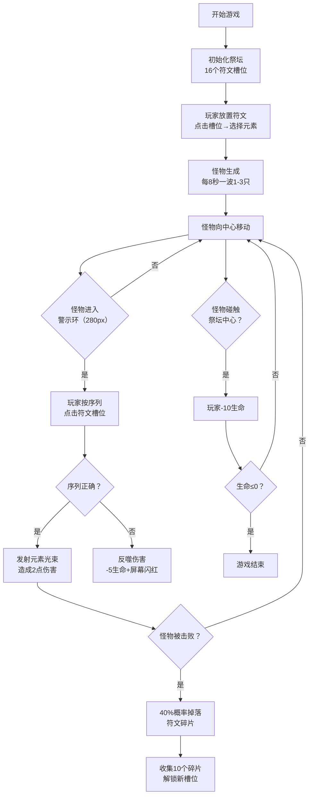
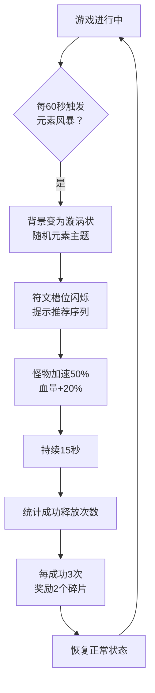

## 1. 产品概述

符文法师祭坛是一款策略性节奏塔防游戏，玩家扮演符文法师在虚空祭坛上绘制符文、激活元素之力，按正确序列释放法术击败来袭的暗影怪物。通过策略性选择符文组合和精准把握释放时机，获得沉浸式魔法战斗体验。

- 核心玩法：符文放置 + 序列释放 + 节奏战斗，融合塔防策略与音乐游戏的节奏感
- 目标用户：喜欢策略游戏、节奏游戏和魔法题材的休闲玩家

## 2. 核心功能

### 2.1 功能模块

1. **祭坛系统**：圆形祭坛、符文槽位管理、符文放置与选择
2. **符文系统**：五种元素符文（火、水、风、土、雷）、序列组合、释放校验
3. **怪物系统**：怪物生成、移动、属性、弱点元素
4. **战斗系统**：光束攻击、伤害计算、反噬机制
5. **收集系统**：符文碎片掉落、槽位解锁、粒子特效
6. **事件系统**：元素风暴、难度提升、额外奖励
7. **UI系统**：生命值、碎片数量、波数显示、序列预览

### 2.2 页面详情

| 页面名称 | 模块名称 | 功能描述 |
|---------|---------|---------|
| 游戏主界面 | 祭坛渲染 | 绘制圆形祭坛（半径200px）、环形辉光纹理（#4A2C8D到#1A0A3E径向渐变）、16个等距符文槽位 |
| 游戏主界面 | 符文交互 | 点击槽位打开半透明毛玻璃选择面板（#2A1A5E，透明度0.7），选择五种元素符文之一放置 |
| 游戏主界面 | 怪物渲染 | 半透明暗影球体（半径15-25px），深紫#2B0054到深红#540000渐变，生命值显示 |
| 游戏主界面 | 战斗特效 | 波纹扩散动画（0.3秒）、元素光束（300px长，6px宽带尾迹）、粒子拖尾（20个） |
| 游戏主界面 | 顶部UI | 生命值红条（#FF3355带分段刻度）、金色碎片数量（#FFD700）、浅紫波数（#B088FF） |
| 游戏主界面 | 序列预览 | 右下角面板显示建议符文序列，12px颜色圆点带呼吸动画 |
| 游戏主界面 | 碎片收集 | 金色星形碎片掉落、旋转漂浮、收集计数、槽位解锁（最多20个） |
| 游戏主界面 | 元素风暴 | 每60秒触发，漩涡背景，怪物加速50%+血量+20%，持续15秒 |

## 3. 核心流程

### 3.1 游戏主流程

### 3.2 元素风暴事件流程

## 4. 用户界面设计

### 4.1 设计风格

- **整体基调**：深邃神秘的魔法风格，深空紫背景营造虚空氛围
- **主色调**：深空紫 #0B0020（背景）、暗紫 #1A0A3E（祭坛内圈）、紫 #4A2C8D（祭坛外圈）
- **元素色**：火 #FF4444、水 #4488FF、风 #44FF88、土 #AA6633、雷 #FFD700
- **强调色**：警示红 #FF2200、金色 #FFD700（碎片/UI）
- **视觉效果**：微光动画、脉冲光效、粒子爆发、波纹扩散、毛玻璃面板
- **字体**：使用神秘风格的衬线字体或等宽字体，增强魔法感

### 4.2 页面设计概述

| 页面名称 | 模块名称 | UI元素 |
|---------|---------|--------|
| 游戏主界面 | 祭坛区域 | 居中显示，径向渐变背景，16个等距槽位环绕边缘，已放置符文带脉冲光效（2秒周期，亮度0.6-1.0） |
| 游戏主界面 | 符文选择面板 | 半透明毛玻璃效果，5个圆形符文按钮，悬停放大效果 |
| 游戏主界面 | 怪物区域 | 从屏幕四周随机方向生成，半透明暗影球体，带生命值指示 |
| 游戏主界面 | 警示环 | 半径280px红色闪烁环，提示怪物进入攻击范围 |
| 游戏主界面 | 顶部状态栏 | 左侧：红色分段血条，中间：金色碎片数，右侧：浅紫波数 |
| 游戏主界面 | 序列预览面板 | 右下角，圆角半透明面板，彩色圆点排列显示建议序列，呼吸动画 |
| 游戏主界面 | 战斗特效 | 光束：300px长6px宽，粒子拖尾20个；碎片：金色星形旋转漂浮 |
| 游戏主界面 | 元素风暴特效 | 漩涡背景动画，符文槽位闪烁提示，怪物轮廓增强 |

### 4.3 响应式设计

- **桌面端（≥768px）**：祭坛半径200px，UI元素正常尺寸
- **移动端（<768px）**：祭坛和所有UI元素缩小50%，保持比例，触摸区域优化
- **布局策略**：Canvas自适应窗口大小，保持1:1比例居中显示，背景色填充剩余空间

### 4.4 动画与交互反馈

| 交互类型 | 视觉反馈 | 时长 |
|---------|---------|------|
| 点击符文槽位 | 波纹扩散动画 | 0.3秒 |
| 符文放置成功 | 对应颜色脉冲光效 | 2秒周期循环 |
| 序列释放成功 | 元素光束+粒子拖尾 | 0.5秒 |
| 序列错误 | 屏幕闪红 | 0.2秒 |
| 生命值变化 | 数字弹出上浮 | 1秒 |
| 击败怪物 | 碎片掉落+旋转漂浮 | 10秒 |
| 解锁槽位 | 金色粒子爆发（100个） | 1秒 |
| 符文选择面板 | 淡入淡出 | 0.2秒 |

## 5. 性能要求

- **帧率目标**：稳定60FPS
- **更新周期**：游戏循环≤16ms
- **并发限制**：怪物最多20个，粒子特效最多200个
- **渲染优化**：使用Canvas分层渲染，离屏缓存静态元素
