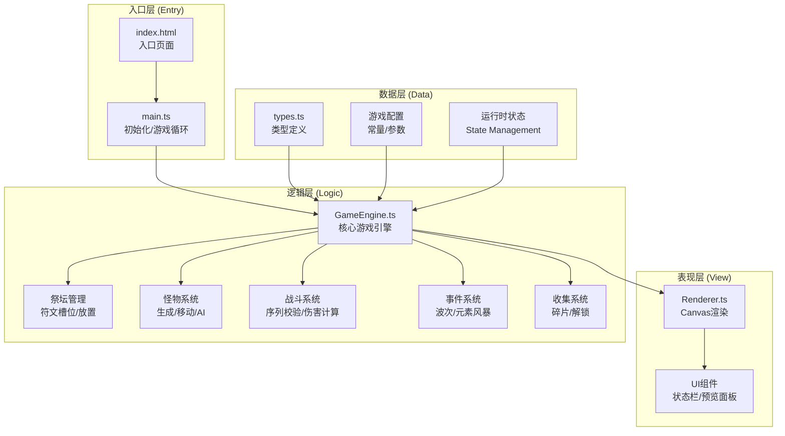

## 1. 架构设计



## 2. 技术选型

| 技术 | 版本 | 用途 |
|------|------|------|
| TypeScript | ^5.0 | 类型安全的开发语言 |
| Vite | ^5.0 | 构建工具与开发服务器 |
| HTML5 Canvas | - | 2D图形渲染 |
| requestAnimationFrame | - | 游戏循环驱动 |

**技术决策说明**：
- 采用原生Canvas而非游戏引擎：满足轻量级需求，完全掌控渲染性能
- TypeScript严格模式：确保类型安全，减少运行时错误
- Vite构建：快速热更新，开发体验好
- 无额外UI框架：使用Canvas自绘UI，保持渲染一致性和性能

## 3. 项目结构

```
auto136/
├── index.html              # 入口HTML
├── package.json            # 项目配置
├── tsconfig.json           # TS配置
├── vite.config.js          # Vite配置
└── src/
    ├── main.ts             # 游戏入口
    ├── GameEngine.ts       # 游戏核心引擎
    ├── Renderer.ts         # Canvas渲染器
    └── types.ts            # 类型定义
```

## 4. 核心模块设计

### 4.1 类型定义 (types.ts)

```typescript
// 元素类型
export type ElementType = 'fire' | 'water' | 'wind' | 'earth' | 'thunder';

// 符文接口
export interface Rune {
  id: string;
  element: ElementType;
  slotIndex: number;
  pulsePhase: number;
}

// 符文槽位接口
export interface RuneSlot {
  index: number;
  angle: number;
  rune: Rune | null;
  ripplePhase: number;
  isHighlighted: boolean;
}

// 怪物接口
export interface Monster {
  id: string;
  x: number;
  y: number;
  radius: number;
  hp: number;
  maxHp: number;
  speed: number;
  element: ElementType;
  weakness: ElementType[];
  colorStart: string;
  colorEnd: string;
}

// 粒子接口
export interface Particle {
  id: string;
  x: number;
  y: number;
  vx: number;
  vy: number;
  life: number;
  maxLife: number;
  color: string;
  size: number;
}

// 光束接口
export interface Beam {
  id: string;
  startX: number;
  startY: number;
  endX: number;
  endY: number;
  color: string;
  life: number;
  maxLife: number;
  width: number;
}

// 碎片接口
export interface Fragment {
  id: string;
  x: number;
  y: number;
  targetX: number;
  targetY: number;
  rotation: number;
  life: number;
  maxLife: number;
}

// 浮动数字接口
export interface FloatingText {
  id: string;
  x: number;
  y: number;
  text: string;
  color: string;
  life: number;
  maxLife: number;
}

// 游戏状态接口
export interface GameState {
  playerHp: number;
  maxPlayerHp: number;
  fragments: number;
  wave: number;
  slots: RuneSlot[];
  monsters: Monster[];
  particles: Particle[];
  beams: Beam[];
  fragmentsItems: Fragment[];
  floatingTexts: FloatingText[];
  sequenceInput: number[];
  targetSequence: ElementType[];
  isElementStorm: boolean;
  stormTimer: number;
  stormElement: ElementType | null;
  stormSuccessCount: number;
  screenFlash: { color: string; life: number } | null;
  altarRadius: number;
  warningRadius: number;
  lastWaveTime: number;
  lastStormTime: number;
  totalSlots: number;
  isRunning: boolean;
}

// 游戏配置接口
export interface GameConfig {
  ALTAR_RADIUS: number;
  WARNING_RADIUS: number;
  INITIAL_SLOTS: number;
  MAX_SLOTS: number;
  WAVE_INTERVAL: number;
  STORM_INTERVAL: number;
  STORM_DURATION: number;
  MONSTERS_PER_WAVE: [number, number];
  MONSTER_BASE_HP: number;
  MONSTER_BASE_SPEED: [number, number];
  MONSTER_RADIUS: [number, number];
  DAMAGE_PER_HIT: number;
  PLAYER_MAX_HP: number;
  MONSTER_DAMAGE: number;
  MISMATCH_DAMAGE: number;
  FRAGMENT_DROP_CHANCE: number;
  FRAGMENTS_PER_UNLOCK: number;
  BEAM_DURATION: number;
  PARTICLE_POOL_SIZE: number;
}
```

### 4.2 游戏引擎 (GameEngine.ts)

核心类：
- `GameEngine`：游戏主引擎，管理所有游戏逻辑

核心方法：
- `constructor(canvas: HTMLCanvasElement)`：初始化引擎
- `start()`：启动游戏
- `stop()`：停止游戏
- `update(deltaTime: number)`：游戏逻辑更新
- `handleClick(x: number, y: number)`：处理点击事件
- `placeRune(slotIndex: number, element: ElementType)`：放置符文
- `generateTargetSequence()`：生成目标符文序列
- `validateSequence()`：校验输入序列
- `spawnWave()`：生成怪物波次
- `triggerElementStorm()`：触发元素风暴
- `spawnParticles(x, y, color, count)`：生成粒子
- `damageMonster(monster, damage)`：对怪物造成伤害
- `collectFragment(fragment)`：收集碎片
- `unlockSlot()`：解锁新槽位

### 4.3 渲染器 (Renderer.ts)

核心类：
- `Renderer`：Canvas渲染器

核心方法：
- `constructor(canvas: HTMLCanvasElement)`：初始化渲染器
- `render(state: GameState, time: number)`：主渲染方法
- `drawBackground(time: number, isStorm: boolean, stormElement: ElementType | null)`：绘制背景
- `drawAltar(state: GameState, time: number)`：绘制祭坛
- `drawRuneSlots(state: GameState, time: number)`：绘制符文槽位
- `drawWarningRing(state: GameState, time: number)`：绘制警示环
- `drawMonsters(state: GameState, time: number)`：绘制怪物
- `drawBeams(state: GameState, time: number)`：绘制光束
- `drawParticles(state: GameState, time: number)`：绘制粒子
- `drawFragments(state: GameState, time: number)`：绘制碎片
- `drawUI(state: GameState, time: number)`：绘制UI
- `drawFloatingTexts(state: GameState, time: number)`：绘制浮动文字
- `drawScreenFlash(state: GameState)`：绘制屏幕闪烁

## 5. 性能优化策略

### 5.1 对象池模式
- 粒子对象池：预先创建200个粒子对象，复用避免GC
- 怪物对象池：预先创建20个怪物对象
- 浮动文字对象池：预先创建10个对象

### 5.2 渲染优化
- 分层Canvas：背景层、游戏层、UI层分离
- 离屏缓存：静态元素（祭坛、槽位背景）缓存到离屏Canvas
- 脏矩形渲染：仅重绘变化区域
-  requestAnimationFrame驱动：与显示器刷新率同步

### 5.3 计算优化
- 空间分区：怪物位置按网格分区，减少碰撞检测
- 增量计算：避免每帧重复计算三角函数
- 数学运算缓存：预计算槽位角度、位置等常量

## 6. 运行配置

### 6.1 package.json
```json
{
  "name": "rune-altar-game",
  "version": "1.0.0",
  "type": "module",
  "scripts": {
    "dev": "vite",
    "build": "tsc && vite build",
    "preview": "vite preview"
  },
  "devDependencies": {
    "typescript": "^5.0.0",
    "vite": "^5.0.0"
  }
}
```

### 6.2 tsconfig.json
```json
{
  "compilerOptions": {
    "target": "ES2020",
    "module": "ESNext",
    "strict": true,
    "esModuleInterop": true,
    "skipLibCheck": true,
    "forceConsistentCasingInFileNames": true,
    "moduleResolution": "bundler",
    "resolveJsonModule": true,
    "isolatedModules": true,
    "noEmit": true
  },
  "include": ["src"]
}
```

### 6.3 vite.config.js
```javascript
export default {
  root: '.',
  server: {
    port: 3000,
    open: true
  },
  build: {
    outDir: 'dist',
    sourcemap: true
  }
}
```
