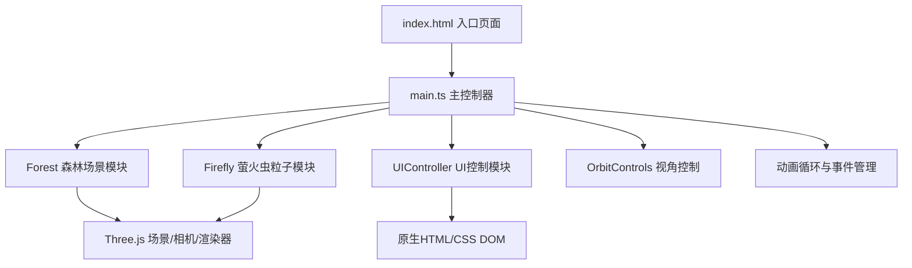

## 1. 架构设计

本项目为纯前端3D可视化应用，采用模块化分层架构。



## 2. 技术栈说明

- **前端框架**：无框架，原生TypeScript
- **3D引擎**：Three.js r160+
- **构建工具**：Vite 5.x
- **语言**：TypeScript 5.x (严格模式，target ES2020)
- **样式**：原生CSS（无CSS框架）

**依赖清单**：
| 包名 | 版本范围 | 用途 |
|------|----------|------|
| three | ^0.160.0 | 3D渲染引擎 |
| @types/three | ^0.160.0 | Three.js类型定义 |
| typescript | ^5.3.0 | TypeScript编译器 |
| vite | ^5.0.0 | 构建与开发服务器 |

## 3. 文件结构

```
auto137/
├── package.json              # 项目配置与依赖
├── index.html                # 入口HTML页面
├── vite.config.js            # Vite构建配置
├── tsconfig.json             # TypeScript配置
└── src/
    ├── main.ts               # 主入口，场景初始化与动画循环
    ├── Firefly.ts            # 萤火虫类：粒子渲染、飘动、闪光、交互
    ├── Forest.ts             # 森林场景类：地面、树木、光照、雾效
    └── UIController.ts       # UI控制器：参数面板、帧率显示、事件绑定
```

## 4. 核心类设计

### 4.1 Firefly 类

```typescript
class Firefly {
  // 属性
  mesh: THREE.Points;              // 粒子网格
  glowMesh: THREE.Mesh;            // 光晕网格
  position: THREE.Vector3;         // 当前位置
  basePosition: THREE.Vector3;     // 基准位置
  velocity: THREE.Vector3;         // 速度向量
  flashPeriod: number;             // 闪光周期(秒)
  flashTimer: number;              // 闪光计时器
  isFlashing: boolean;             // 是否正在闪光
  flashIntensity: number;          // 当前闪光强度
  baseColor: THREE.Color;          // 基础颜色
  isSelected: boolean;             // 是否被选中
  selectedTimer: number;           // 选中状态计时器
  chainFlashCount: number;         // 连锁闪光剩余次数
  trailParticles: THREE.Points;    // 拖尾粒子

  // 方法
  constructor(scene: THREE.Scene, position: THREE.Vector3);
  update(delta: number, speedMultiplier: number, intensityMultiplier: number): void;
  triggerClickChain(allFireflies: Firefly[]): void;
  triggerChainFlash(): void;
  dispose(): void;
}
```

### 4.2 Forest 类

```typescript
class Forest {
  // 属性
  scene: THREE.Scene;              // Three.js场景
  ground: THREE.Mesh;              // 地面网格
  trees: THREE.Group[];            // 树木组
  ambientLight: THREE.AmbientLight; // 环境光(月光)
  fog: THREE.Fog;                  // 雾效

  // 方法
  constructor(scene: THREE.Scene);
  createGround(): void;
  createTrees(count: number): void;
  createTree(position: THREE.Vector3, height: number): THREE.Group;
  setMoonlightIntensity(intensity: number): void;
  dispose(): void;
}
```

### 4.3 UIController 类

```typescript
class UIController {
  // 属性
  container: HTMLElement;           // UI容器
  fpsElement: HTMLElement;          // 帧率显示元素
  fireflyCountSlider: HTMLInputElement;
  speedSlider: HTMLInputElement;
  intensitySlider: HTMLInputElement;
  moonlightSlider: HTMLInputElement;

  // 回调
  onFireflyCountChange: (count: number) => void;
  onSpeedChange: (speed: number) => void;
  onIntensityChange: (intensity: number) => void;
  onMoonlightChange: (intensity: number) => void;

  // 方法
  constructor();
  createPanel(): void;
  createSlider(label: string, min: number, max: number, step: number, defaultValue: number): HTMLInputElement;
  updateFPS(fps: number): void;
  dispose(): void;
}
```

### 4.4 main.ts 主流程

```typescript
// 初始化顺序
1. 创建Three.js场景、相机、渲染器
2. 初始化Forest森林场景
3. 创建Firefly萤火虫数组(默认200只)
4. 初始化OrbitControls
5. 创建UIController参数面板
6. 注册事件监听(窗口resize、鼠标点击、空闲检测)
7. 启动requestAnimationFrame动画循环
```

## 5. 关键算法

### 5.1 萤火虫飘动算法
- 使用基础随机游走方向向量
- 叠加正弦波偏移：`offset = sin(time * frequency + phase) * amplitude`
- 每个萤火虫具有独立的相位和频率参数

### 5.2 点击检测与连锁反应
- 使用Raycaster进行3D空间点击拾取
- 被点击萤火虫5单位半径内空间查询，取最近10只
- 使用setTimeout链式触发闪光序列

### 5.3 空闲检测与自动相机
- 记录最后交互时间戳
- 每帧检测 `now - lastInteraction > 5000ms`
- 自动环绕使用极坐标更新相机位置：`x = r*cos(θ), z = r*sin(θ)`

### 5.4 性能优化
- 使用Points批量渲染萤火虫核心粒子
- 光晕使用Sprite或简单平面，开启透明度混合
- 拖尾粒子使用对象池复用
- 帧率目标30FPS+，可根据设备性能动态调整粒子数
