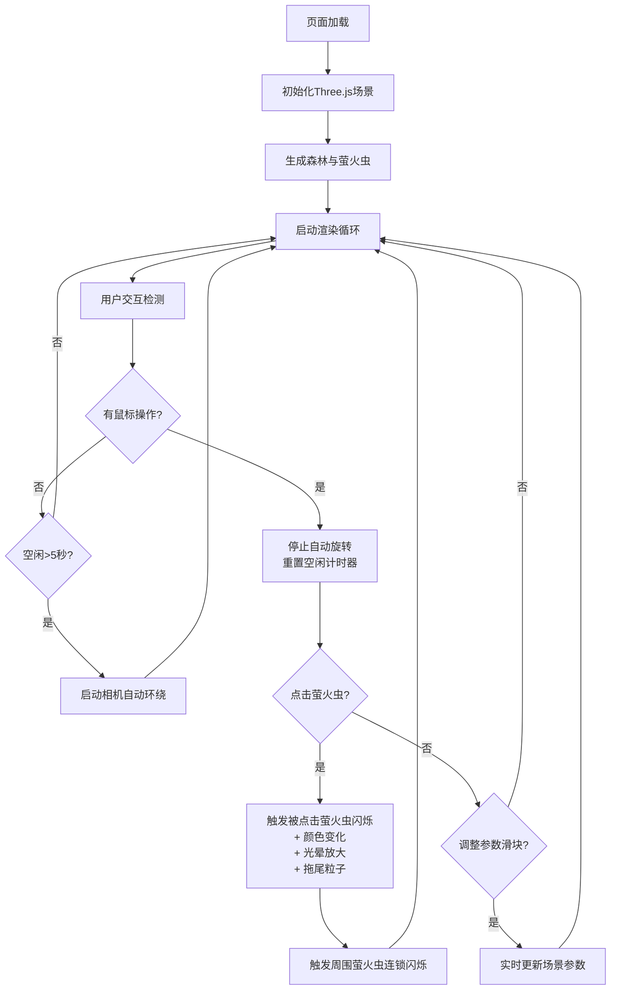

## 1. 产品概述

基于Three.js的交互式3D萤火虫生态夜林可视化项目，构建沉浸式夜间森林场景，模拟数百只萤火虫自由飞舞并支持用户交互。

- 主要用途：沉浸式自然生态体验、3D可视化展示、交互艺术装置
- 目标用户：对3D可视化、自然模拟、交互艺术感兴趣的用户
- 产品价值：通过高质量3D渲染和丰富交互，打造独特的夜间生态观赏体验

## 2. 核心特性

### 2.1 功能模块

1. **3D森林场景**：渐变夜空背景、起伏草地、低多边形树木
2. **萤火虫粒子系统**：200只发光萤火虫，独立飘动路径与闪光周期
3. **用户交互系统**：视角旋转控制、萤火虫点击响应、连锁闪光反应
4. **参数控制面板**：实时调节萤火虫数量、速度、闪光强度、月光亮度
5. **自动相机动画**：空闲时自动环绕场景旋转
6. **性能监控**：实时帧率显示

### 2.2 功能详情

| 模块名称 | 子功能 | 功能描述 |
|-----------|--------|----------|
| 森林场景 | 渐变天空 | 背景色从#0F0A2E到#1A1443的垂直渐变 |
| 森林场景 | 起伏草地 | 深绿色(#1D3B1A)地面，略带高度起伏 |
| 森林场景 | 低多边形树木 | 30棵树随机分布在半径15单位圆形区域，树干#4A3525，树冠#2D5E2A，3-4个锥体堆叠，高度1.5-3单位 |
| 萤火虫粒子 | 外观渲染 | 核心半径0.15，发光半径0.5，颜色#CCFF66到#FFFF99渐变，光晕半径2，透明度0.15 |
| 萤火虫粒子 | 飘动运动 | 速度0.1-0.3单位/秒，正弦波抖动(振幅0.5，频率0.3Hz) |
| 萤火虫粒子 | 闪光效果 | 周期1.5-3秒随机，亮度增强至2倍，持续0.2秒 |
| 用户交互 | 视角控制 | OrbitControls鼠标拖拽旋转，默认相机(12, 8, 12)俯视 |
| 用户交互 | 点击响应 | 被点击萤火虫加速闪烁3次(间隔0.3秒，亮度3倍)，颜色变#88CCFF持续5秒，光晕增大50%，拖尾粒子20个 |
| 用户交互 | 连锁反应 | 被点击萤火虫5单位半径内10只同步闪烁2次 |
| 参数控制 | 萤火虫数量 | 滑块50-500，默认200，实时增减 |
| 参数控制 | 飘动速度 | 滑块0.05-0.5，默认0.2 |
| 参数控制 | 闪光强度 | 滑块1-5，默认2 |
| 参数控制 | 月光亮度 | 滑块0.1-1，默认0.5，控制环境光 |
| 自动相机 | 空闲旋转 | 用户空闲5秒后自动环绕(0.05弧度/秒)，交互后延迟5秒重启 |
| 性能监控 | 帧率显示 | 左上角FPS计数器，monospace 14px，半透明背景 |

## 3. 核心流程

用户进入页面后自动加载3D场景，萤火虫开始飘动闪烁。用户可拖拽旋转视角观察场景，点击单个萤火虫触发连锁闪光反应。通过左下角参数面板实时调整视觉效果。5秒无操作后相机自动环绕，任何交互立即停止自动旋转。

## 4. 用户界面设计

### 4.1 设计风格

- **主色调**：深蓝紫夜空(#0F0A2E ~ #1A1443)、深绿草地面(#1D3B1A)、萤火虫黄绿(#CCFF66)
- **辅助色**：萤火虫选中淡蓝(#88CCFF)、拖尾粒子浅绿(#AAFF88)
- **UI面板**：半透明深色背景(#2A2A3E)、圆角6px、滑块手柄圆形亮绿(#CCFF66)
- **字体**：帧率显示使用monospace等宽字体14px
- **整体风格**：沉浸式暗色主题、柔和发光效果、自然生态氛围

### 4.2 界面布局

| 区域位置 | 模块名称 | UI元素 |
|----------|----------|--------|
| 全屏中心 | 3D渲染画布 | Three.js WebGL Canvas，黑色背景全屏覆盖 |
| 左上角 | 帧率计数器 | 白色文字，半透明深色背景#1A1A2E，圆角4px |
| 左下角 | 参数控制面板 | 4个垂直排列滑块，每个带数值显示，浅色半透明背景#2A2A3E，圆角6px |

### 4.3 响应式设计

- 桌面端优先设计，Canvas自适应窗口尺寸
- 参数面板固定左下角，不随窗口缩放变化位置
- 触摸设备支持单指拖拽旋转视角

### 4.4 3D场景设计指引

- **环境氛围**：深蓝紫渐变夜空营造夜晚氛围，雾效增强空间深度感
- **光照设置**：低强度环境光模拟月光，萤火虫自发光为主要光源
- **相机设置**：默认位置(12, 8, 12)，PerspectiveCamera透视投影，看向场景中心
- **构图**：树木集中在中心15单位半径区域，萤火虫在整个场景空间飘动
- **动画**：萤火虫持续不规则飘动，周期性闪光，点击触发挥发性闪光效果
- **后处理**：使用发光后期处理增强萤火虫光晕效果
