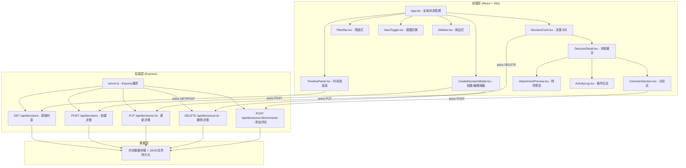
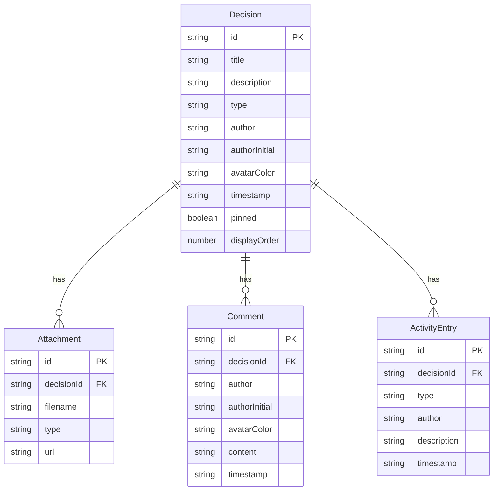

## 1. 架构设计



## 2. 技术说明

- **前端**: React@18 + TypeScript + Vite + Tailwind CSS
- **初始化工具**: vite-init (react-express-ts 模板)
- **后端**: Express@4 + TypeScript
- **状态管理**: Zustand
- **数据存储**: 内存数据 + JSON文件持久化（低依赖方案）
- **图标**: lucide-react
- **HTTP客户端**: axios
- **ID生成**: uuid
- **虚拟滚动**: 自定义实现（视口+缓冲区渲染策略）

## 3. 路由定义

| 路由 | 用途 |
|------|------|
| / | 主页面，时间线视图 |

（单页应用，所有视图切换在客户端完成）

## 4. API定义

### 4.1 TypeScript 类型定义

```typescript
interface Decision {
  id: string;
  title: string;
  description: string;
  type: 'technical' | 'design' | 'management';
  author: string;
  authorInitial: string;
  avatarColor: string;
  timestamp: string;
  pinned: boolean;
  attachments: Attachment[];
  comments: Comment[];
  activityLog: ActivityEntry[];
  displayOrder: number;
}

interface Attachment {
  id: string;
  filename: string;
  type: 'image' | 'pdf';
  url: string;
}

interface Comment {
  id: string;
  author: string;
  authorInitial: string;
  avatarColor: string;
  content: string;
  timestamp: string;
}

interface ActivityEntry {
  id: string;
  type: 'create' | 'edit' | 'comment' | 'attachment';
  author: string;
  description: string;
  timestamp: string;
}
```

### 4.2 请求/响应模式

| 方法 | 路径 | 请求体 | 响应 |
|------|------|--------|------|
| GET | /api/decisions | - | `{ decisions: Decision[] }` |
| POST | /api/decisions | `CreateDecisionDTO` | `{ decision: Decision }` |
| PUT | /api/decisions/:id | `UpdateDecisionDTO` | `{ decision: Decision }` |
| DELETE | /api/decisions/:id | - | `{ success: boolean }` |
| POST | /api/decisions/:id/comments | `{ author, content }` | `{ comment: Comment }` |
| POST | /api/decisions/:id/pin | - | `{ decision: Decision }` |

## 5. 服务端架构

```mermaid
flowchart LR
    "Express Router" --> "DecisionController"
    "DecisionController" --> "DecisionService"
    "DecisionService" --> "DataStore (内存 + JSON)"
```

- **DecisionController**: 处理HTTP请求，参数校验，返回JSON响应
- **DecisionService**: 业务逻辑处理（创建、更新、删除、评论、置顶）
- **DataStore**: 内存数据存储，启动时从JSON文件加载，变更时写回

## 6. 数据模型

### 6.1 数据模型定义



### 6.2 性能策略

- **虚拟滚动**：只渲染视口及上下缓冲区共30条卡片，使用IntersectionObserver检测可见性
- **相对时间更新**：每60秒刷新一次"X分钟前"标签，使用setInterval
- **CSS动画优先**：所有过渡动画使用CSS transition/animation，避免JS动画
- **懒加载**：附件缩略图使用loading="lazy"
- **防抖搜索**：关键词搜索300ms防抖

## 7. 文件结构与调用关系

```
├── package.json
├── vite.config.js          → 构建配置，入口index.html，端口3000
├── tsconfig.json            → 严格模式，ES2020，jsx react-jsx
├── index.html               → 入口页面，#F8F9FA背景，挂载React根节点
├── src/
│   ├── server.ts            → Express后端，CRUD API，数据流：请求→读写JSON→响应
│   ├── App.tsx              → 主组件，全局状态，调用后端API→传递数据给子组件
│   ├── main.tsx             → React入口
│   ├── types.ts             → TypeScript类型定义（共享）
│   ├── store.ts             → Zustand状态管理
│   ├── api.ts               → axios API封装
│   ├── components/
│   │   ├── TimelinePanel.tsx    → 时间线渲染，虚拟滚动
│   │   ├── DecisionCard.tsx     → 决策卡片（头像、标题、描述、时间标签）
│   │   ├── DecisionDetail.tsx   → 详情展开（评论区、附件、操作日志）
│   │   ├── CommentSection.tsx   → 评论区
│   │   ├── AttachmentPreview.tsx→ 附件预览（图片缩略图/PDF图标/灯箱）
│   │   ├── ActivityLog.tsx      → 操作日志
│   │   ├── CreateDecisionModal.tsx → 创建/编辑弹窗
│   │   ├── FilterBar.tsx       → 筛选按钮 + 搜索框
│   │   ├── ViewToggle.tsx      → 视图切换按钮
│   │   ├── WaterfallView.tsx   → 瀑布流视图
│   │   ├── Sidebar.tsx         → 侧边栏
│   │   ├── FloatingActionButton.tsx → 悬浮+按钮
│   │   └── Lightbox.tsx        → 灯箱全屏预览
│   └── hooks/
│       ├── useVirtualScroll.ts  → 虚拟滚动Hook
│       └── useRelativeTime.ts   → 相对时间计算Hook
```
