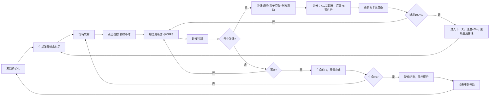

## 1. 产品概述

基于物理引擎的弹珠消除游戏，玩家通过拖动底部挡板反弹小球击碎彩色弹珠，融合经典打砖块玩法与创新连锁消除机制。

- 核心玩法：挡板反弹小球击碎蜂窝状排列的弹珠，弹珠碎裂产生粒子效果与连锁反应
- 目标用户：休闲游戏玩家，适合碎片化时间娱乐
- 产品价值：提供流畅的物理碰撞体验、炫酷的视觉效果和渐进式关卡挑战

## 2. 核心功能

### 2.1 功能模块
1. **游戏主界面**：Canvas游戏画布、实时计分板、生命值显示、关卡进度条
2. **物理引擎系统**：小球运动、碰撞检测、反弹角度随机微调
3. **弹珠管理系统**：蜂窝状排列生成、碎裂粒子效果、连锁消除判定
4. **挡板控制系统**：鼠标/触摸拖拽、弹性阻尼效果、移动范围限制
5. **游戏状态管理**：关卡进度、生命值、得分计算、游戏结束/重新开始

### 2.2 页面详情

| 页面名称 | 模块名称 | 功能描述 |
|---------|---------|---------|
| 游戏主界面 | Canvas渲染层 | 80+颗彩色弹珠（6种颜色）、小球、挡板、粒子效果实时绘制 |
| 游戏主界面 | HUD信息层 | 右上角实时计分（击碎+10，连锁+5）、生命值（3条）、关卡进度条 |
| 游戏主界面 | 交互控制层 | 鼠标/触摸拖拽挡板、点击/触屏发射小球 |
| 游戏结束层 | 结果展示 | 最终得分、"重新开始"按钮 |

## 3. 核心流程

## 4. 用户界面设计

### 4.1 设计风格
- **主题**：深色科技风
- **背景色**：#1a1a2e（深靛蓝紫）
- **弹珠颜色**：红(#ff4757)、橙(#ffa502)、黄(#ffd32a)、绿(#2ed573)、蓝(#1e90ff)、紫(#a55eea)，保持鲜艳饱和
- **挡板渐变**：#00d2ff → #3a7bd5（青蓝渐变）
- **边框风格**：圆角+发光边框（box-shadow/glow效果）
- **字体**：现代无衬线字体，数字使用等宽字体

### 4.2 页面设计概述

| 页面名称 | 模块名称 | UI元素 |
|---------|---------|---------|
| 游戏主界面 | Canvas游戏区 | 蜂窝状弹珠阵列（上半部分）、小球（白色发光）、渐变挡板、粒子碎裂特效、四周边框 |
| 游戏主界面 | 顶部HUD | 右上角：分数（白色发光）、生命值（红心图标）、关卡进度条（渐变填充） |
| 游戏主界面 | 加载提示 | 居中"加载中..."动效 |
| 游戏结束层 | 弹窗 | 半透明黑色背景、"游戏结束"标题、最终得分、圆角"重新开始"按钮（发光悬停效果） |

### 4.3 响应式设计
- **桌面优先**：最大宽度800px，高度保持4:3比例自适应
- **移动端适配**：宽度自适应屏幕，触摸响应延迟<50ms
- **触控优化**：挡板拖拽区域扩大，防止误触

### 4.4 动效与反馈
- **挡板弹性**：松手后回弹3-5像素，模拟弹性阻尼
- **屏幕震动**：弹珠碎裂时画布偏移2-3像素，持续100ms
- **粒子效果**：每颗弹珠碎裂成5-8个微粒子，颜色渐变，扩散半径30px，0.5秒后消失
- **发光效果**：弹珠、挡板、文字均有轻微发光（glow）效果
