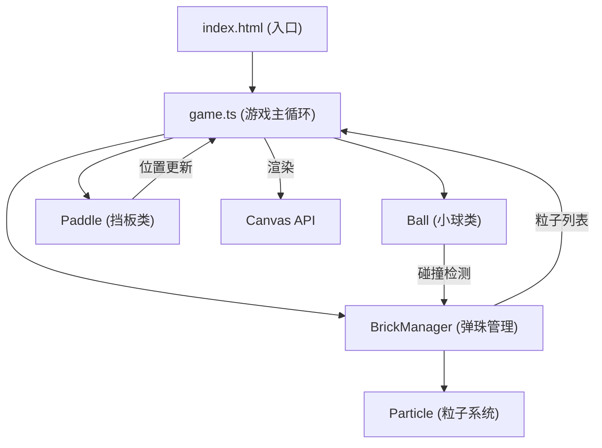

## 1. 架构设计



## 2. 技术描述

- **前端框架**：纯TypeScript + HTML5 Canvas API（无React/Vue，游戏项目轻量高效）
- **构建工具**：Vite 5.x
- **语言**：TypeScript 5.x（严格模式，target ES2020）
- **渲染引擎**：Canvas 2D Context
- **物理引擎**：自研轻量物理系统（AABB碰撞检测、向量运算）
- **状态管理**：game.ts内集中管理游戏状态

## 3. 目录结构

```
auto14/
├── package.json          # 依赖与脚本
├── index.html            # 入口HTML
├── vite.config.js        # Vite配置
├── tsconfig.json         # TypeScript配置
└── src/
    ├── game.ts           # 游戏主循环、初始化、渲染调度
    ├── ball.ts           # 小球类（位置、速度、碰撞检测）
    ├── brick.ts          # 弹珠管理（蜂窝排列、碎裂、粒子）
    └── paddle.ts         # 挡板类（事件处理、弹性阻尼）
```

## 4. 核心数据模型

### 4.1 Ball 类
```typescript
interface Ball {
  x: number;           // X坐标
  y: number;           // Y坐标
  vx: number;          // X速度分量
  vy: number;          // Y速度分量
  radius: number;      // 半径
  speed: number;       // 恒定速率
}
```

### 4.2 Brick 接口
```typescript
interface Brick {
  x: number;           // 中心X
  y: number;           // 中心Y
  radius: number;      // 半径（10px）
  color: string;       // 颜色（6种之一）
  alive: boolean;      // 是否存活
}
```

### 4.3 Particle 接口
```typescript
interface Particle {
  x: number;           // X坐标
  y: number;           // Y坐标
  vx: number;          // X速度
  vy: number;          // Y速度
  color: string;       // 颜色
  alpha: number;       // 透明度
  life: number;        // 剩余生命（ms）
  maxLife: number;     // 最大生命（500ms）
}
```

### 4.4 Paddle 类
```typescript
interface Paddle {
  x: number;           // X坐标（左上角）
  y: number;           // Y坐标（左上角）
  width: number;       // 宽度（100px）
  height: number;      // 高度（15px）
  velocity: number;    // 速度（弹性阻尼用）
  isDragging: boolean; // 是否拖拽中
}
```

### 4.5 GameState 接口
```typescript
interface GameState {
  score: number;       // 当前分数
  lives: number;       // 剩余生命
  level: number;       // 当前关卡
  isPlaying: boolean;  // 是否进行中
  isGameOver: boolean; // 是否结束
  comboCount: number;  // 连锁计数
}
```

## 5. 核心算法

### 5.1 蜂窝排列算法
- 弹珠直径20px，间距2px
- 奇数行向右偏移11px（半径+1）
- 每行最多：Math.floor((canvasWidth - 20) / 22) 颗
- 总行数：确保总数≥80颗

### 5.2 碰撞检测
- 小球与弹珠：圆心距离检测（圆-圆碰撞）
- 小球与挡板：AABB检测 + 碰撞点位置计算反弹角度
- 小球与边界：简单坐标边界检测

### 5.3 反弹角度微调
- 每次碰撞后在原有反弹角度基础上 ±15° 随机微调
- 保持速率恒定，仅调整方向

### 5.4 弹性阻尼效果
```
velocity *= 0.85  // 阻尼系数
x += velocity     // 位置更新
松手后：velocity = -lastDelta * 0.3（回弹）
```

### 5.5 粒子系统限制
- 最大粒子数：200个
- 超出时移除最早的粒子（FIFO）
- 每帧更新粒子位置与透明度

## 6. 性能优化

- **对象池**：粒子对象复用，避免频繁GC
- **空间分区**：弹珠按网格分区，减少碰撞检测次数
- **离屏渲染**：弹珠静态图缓存，减少重复绘制
- **节流控制**：触摸事件节流，保证响应延迟<50ms
- **帧率监控**：requestAnimationFrame自动适配，目标60FPS
