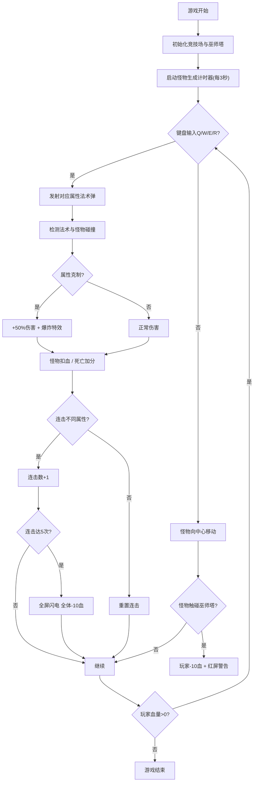

## 1. 产品概述
符文法阵·深渊是一款哥特风格的地城冒险战斗Web游戏，玩家操控位于竞技场中心的巫师塔，使用四种属性魔法书抵御不断涌来的怪物。
- 核心目标：策略爱好者通过选择法术序列与反应时机击败怪物，体验卡牌与动作结合的战斗乐趣
- 市场价值：提供即时策略玩法，元素克制系统增加深度，连击机制带来爽快感

## 2. 核心功能

### 2.1 功能模块
1. **竞技场场景**：圆形渐变竞技场、16根发光立柱、巫师塔表现
2. **怪物系统**：三种怪物生成、移动、AI行为、血量与死亡特效
3. **法术系统**：四种属性法术弹、拖尾粒子、元素克制、伤害计算
4. **玩家状态**：血量条、得分、连击计数、闪电特效、受伤警告
5. **UI界面**：游戏标题、魔法书按钮、键盘输入响应

### 2.2 页面详情
| 页面名称 | 模块名称 | 功能描述 |
|---------|---------|----------|
| 游戏主页面 | 竞技场渲染 | 圆形渐变地面、紫色光晕边缘、立柱呼吸动画 |
| 游戏主页面 | 怪物生成 | 每3秒从边缘随机生成骷髅兵/暗影法师/石像鬼，带烟雾粒子 |
| 游戏主页面 | 法术攻击 | Q/W/E/R按键发射四属性法术，命中检测与元素克制加成 |
| 游戏主页面 | 状态显示 | 顶部显示血量条、得分、连击数；底部显示四个魔法书按钮 |
| 游戏主页面 | 特效系统 | 法术拖尾、爆炸、全屏闪电、受伤红屏闪烁 |

## 3. 核心流程

## 4. 用户界面设计

### 4.1 设计风格
- 主色调：纯黑背景(#000000)、暗紫(#2A1548)到深蓝(#0D0221)渐变竞技场
- 四属性颜色：火(#FF4500)、水(#1E90FF)、风(#32CD32)、雷(#FFD700)
- 点缀色：暗金标题(#B8860B)、立柱紫(#6A3B8A)
- 按钮风格：60×30px圆角矩形，悬停放大1.1倍+外发光
- 字体：游戏标题使用带燃烧动画的暗金色装饰字体，界面使用无衬线字体
- 动画：立柱光球呼吸闪烁、塔顶白点闪烁、法术拖尾粒子、爆炸特效、全屏闪电、受伤红屏

### 4.2 页面设计概览
| 页面名称 | 模块名称 | UI元素 |
|---------|---------|--------|
| 游戏主页面 | 顶部标题区 | "符文法阵·深渊"暗金色标题，燃烧动画，居中 |
| 游戏主页面 | 状态显示区 | 红色血量条(100点)、得分数字、连击计数器，位于竞技场上方 |
| 游戏主页面 | 中央游戏区 | Canvas画布，圆形竞技场、立柱、巫师塔、怪物、法术弹、粒子 |
| 游戏主页面 | 底部控制区 | 四个魔法书按钮(Q火/W水/E风/R雷)，对应颜色，悬停效果 |

### 4.3 响应性
- 桌面端优先，Canvas固定尺寸居中显示
- 魔法书按钮支持鼠标点击与键盘快捷键双操作
