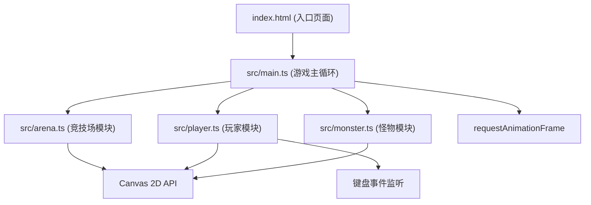

## 1. 架构设计



## 2. 技术描述
- 前端：TypeScript + 原生 JavaScript (Canvas 2D API)
- 构建工具：Vite 5.x
- 初始化：手动创建配置文件，不使用框架模板
- 后端：无（纯前端游戏）
- 数据库：无

## 3. 路由定义
| 路由 | 用途 |
|------|------|
| / | 游戏主页面（单页应用，无路由跳转） |

## 4. 文件结构
```
auto140/
├── package.json          # 项目依赖与脚本
├── index.html            # 入口HTML，纯黑背景，Canvas容器
├── vite.config.js        # Vite配置，端口3000
├── tsconfig.json         # TypeScript严格模式配置
└── src/
    ├── arena.ts          # 竞技场渲染：圆形渐变、16根立柱、光晕、呼吸动画
    ├── player.ts         # 玩家：巫师塔绘制、血量、连击、法术弹发射与碰撞
    ├── monster.ts        # 怪物：三种类型生成、移动、血量、粒子特效、属性伤害
    └── main.ts           # 入口：Canvas初始化、游戏循环、键盘输入整合
```

## 5. 核心数据模型

### 5.1 类型定义

```typescript
// 元素类型
type ElementType = 'fire' | 'water' | 'wind' | 'earth';

// 法术弹
interface Spell {
  x: number;
  y: number;
  vx: number;
  vy: number;
  element: ElementType;
  radius: number;
  speed: number;
  trail: Particle[];
}

// 怪物类型
type MonsterType = 'skeleton' | 'shadowMage' | 'gargoyle';

// 怪物
interface Monster {
  id: number;
  x: number;
  y: number;
  type: MonsterType;
  radius: number;
  hp: number;
  maxHp: number;
  speed: number;
  lastShot?: number;
  spawnParticles: Particle[];
}

// 暗影弹
interface ShadowBall {
  x: number;
  y: number;
  vx: number;
  vy: number;
  radius: number;
}

// 粒子
interface Particle {
  x: number;
  y: number;
  vx: number;
  vy: number;
  life: number;
  maxLife: number;
  size: number;
  color: string;
}

// 玩家状态
interface PlayerState {
  hp: number;
  maxHp: number;
  score: number;
  combo: number;
  lastElement: ElementType | null;
  damageFlash: number;
  lightningFlash: number;
}

// 立柱
interface Pillar {
  angle: number;
  pulsePhase: number;
}
```

### 5.2 元素克制关系
- fire → wind (+50% 伤害)
- wind → earth (+50% 伤害) 
- earth → water (+50% 伤害)
- water → fire (+50% 伤害)

### 5.3 怪物属性表
| 类型 | 半径 | 速度 | 血量 | 特殊行为 |
|------|------|------|------|----------|
| 骷髅兵 | 15px | 50px/s | 1x | 无 |
| 暗影法师 | 20px | 30px/s | 1x | 每5秒发射暗影弹 |
| 石像鬼 | 25px | 20px/s | 3x | 无 |

## 6. 性能优化策略
- 使用 requestAnimationFrame 驱动60FPS游戏循环
- 粒子对象池复用，避免频繁GC
- 碰撞检测使用圆形距离平方比较（避免开方）
- 超出竞技场范围的法术弹及时销毁
- Canvas渲染分层，静态元素预渲染缓存
