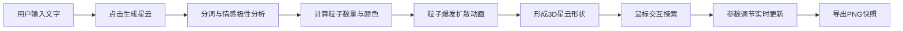

## 1. 产品概述

情感星云是一款将用户输入的文字实时转化为3D粒子星云的Web应用。粒子根据文字的情感极性和词汇抽象程度自动排列成独特三维形状，让用户直观感受文字情感与意象在空间中的立体呈现。

- **核心价值**：解决普通用户无法直观感受文字情感与意象在空间中立体呈现的痛点
- **目标用户**：文字创作者、设计师、教育工作者及普通大众
- **市场定位**：创新型文字可视化工具，结合情感分析与3D视觉艺术

## 2. 核心功能

### 2.1 用户角色
| 角色 | 注册方式 | 核心权限 |
|------|----------|----------|
| 普通用户 | 无需注册，直接使用 | 输入文字、生成星云、交互探索、导出快照 |

### 2.2 功能模块
1. **文字输入模块**：左侧控制面板，支持多行文本输入与生成按钮
2. **3D粒子渲染模块**：右侧场景，粒子星云的生成、动画与交互
3. **情感分析模块**：文字情感极性判断（正面/负面/中性）与颜色映射
4. **交互控制模块**：鼠标拖拽旋转、滚轮缩放、悬停标签显示
5. **参数调节模块**：粒子扩散速度、色彩饱和度、背景深度滑块
6. **导出功能模块**：1920x1080分辨率PNG快照导出

### 2.3 页面详情
| 页面名称 | 模块名称 | 功能描述 |
|---------|----------|----------|
| 主页面 | 文字输入区 | 宽300px高200px深灰输入框，"生成星云"渐变紫按钮 |
| 主页面 | 3D场景区 | 全屏粒子星云渲染，深空蓝到深紫渐变背景，200颗静态背景星点 |
| 主页面 | 参数控制区 | 底部三个自定义圆形滑块（扩散速度、饱和度、背景深度） |
| 主页面 | 导出按钮 | 右下角悬浮圆形按钮，1920x1080 PNG导出 |

## 3. 核心流程

用户输入文字 → 点击生成按钮 → 情感分析与分词处理 → 粒子从中心爆发扩散（2秒） → 形成星云形状 → 鼠标交互探索（旋转/缩放/悬停标签） → 调节参数实时更新效果 → 导出快照

## 4. 用户界面设计

### 4.1 设计风格
- **主色调**：深空蓝(#0A0A23)到深紫(#1A0A2E)渐变背景，紫色(#8B5CF6)强调色
- **辅助色**：暖色(正面#FF6B6B→#FFE66D)、冷色(负面#4A90D9→#1C3D5A)、中性色(#9CA3AF)
- **按钮样式**：渐变紫按钮，圆角6px，悬停亮度+10%，点击缩放0.95倍
- **字体**：Inter或系统无衬线字体，字号14px，文字颜色浅灰#D1D5DB
- **布局风格**：左右分栏式，左侧控制面板320px纯黑背景，右侧全屏3D场景
- **控件圆角**：统一8px圆角
- **滑块样式**：自定义圆形滑块（直径12px，轨道#4A4A4A，填充渐变紫）

### 4.2 页面设计概述
| 页面名称 | 模块名称 | UI元素 |
|---------|----------|--------|
| 主页面 | 控制面板 | 深灰输入框、渐变紫按钮、三个自定义滑块、1px渐变分割线 |
| 主页面 | 3D场景 | 渐变背景、200颗静态星点、动态粒子星云、拖尾光效 |
| 主页面 | 交互元素 | 鼠标旋转、滚轮缩放、悬停半透明标签、右下角导出按钮 |
| 主页面 | 响应式 | <800px时控制面板折叠为顶部60px横条，点击展开图标旋转180度 |

### 4.3 响应式
- **桌面端**：左右分栏布局，左侧320px控制面板，右侧全屏3D场景
- **移动端**（<800px）：控制面板折叠为顶部60px横条，点击展开图标旋转180度，3D场景占满全屏
- **触摸优化**：支持触摸拖拽旋转、双指缩放

### 4.4 3D场景指导
- **环境与氛围**：深空宇宙氛围，深蓝到深紫渐变背景，营造神秘梦幻感
- **光照设置**：环境光+点光源组合，粒子自发光效果，拖尾透明度衰减
- **相机设置**：PerspectiveCamera，fov 75，初始距离15单位
- **相机动画**：鼠标拖拽旋转（0.5度/像素），滚轮缩放（0.5-3倍）
- **构图与焦点**：粒子星云位于场景中心，背景星点营造纵深感
- **交互与动画**：粒子爆发扩散2秒，拖尾透明度0.8→0.1，悬停粒子簇放大1.2倍
- **后处理效果**：粒子抗锯齿，颜色饱和度调节，背景深度控制
- **性能预算**：粒子上限15000颗，帧率稳定55FPS以上，Web Worker计算粒子更新
