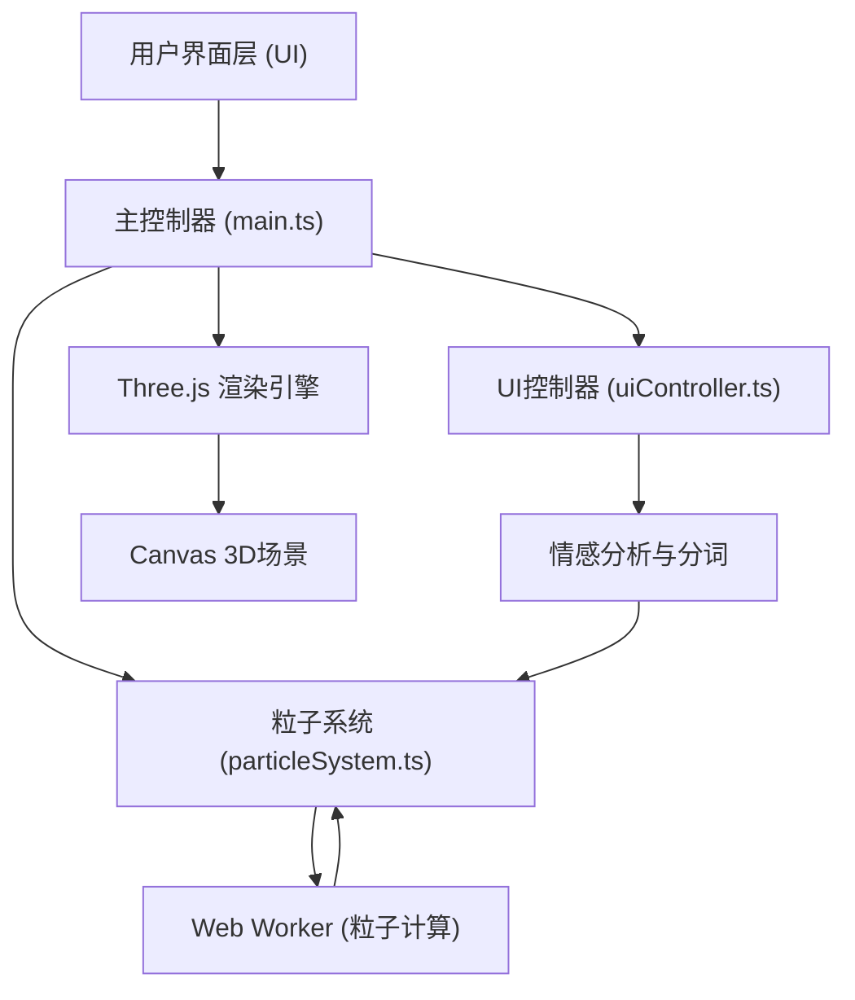

## 1. 架构设计



## 2. 技术描述

- **前端框架**：原生 TypeScript + Three.js（无需React，按用户指定实现）
- **构建工具**：Vite
- **3D引擎**：Three.js
- **UI库**：lil-gui（备选，按用户需求自定义实现）
- **类型支持**：@types/three
- **后端**：无，纯前端应用
- **数据库**：无
- **性能优化**：Web Worker 执行粒子更新计算，requestAnimationFrame 动画循环

## 3. 文件结构

```
.
├── package.json
├── vite.config.js
├── tsconfig.json
├── index.html
└── src/
    ├── main.ts              # 主入口，初始化Three.js、相机、渲染器
    ├── particleSystem.ts    # 粒子系统，创建/更新/销毁，情感颜色映射
    └── uiController.ts      # UI控制，滑块、输入框、导出功能
```

## 4. 核心模块定义

### 4.1 main.ts 主入口
```typescript
class NebulaApp {
  scene: THREE.Scene
  camera: THREE.PerspectiveCamera
  renderer: THREE.WebGLRenderer
  particleSystem: ParticleSystem
  uiController: UIController
  
  init(): void
  animate(): void
  onWindowResize(): void
  handleMouseMove(event: MouseEvent): void
  handleMouseDown(event: MouseEvent): void
  handleMouseUp(event: MouseEvent): void
  handleWheel(event: WheelEvent): void
}
```

### 4.2 particleSystem.ts 粒子系统
```typescript
interface ParticleData {
  position: Float32Array
  velocity: Float32Array
  targetPosition: Float32Array
  color: Float32Array
  size: Float32Array
  word: string
  clusterId: number
}

class ParticleSystem {
  geometry: THREE.BufferGeometry
  material: THREE.PointsMaterial
  points: THREE.Points
  particles: ParticleData
  worker: Worker
  
  createParticles(text: string, sentimentData: SentimentResult[]): void
  updateParticles(deltaTime: number): void
  diffuseAnimation(duration: number): Promise<void>
  mapSentimentToColor(sentiment: 'positive' | 'negative' | 'neutral'): THREE.Color
  getClusterAtPosition(position: THREE.Vector3, radius: number): number | null
  scaleCluster(clusterId: number, scale: number): void
  destroy(): void
}

interface SentimentResult {
  word: string
  sentiment: 'positive' | 'negative' | 'neutral'
  abstraction: number
}
```

### 4.3 uiController.ts UI控制器
```typescript
class UIController {
  inputElement: HTMLTextAreaElement
  generateButton: HTMLButtonElement
  exportButton: HTMLButtonElement
  sliders: {
    diffusionSpeed: HTMLInputElement
    saturation: HTMLInputElement
    backgroundDepth: HTMLInputElement
  }
  
  init(onGenerate: (text: string) => void, onExport: () => void): void
  getSliderValues(): { diffusionSpeed: number, saturation: number, backgroundDepth: number }
  validateInput(text: string): boolean
  exportSnapshot(renderer: THREE.WebGLRenderer, width: number, height: number): void
  showTooltip(word: string, position: { x: number, y: number }): void
  hideTooltip(): void
  toggleMobilePanel(): void
}
```

## 5. 性能优化

1. **Web Worker**：粒子位置更新计算在Worker线程执行，避免阻塞主线程
2. **BufferGeometry**：使用BufferGeometry存储粒子数据，一次性上传GPU
3. **粒子上限**：最多15000颗粒子，避免内存溢出
4. **requestAnimationFrame**：动画循环与浏览器刷新率同步
5. **离屏渲染**：导出快照时使用离屏Canvas渲染1920x1080分辨率
6. **懒加载**：静态背景星点一次性生成，不参与动态更新

## 6. 情感分析实现

使用规则匹配+情感词典方式：
- 内置正面情感词库（如"快乐"、"美好"、"爱"等）
- 内置负面情感词库（如"悲伤"、"痛苦"、"恨"等）
- 未匹配词汇默认为中性
- 抽象程度基于词汇词性（形容词、抽象名词>具体名词、动词）
