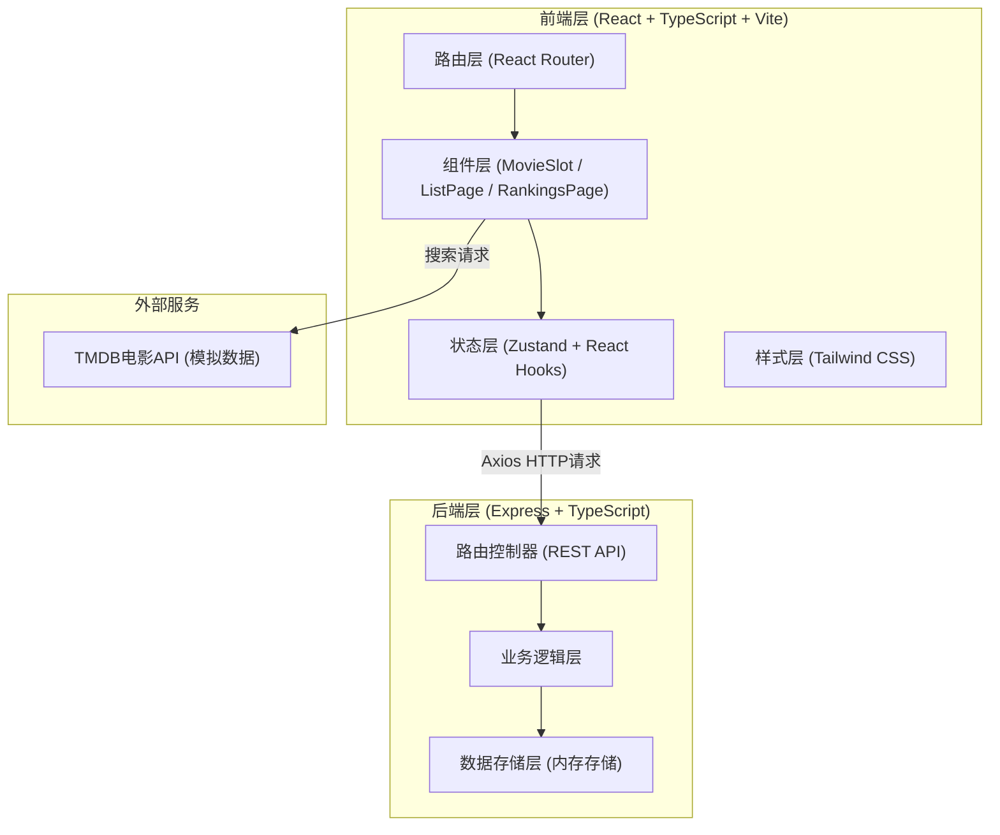
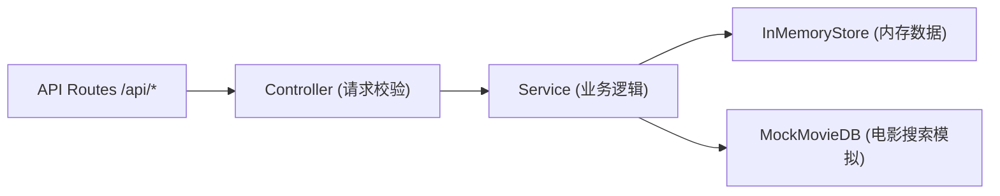
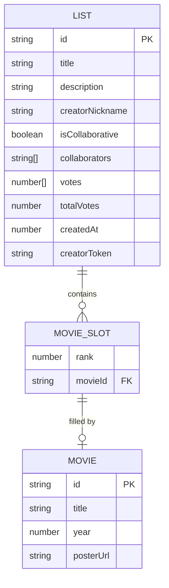

## 1. 架构设计



## 2. 技术说明
- 前端：React@18 + TypeScript + Vite@5 + React Router DOM@6 + Tailwind CSS@3 + Zustand + Axios + Lucide React
- 后端：Express@4 + TypeScript + UUID
- 初始化工具：Vite脚手架（react-express-ts模板）
- 数据库：无持久化数据库，使用内存对象存储（用户未指定数据库）
- 电影API：使用模拟数据（内置电影库模拟TMDB搜索结果）

## 3. 路由定义

### 前端路由 (React Router)
| 路由路径 | 页面组件 | 用途 |
|---------|---------|------|
| `/` | CreatePage（首页/创建榜单） | 创建新榜单入口 |
| `/list/:id` | ListPage | 榜单详情页，查看/编辑/投票 |
| `/rankings` | RankingsPage | 排行榜页面，所有榜单按点赞排序 |

### 后端API路由 (Express)
| 方法 | 路径 | 用途 | 请求体 | 响应体 |
|-----|------|------|--------|--------|
| GET | `/api/lists` | 获取所有榜单（用于排行榜） | - | List[] |
| POST | `/api/lists` | 创建新榜单 | { title, description, creatorNickname } | List |
| GET | `/api/lists/:id` | 获取单个榜单详情 | - | List |
| PUT | `/api/lists/:id` | 更新榜单内容（电影/协作模式） | Partial<List> | List |
| POST | `/api/lists/:id/vote` | 对榜单点赞 | { movieIndex } | { votes: number[], totalVotes: number } |

## 4. API类型定义

```typescript
interface Movie {
  id: string;
  title: string;
  year: number;
  posterUrl: string;
}

interface MovieSlot {
  rank: number;      // 1-10
  movie: Movie | null;
}

interface List {
  id: string;                    // UUID
  title: string;                 // 榜单标题
  description: string;           // 不超过200字
  creatorNickname: string;       // 创建者昵称
  slots: MovieSlot[];            // 10个槽位
  isCollaborative: boolean;      // 是否协作模式
  collaborators: string[];       // 协作者昵称列表
  votes: number[];               // 每部电影的点赞数 [slot0, slot1, ...]
  totalVotes: number;            // 总点赞数
  createdAt: number;             // 时间戳 (ms)
  creatorToken: string;          // 创建者标识token（localStorage存储）
}

interface ApiResponse<T> {
  success: boolean;
  data?: T;
  error?: string;
}
```

## 5. 后端服务架构



### 后端文件结构
```
src/server.ts        - Express服务器入口 + 路由定义 + 业务逻辑（简化单文件）
```

### 内存数据结构
```typescript
const store: {
  lists: Map<string, List>;       // id -> List
  votedSessions: Set<string>;     // "listId:browserId" 防止重复投票
}
```

## 6. 数据模型

### 6.1 实体关系图



### 6.2 初始模拟数据
应用启动时内置3个示例榜单数据用于展示排行榜效果：
1. "2024年度十佳电影" - 影评人张三
2. "我的科幻经典TOP10" - 影迷李四
3. "导演视角：2023精选" - 创作者王五
每个榜单预填充6-8部电影，预置点赞数便于展示排序效果。

内置20部模拟电影数据（海报使用placeholder图片服务）：
涵盖经典、科幻、动作、剧情等类型，包含上映年份。
