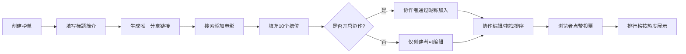

## 1. 产品概述
电影十佳榜单Web应用，帮助电影爱好者和影评人快速创建、分享和投票评选个人年度十佳电影榜单。
- 解决现有榜单工具无法灵活支持自定义分组、协作编辑和实时投票的问题
- 目标用户为电影爱好者、影评人，提供极简的榜单创建与分享体验

## 2. 核心功能

### 2.1 用户角色
| 角色 | 注册方式 | 核心权限 |
|------|----------|----------|
| 榜单创建者 | 无需注册，创建时自动生成身份标识 | 创建榜单、编辑榜单内容、开启/关闭协作模式、分享榜单 |
| 协作者 | 通过分享链接+昵称加入 | 在协作模式下添加/删除电影、拖拽调整排序 |
| 浏览者 | 无需登录 | 浏览榜单、点赞投票、查看排行榜 |

### 2.2 功能模块
1. **榜单详情页**: 榜单标题简介、10个电影槽位网格、协作控制、投票按钮
2. **排行榜页面**: 所有榜单按点赞数降序排列的卡片列表
3. **电影搜索**: 搜索框调用电影API查找并添加电影
4. **拖拽排序**: 拖拽调整电影槽位顺序
5. **分享系统**: 自动生成唯一分享链接，支持一键复制

### 2.3 页面详情
| 页面名称 | 模块名称 | 功能描述 |
|---------|---------|---------|
| 榜单详情页 | 头部信息 | 展示榜单标题（28px白色加粗）、简介（16px灰色#B0B3C5）、分享按钮 |
| 榜单详情页 | 协作控制 | 切换协作模式开关、昵称输入框（协作者加入时） |
| 榜单详情页 | 电影槽位网格 | 2列布局10个槽位，显示电影海报(200x300px圆角8px)、片名、年份，支持删除 |
| 榜单详情页 | 空槽位 | 虚线边框(#3D3F5E 2px)、加号图标，悬停变蓝(#3B82F6)提示"点击添加电影" |
| 榜单详情页 | 搜索弹窗 | 搜索框+结果列表，点击添加到当前槽位 |
| 榜单详情页 | 投票按钮 | 底部点赞按钮，灰色→红色(#EF4444)，缩放动画0.95倍200ms |
| 排行榜页面 | 榜单卡片列表 | 水平布局卡片，标题+简介两行截断，右侧点赞数+查看详情 |
| 排行榜页面 | 排序功能 | 按点赞总数降序排列，显示相对时间（如"3小时前"） |
| 排行榜页面 | 导航 | 顶部导航栏，返回首页/创建新榜单 |

## 3. 核心流程
用户从创建榜单开始，填写标题简介后获得唯一分享链接，通过搜索添加电影填充10个槽位，可开启协作模式允许他人编辑，最终浏览者点赞投票，所有榜单在排行榜页面按热度展示。

## 4. 界面设计

### 4.1 设计风格
- 主色调：深色背景#1A1B2E，卡片背景#25264A
- 强调色：蓝色#3B82F6（交互）、红色#EF4444（投票）、灰色#9CA3AF（未激活）
- 边框色：#3D3F5E（虚线槽位边框）、#B0B3C5（简介文字）
- 字体：系统无衬线字体（font-family: system-ui, -apple-system, sans-serif）
- 布局：卡片式设计，网格布局，响应式适配
- 动效：过渡时间300ms ease-out，拖拽透明度0.8，缩放动画0.95倍

### 4.2 页面设计概览
| 页面名称 | 模块名称 | UI元素 |
|---------|---------|---------|
| 榜单详情页 | 头部区域 | 左对齐标题、简介段落、右上角分享按钮（复制到剪贴板） |
| 榜单详情页 | 协作区域 | 开关控件+标签、条件渲染昵称输入框 |
| 榜单详情页 | 网格区域 | 2列gap-16px，卡片内边距24px，拖拽时自动让位动画 |
| 榜单详情页 | 投票区域 | 底部居中按钮，flex布局对齐图标+文字+计数 |
| 排行榜页面 | 卡片列表 | 垂直方向gap-12px，悬停背景变亮5%+上移3px |
| 排行榜页面 | 卡片内部 | 左侧flex-col标题/简介，右侧flex-col点赞数/按钮 |

### 4.3 响应式设计
- 桌面端（≥1024px）：全宽布局，榜单详情2列网格，排行榜卡片水平布局
- 平板（768px-1023px）：单列布局，所有网格改为1列
- 手机（<768px）：单列布局，卡片内边距从24px减半为12px，字体适当缩小

### 4.4 性能要求
- 列表渲染流畅60FPS
- 拖拽操作无显著卡顿
- API响应时间≤1秒
- 使用CSS transforms实现拖拽动画避免重排
