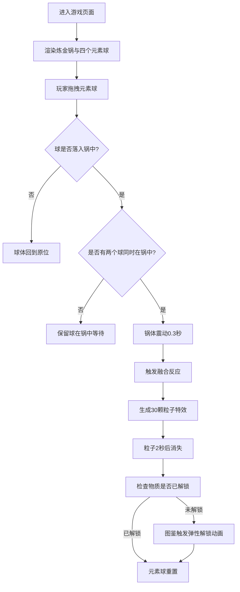

## 1. 产品概述

基于Canvas的交互式炼金术元素融合模拟游戏，玩家通过拖拽四种基础元素（火、水、土、风）的结晶球到炼金锅中，触发融合反应生成新物质，最终解锁完整的元素图鉴。

- **核心玩法**：拖拽交互 + 元素融合 + 收集图鉴
- **目标用户**：休闲游戏爱好者、对炼金术/元素题材感兴趣的玩家
- **产品价值**：提供沉浸式的炼金术体验，通过精美的视觉效果和粒子动画带来愉悦的探索乐趣

## 2. 核心功能

### 2.1 功能模块

1. **炼金锅模块**：中央青铜色炼金锅，发光呼吸动画，接收元素球，触发融合反应和锅体震动
2. **元素结晶球模块**：四种基础元素球（火/水/土/风），可拖拽，视觉区分明显
3. **融合反应模块**：双元素组合生成新物质，触发对应粒子特效（蒸汽/泥浆/熔岩/沙尘）
4. **图鉴面板模块**：右侧展示已解锁物质，未解锁显示灰色问号，解锁弹性动画

### 2.2 页面详情

| 页面名称 | 模块名称 | 功能描述 |
|----------|----------|----------|
| 主游戏页面 | 背景层 | 深灰石板纹理背景(#2C2A2E) |
| 主游戏页面 | 炼金锅 | 320px直径青铜锅，5秒周期橙红光晕呼吸动画 |
| 主游戏页面 | 元素结晶球 | 4个半径30px的可拖拽元素球，拖拽时放大1.1倍 |
| 主游戏页面 | 融合粒子系统 | 30颗粒子，2秒消失，不同物质不同运动轨迹 |
| 主游戏页面 | 图鉴面板 | 220px宽半透明白底，毛笔字体"炼金图录"标题，解锁弹性动画 |

## 3. 核心流程

## 4. 用户界面设计

### 4.1 设计风格

- **主色调**：暗金(#C8A96E) + 青铜(#7A5C3A/#4A3720) + 琥珀色系
- **背景色**：深灰石板纹理(#2C2A2E)
- **按钮交互**：悬停亮度提升15%+外发光，点击缩放0.95倍
- **元素颜色**：
  - 火：红(#FF4444) + 橙色内发光
  - 水：蓝(#4488FF) + 白色内发光
  - 土：褐(#8B5E3C) + 淡黄内发光
  - 风：绿(#66CC88) + 浅绿内发光

### 4.2 页面设计概述

| 页面名称 | 模块名称 | UI元素 |
|----------|----------|--------|
| 主游戏页面 | 炼金锅 | 径向渐变青铜色，橙红光晕呼吸动画，融合时晃动4px/0.3s |
| 主游戏页面 | 元素球 | 径向渐变+内发光，圆形，拖拽cursor:grabbing，放大1.1倍 |
| 主游戏页面 | 粒子特效 | 火+水=蒸汽(向上飘散)；水+土=泥浆(缓慢冒泡)；火+土=熔岩(向下沉淀+红光)；土+风=沙尘(旋转飘散) |
| 主游戏页面 | 图鉴面板 | 220px宽，圆角16px，rgba(255,255,255,0.08)半透明白底，40px圆形颜色图标 |

### 4.3 响应式设计

- 桌面端优先设计，Canvas居中显示
- 图鉴面板固定在锅右侧，空间不足时自适应布局
- 拖拽交互支持鼠标操作，触摸端需兼容touch事件

## 5. 性能要求

- 融合动画帧率不低于30fps
- 同屏粒子数量上限200颗
- 粒子生命周期2秒自动回收
