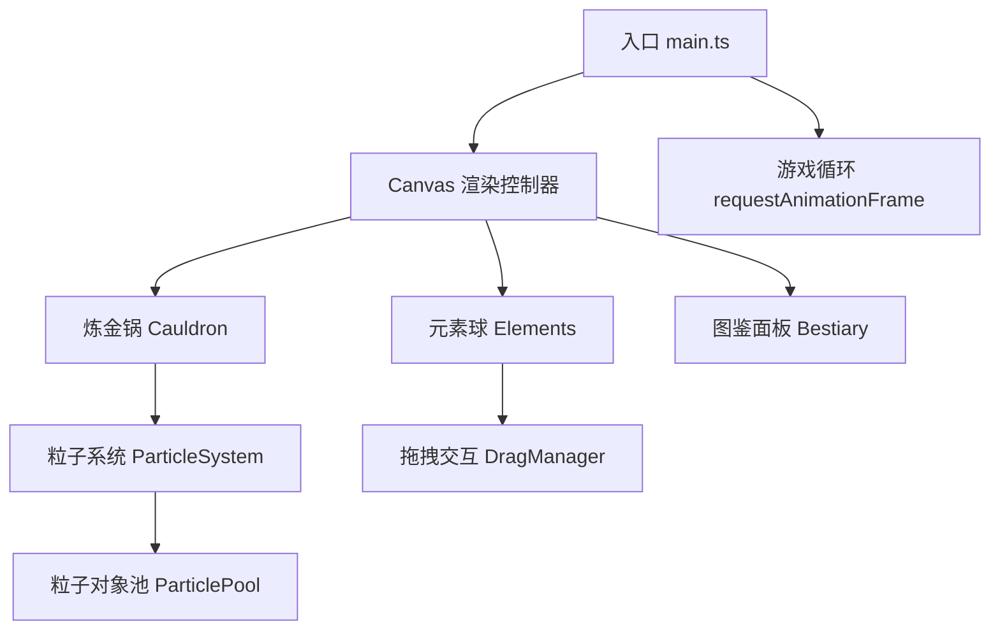

## 1. 架构设计



## 2. 技术栈说明

- **前端框架**：原生 TypeScript + HTML5 Canvas（无UI框架）
- **构建工具**：Vite@5
- **开发语言**：TypeScript（严格模式，target ES2020）
- **后端**：无（纯前端项目）
- **数据库**：LocalStorage（保存图鉴解锁进度，可选）

## 3. 文件结构定义

| 文件路径 | 职责说明 |
|----------|----------|
| `/package.json` | 项目依赖配置（typescript, vite），启动脚本 |
| `/index.html` | 入口页面，深灰背景，居中Canvas容器 |
| `/vite.config.js` | Vite构建配置，端口3000，入口index.html |
| `/tsconfig.json` | TypeScript配置，严格模式，ES2020 |
| `/src/main.ts` | 程序入口：初始化Canvas，加载资源，启动游戏循环 |
| `/src/cauldron.ts` | 炼金锅类：绘制锅体、光晕动画、检测球体落入、融合逻辑、粒子管理、震动动画 |
| `/src/elements.ts` | 元素球类：绘制球体、内发光效果、拖拽交互、碰撞检测、位置重置 |
| `/src/bestiary.ts` | 图鉴面板类：渲染面板、标题、解锁列表、管理解锁状态、弹性动画 |

## 4. 核心数据模型

### 4.1 元素定义

```typescript
type ElementType = 'fire' | 'water' | 'earth' | 'wind';
type SubstanceType = 'steam' | 'mud' | 'lava' | 'dust';

interface ElementBall {
  type: ElementType;
  x: number;
  y: number;
  radius: number;
  color: string;
  glowColor: string;
  isDragging: boolean;
  isInCauldron: boolean;
  scale: number;
}

interface Particle {
  x: number;
  y: number;
  vx: number;
  vy: number;
  life: number;
  maxLife: number;
  color: string;
  size: number;
  type: 'steam' | 'mud' | 'lava' | 'dust';
}

interface Substance {
  type: SubstanceType;
  name: string;
  color: string;
  formula: [ElementType, ElementType];
  unlocked: boolean;
}
```

### 4.2 融合配方表

| 组合 | 生成物质 | 粒子行为 |
|------|----------|----------|
| 火 + 水 | 蒸汽(Steam) | 向上飘散 |
| 水 + 土 | 泥浆(Mud) | 缓慢冒泡 |
| 火 + 土 | 熔岩(Lava) | 向下沉淀+红光 |
| 土 + 风 | 沙尘(Dust) | 旋转飘散 |

## 5. 性能优化策略

1. **粒子对象池**：预分配200个Particle对象，避免频繁GC
2. **Canvas分层渲染**：背景/锅/粒子/UI分层，减少重绘区域
3. **帧率控制**：requestAnimationFrame时间差计算，保证30fps+
4. **离屏缓存**：炼金锅静态图形缓存为离屏Canvas，每帧只重绘动态部分
5. **粒子自动回收**：life<=0自动回收到对象池
