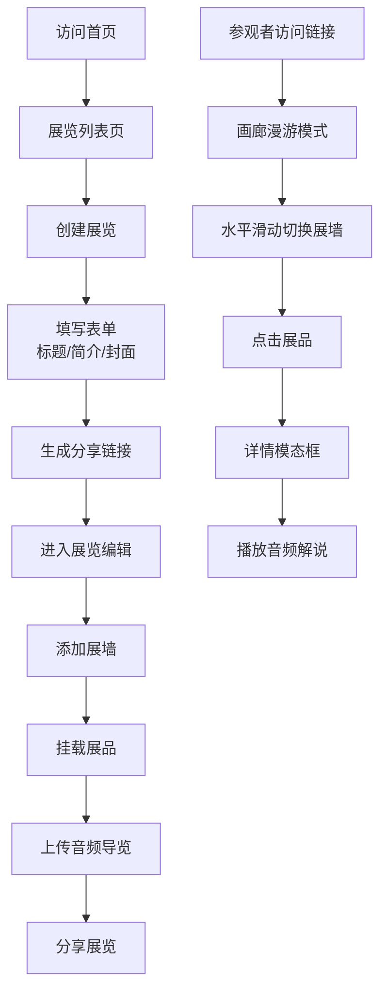

## 1. 产品概述

虚拟艺术展览Web应用，帮助小型艺术团队和独立策展人快速策划和展示虚拟艺术展，解决线下布展物理空间限制、人力搬运成本高和展品切换耗时的问题。用户可在线创建展览、按墙分组管理展品、添加文字标签和音频导览，参观者可模拟画廊漫游体验。

## 2. 核心功能

### 2.1 用户角色

| 角色 | 使用方式 | 核心权限 |
|------|----------|----------|
| 策展人 | 直接访问 | 创建展览、管理展墙与展品、上传音频导览 |
| 参观者 | 通过分享链接访问 | 浏览展览、查看展品详情、播放音频解说 |

### 2.2 功能模块

1. **展览列表页**：瀑布流展示所有展览、创建新展览入口
2. **展览详情页**：画廊式漫游、展墙水平滑动导航
3. **展品详情模态框**：展品大图展示、简介文本、音频播放控制
4. **展览创建流程**：标题/简介/封面上传、自动生成分享链接
5. **展墙与展品管理**：多展墙布局、展品挂载、音频导览上传

### 2.3 页面详情

| 页面名称 | 模块名称 | 功能描述 |
|----------|----------|----------|
| 展览列表页 | 瀑布流网格 | PC端3列、平板2列、手机1列自适应布局 |
| 展览列表页 | 展览卡片 | 封面图、标题、简介预览、进入展览按钮 |
| 展览列表页 | 创建展览 | 表单：标题、简介（300字限制）、封面上传（16:9裁剪） |
| 展览详情页 | 展墙滑动 | 水平滑动切换展墙，ease-out缓动0.5s |
| 展览详情页 | 导航指示器 | 底部圆点指示器、左右箭头导航按钮 |
| 展览详情页 | 展品展示 | 画框样式展品、等间距排列、点击弹出详情 |
| 展品详情模态框 | 展品大图 | 400x400px，保持宽高比居中 |
| 展品详情模态框 | 信息展示 | 名称（18px粗体）、简介（最多200字） |
| 展品详情模态框 | 音频播放器 | 播放/暂停、进度条、音量控制、简介同步滚动 |

## 3. 核心流程

### 3.1 策展人流程

策展人访问首页 → 点击创建展览 → 填写标题/简介/上传封面 → 系统生成唯一分享链接 → 进入展览编辑 → 添加展墙（最多5个）→ 在展墙上挂载展品（每墙最多6件）→ 为展品上传音频导览 → 分享展览链接

### 3.2 参观者流程

参观者通过分享链接进入展览 → 浏览第一面展墙 → 左右滑动/点击箭头切换展墙 → 点击展品查看详情 → 播放音频导览 → 继续浏览其他展品

## 4. 用户界面设计

### 4.1 设计风格

- **主色调**：画廊米白 #F5F0E1（背景）、深褐 #2A1E10（文字）
- **强调色**：暗金 #C9A96E（装饰）、渐变紫 #7C3AED → #6D28D9（按钮）
- **展墙色**：浅米色 #E8DCC8、网格纹 #D1C4A5
- **画框色**：木质色 #5C3A21
- **按钮样式**：圆角6px，悬停亮度+15%，点击缩放0.95，过渡0.2s
- **卡片阴影**：#00000015，偏移2px，模糊8px
- **背景纹理**：浅麻布纹理（CSS subtle pattern）
- **字体选择**：优雅的衬线字体用于标题，现代无衬线用于正文
- **整体氛围**：美术馆/画廊质感，简洁高雅，注重内容呈现

### 4.2 页面设计概览

| 页面名称 | 模块名称 | UI元素 |
|----------|----------|--------|
| 展览列表页 | 顶部导航 | 标题、创建展览按钮 |
| 展览列表页 | 瀑布流网格 | 卡片悬停微动效、渐变按钮 |
| 展览详情页 | 展墙容器 | 浅米色背景 + 网格纹理、画框展品 |
| 展览详情页 | 底部指示器 | 圆点导航、当前紫色填充 |
| 展览详情页 | 侧导航箭头 | 半透明黑色、悬停加深 |
| 展品模态框 | 内容布局 | 大图在上、信息在下、音频控制在底 |
| 展品模态框 | 播放条 | 米色背景、蓝色渐变进度、圆角12px |

### 4.3 响应式设计

- **设计原则**：Desktop-first，移动端适配
- **断点设置**：1024px（平板）、768px（手机）
- **瀑布流列数**：PC 3列 → 平板 2列 → 手机 1列
- **展墙尺寸**：根据视口宽度自适应缩放
- **触摸支持**：水平滑动手势切换展墙
- **模态框**：移动端全屏或接近全屏显示

### 4.4 动效与交互

- **展墙切换**：水平滑动，ease-out 缓动，0.5s 时长
- **按钮交互**：0.2s ease-in-out 过渡，悬停亮度提升，点击缩放
- **模态框**：淡入 + 轻微缩放出现效果
- **音频播放**：进度条平滑动画，简介文本自动滚动
- **图片加载**：懒加载，淡入显示
- **帧率目标**：展墙切换动画 ≥ 50fps
