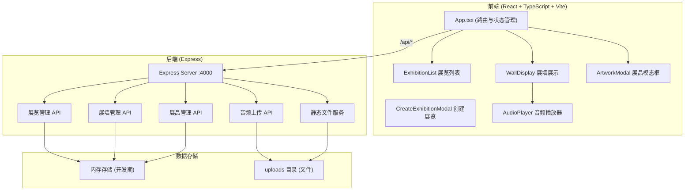
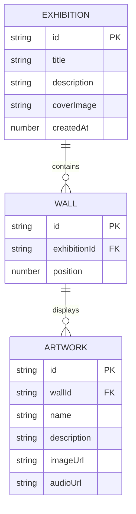

## 1. 架构设计



## 2. 技术选型

- **前端框架**：React 18 + TypeScript
- **构建工具**：Vite（端口3000）
- **路由管理**：React Router（或简单状态路由）
- **状态管理**：React useState/useContext（轻量场景）
- **样式方案**：CSS Modules 或 原生CSS + CSS变量
- **后端框架**：Express 4（端口4000）
- **文件上传**：Multer
- **唯一ID生成**：uuid
- **跨域处理**：cors
- **开发代理**：Vite proxy（/api → 4000端口）

## 3. 路由定义

| 前端路由 | 用途 |
|----------|------|
| / | 展览列表首页 |
| /exhibition/:id | 展览详情页（画廊漫游模式） |

| 后端API | 方法 | 用途 |
|---------|------|------|
| /api/exhibition | POST | 创建新展览 |
| /api/exhibition | GET | 获取所有展览列表 |
| /api/exhibition/:id | GET | 获取单个展览详情 |
| /api/exhibition/:id/wall | POST | 添加展墙 |
| /api/exhibition/:id/wall/:wallId/artwork | POST | 添加展品 |
| /api/exhibition/:id/artwork/:artworkId/audio | POST | 上传音频导览 |
| /uploads/* | GET | 静态文件访问 |

## 4. 数据模型

### 4.1 TypeScript 类型定义

```typescript
interface Exhibition {
  id: string;
  title: string;
  description: string;
  coverImage: string;
  walls: Wall[];
  createdAt: number;
}

interface Wall {
  id: string;
  artworks: Artwork[];
}

interface Artwork {
  id: string;
  name: string;
  description: string;
  imageUrl: string;
  audioUrl?: string;
  audioDuration?: number;
}
```

### 4.2 ER 图



## 5. 项目文件结构

```
/
├── package.json
├── index.html
├── vite.config.js
├── tsconfig.json
├── server.js              # Express 后端
├── uploads/               # 上传文件目录
│   ├── covers/
│   ├── artworks/
│   └── audio/
└── src/
    ├── App.tsx            # 主组件，路由管理
    ├── main.tsx           # 入口文件
    ├── styles/
    │   └── global.css     # 全局样式与CSS变量
    ├── components/
    │   ├── ExhibitionList.tsx    # 展览列表瀑布流
    │   ├── ExhibitionCard.tsx    # 展览卡片组件
    │   ├── CreateExhibitionModal.tsx  # 创建展览模态框
    │   ├── WallDisplay.tsx       # 展墙水平滑动
    │   ├── ArtworkItem.tsx       # 单展品画框
    │   ├── ArtworkModal.tsx      # 展品详情模态框
    │   └── AudioPlayer.tsx       # 音频播放组件
    ├── types/
    │   └── index.ts       # 类型定义
    └── utils/
        └── api.ts         # API 请求封装
```

## 6. 关键技术方案

### 6.1 展墙水平滑动

- 使用 CSS transform + transition 实现平滑滑动
- 支持鼠标拖拽和触摸滑动手势
- 圆点指示器与当前位置联动
- 懒加载：仅加载当前及相邻展墙的图片

### 6.2 音频播放器

- 使用原生 HTML5 Audio API
- 自定义播放UI：播放/暂停按钮、进度条、音量滑块
- 播放时自动同步滚动简介文本（根据音频时长计算滚动速度）

### 6.3 图片上传与处理

- 封面图：前端使用 Canvas 裁剪为 16:9 比例后上传
- 展品图：保持原始比例，显示时自适应
- Multer 配置：文件大小限制、文件类型校验

### 6.4 性能优化

- 图片懒加载（Intersection Observer）
- CSS 硬件加速（transform: translateZ(0)）
- 展墙切换使用 will-change 提示浏览器优化
- 音频预加载策略
