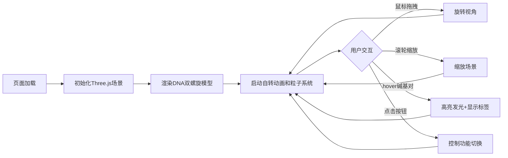

## 1. 产品概述
基于Three.js的3D交互式基因序列双螺旋结构可视化Web应用，用户可通过鼠标在三维空间中观察DNA双螺旋的碱基对连接、旋转动画及序列标签悬浮展示。
- 面向生物科研人员、学生及科技爱好者，提供沉浸式的DNA分子结构交互学习体验
- 以科技感的视觉设计和流畅的交互动画，将抽象的基因结构直观可视化

## 2. 核心功能

### 2.1 功能模块
1. **3D双螺旋模型展示**：完整2圈DNA双螺旋结构（20个碱基对），包含主链、碱基对、连接结构
2. **交互控制**：鼠标拖拽旋转视角、滚轮缩放、OrbitControls支持
3. **智能悬浮标签**：hover碱基对时高亮发光并显示碱基信息标签
4. **动态场景**：双螺旋自转、粒子星云背景、渐变氛围
5. **控制面板**：重置视角、暂停/继续旋转、切换标签显示三个交互按钮

### 2.2 功能详情
| 功能模块 | 子模块 | 详细描述 |
|---------|--------|----------|
| 3D双螺旋模型 | 主链结构 | 球体与圆柱交替组成，渐变半透明（#4FC3F7→#E040FB） |
| 3D双螺旋模型 | 碱基对 | 20个碱基对分2层，A/T/G/C不同颜色，A:#FF5252, T:#FFD740, G:#69F0AE, C:#40C4FF |
| 3D双螺旋模型 | 连接结构 | 碱基对之间细圆柱连接，两端碱基类型渐变颜色 |
| 交互控制 | 视角旋转 | 鼠标拖拽360°自由旋转，无抖动 |
| 交互控制 | 缩放控制 | 滚轮缩放，范围0.5x-3x |
| 智能悬浮标签 | 高亮效果 | hover时外发光（#FFD700，透明度0.5） |
| 智能悬浮标签 | 信息展示 | 显示碱基类型和位置信息（如"A-T 碱基对，位置: 第3层"），面向用户 |
| 动态场景 | 自转动画 | 双螺旋整体绕Y轴自转，周期20秒 |
| 动态场景 | 星云背景 | 300个粒子，大小2-5px，颜色渐变，缓速旋转 |
| 控制面板 | 重置视角 | 恢复初始相机位置和旋转角度 |
| 控制面板 | 暂停/继续 | 控制双螺旋自转状态 |
| 控制面板 | 标签切换 | 显示/隐藏所有碱基对标签 |

## 3. 核心流程

用户打开页面后，首先加载3D场景并启动自转动画。用户可通过鼠标拖拽和缩放观察DNA结构，hover特定碱基对查看详细信息，通过右下角控制按钮调整显示状态。

## 4. 用户界面设计

### 4.1 设计风格
- **主色调**：深蓝黑背景（#0a0a1a→#1a1a3a渐变），科技感冷色调
- **强调色**：主链蓝紫渐变（#4FC3F7→#E040FB），金色高亮（#FFD700）
- **按钮风格**：圆角8px，蓝色背景（#1E88E5），hover变深（#1565C0），点击缩放0.95
- **字体**：sans-serif系，白色文字，半透明圆角标签背景
- **整体氛围**：暗色调衬托发光双螺旋，营造未来科技感

### 4.2 页面布局
| 区域 | 模块 | UI元素 |
|-----|------|--------|
| 全屏 | 3D Canvas | 居中显示，深蓝黑渐变背景，无边框 |
| 右下 | 控制面板 | 三个按钮垂直排列，间距10px，圆角设计，hover微光动画 |
| 浮动 | 碱基对标签 | 半透明白色背景，圆角，跟随相机面向用户 |
| 底部 | 粒子星云 | 300个粒子缓慢旋转，透明度过渡自然 |

### 4.3 3D场景指导
- **环境与氛围**：深蓝黑渐变背景，底部星云粒子营造宇宙空间感
- **光照设置**：环境光+方向光组合，主链发光材质效果，碱基对适度反光
- **相机设置**：PerspectiveCamera，初始距离适中可完整观察双螺旋
- **交互与动画**：OrbitControls平滑控制，自转匀速无卡顿，hover高亮过渡自然
- **性能要求**：60FPS稳定帧率，鼠标交互响应<100ms

### 4.4 响应式设计
- 桌面端优先，Canvas自适应窗口大小
- 按钮在小屏幕上保持可用尺寸
