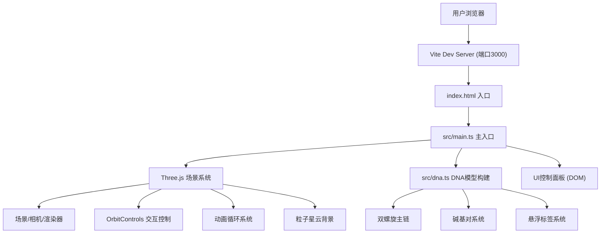

## 1. 架构设计



## 2. 技术说明
- **前端框架**: 原生TypeScript + Three.js（无React，按用户要求）
- **构建工具**: Vite 5.x（快速冷启动，HMR支持）
- **3D引擎**: three@0.160.x + @types/three
- **编程语言**: TypeScript 5.x（严格模式，target ES2020）
- **后端服务**: 无（纯前端3D可视化应用）
- **数据**: 碱基对序列数据在前端生成（20对，A/T/G/C随机分配）

## 3. 文件结构
| 文件路径 | 用途 |
|---------|------|
| /package.json | 项目依赖配置与npm脚本 |
| /index.html | 入口HTML页面（Canvas容器+控制面板） |
| /vite.config.js | Vite构建配置（端口3000） |
| /tsconfig.json | TypeScript编译配置（严格模式） |
| /src/main.ts | 主入口：场景初始化、渲染循环、事件绑定 |
| /src/dna.ts | DNA双螺旋模型构建模块 |

## 4. 核心模块设计

### 4.1 main.ts - 主入口模块
- 初始化THREE.Scene、PerspectiveCamera、WebGLRenderer
- 配置OrbitControls（enableDamping=true防止抖动，min/maxDistance限制缩放）
- 创建光照系统（AmbientLight + DirectionalLight）
- 实例化DNA模型并添加到场景
- 创建粒子星云背景系统
- 实现requestAnimationFrame动画循环
- Raycaster实现hover检测与高亮
- DOM按钮事件绑定（重置/暂停/标签切换）
- 窗口resize自适应处理

### 4.2 dna.ts - DNA模型模块
```typescript
// 核心类型定义
type BaseType = 'A' | 'T' | 'G' | 'C';

interface BasePair {
  left: BaseType;
  right: BaseType;
  layer: number;
  group: THREE.Group;
  highlightMesh?: THREE.Mesh;
}

// 常量配置
const HELIX_RADIUS = 3;          // 螺旋半径
const TOTAL_BASE_PAIRS = 20;     // 2圈 × 10对
const ANGLE_PER_PAIR = (Math.PI * 2) / 10;  // 每对夹角
const HEIGHT_PER_PAIR = 0.8;     // 每对垂直间距
const BACKBONE_SPHERE_RADIUS = 0.25;
const BACKBONE_CYLINDER_RADIUS = 0.12;

// 核心方法
export class DNAHelix {
  public group: THREE.Group;
  public basePairs: BasePair[];
  public labels: Map<THREE.Object3D, HTMLElement>;
  
  constructor();
  private buildBackbone(): void;     // 构建两条主链
  private buildBasePairs(): void;    // 构建碱基对
  private createLabel(bp: BasePair): HTMLElement;  // 创建HTML标签
  public highlight(pairIndex: number): void;  // 高亮指定碱基对
  public clearHighlight(): void;     // 清除高亮
  public toggleLabels(show: boolean): void;  // 切换标签显示
}
```

### 4.3 配色方案
```typescript
const COLORS = {
  A: 0xFF5252,    // 腺嘌呤 - 红
  T: 0xFFD740,    // 胸腺嘧啶 - 黄
  G: 0x69F0AE,    // 鸟嘌呤 - 绿
  C: 0x40C4FF,    // 胞嘧啶 - 蓝
  HIGHLIGHT: 0xFFD700,  // 高亮 - 金色
  BACKBONE_START: 0x4FC3F7,  // 主链起始色 - 浅蓝
  BACKBONE_END: 0xE040FB,    // 主链结束色 - 紫
  BG_TOP: 0x0a0a1a,    // 背景顶部
  BG_BOTTOM: 0x1a1a3a, // 背景底部
  BTN_BG: 0x1E88E5,    // 按钮背景
  BTN_HOVER: 0x1565C0, // 按钮hover
};
```

## 5. 性能优化策略
- **几何体复用**: 使用BufferGeometry，同类型Mesh共享geometry/material
- **材质优化**: 主链使用渐变色逐段计算，避免过多材质实例
- **标签优化**: 使用CSS2DRenderer或DOM overlay方案，减少3D文本开销
- **渲染优化**: enableDamping=true保证平滑，避免不必要的矩阵更新
- **粒子优化**: 使用Points + BufferGeometry一次性渲染300粒子

## 6. 运行脚本
```json
{
  "scripts": {
    "dev": "vite",
    "build": "tsc && vite build",
    "preview": "vite preview"
  }
}
```
