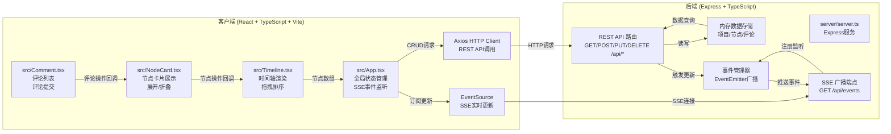
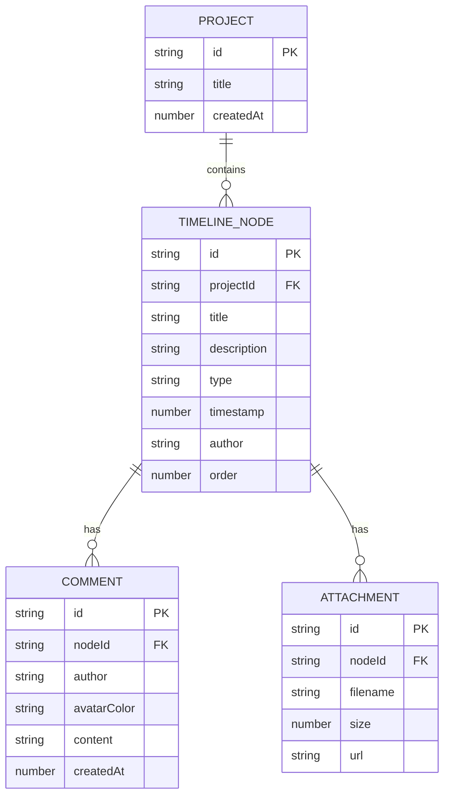

## 1. 架构设计



## 2. 技术描述

- **前端**：React@18 + TypeScript + Vite + react-beautiful-dnd + axios + eventsource
- **后端**：Express@4 + TypeScript + EventEmitter + uuid
- **实时通信**：Server-Sent Events (SSE)
- **数据存储**：内存存储（Map结构，用于演示）
- **构建工具**：Vite（前端）+ ts-node（后端开发）+ tsc（后端编译）

## 3. 项目结构

```
auto153/
├── package.json              # 项目依赖和脚本
├── vite.config.js            # Vite构建配置，代理/api到后端3001端口
├── tsconfig.json             # TypeScript配置（严格模式，target ES2020）
├── index.html                # HTML入口
├── server/
│   └── server.ts             # Express后端，REST API + SSE端点
└── src/
    ├── App.tsx               # React主组件，全局状态，SSE监听
    ├── Timeline.tsx          # 时间轴组件，拖拽排序，节点列表
    ├── NodeCard.tsx          # 节点卡片组件，展示与交互
    └── Comment.tsx           # 评论区组件
```

**文件调用关系与数据流**：
1. `server/server.ts`：启动Express服务器（端口3001），管理内存数据，提供REST API和SSE端点
   - 接收前端HTTP请求 → 操作内存数据 → 通过EventEmitter广播事件 → SSE连接推送给所有客户端
2. `src/App.tsx`：
   - 初始化：生成/读取项目ID，通过EventSource连接`/api/events`订阅SSE
   - 通过Axios调用REST API：`GET /api/projects/{id}`获取数据，`POST/PUT/DELETE`触发变更
   - 接收SSE事件 → 更新全局state → 传递给Timeline组件
3. `src/Timeline.tsx`：
   - 从App接收nodes数组 → 按时间排序渲染 → 调用react-beautiful-dnd实现拖拽
   - 用户操作（拖拽/点击卡片）→ 通过回调传递给App → App调用API
4. `src/NodeCard.tsx`：
   - 从Timeline接收单个node数据 → 渲染卡片UI
   - 展开/折叠状态本地管理 → 展开时渲染Comment组件
   - 编辑/删除请求 → 回调到App
5. `src/Comment.tsx`：
   - 从NodeCard接收comments数组 → 渲染评论列表
   - 提交新评论 → 回调到App → App调用`POST /api/nodes/{id}/comments`

## 4. 路由定义

| 路由 | 用途 |
|------|------|
| / | 首页，自动生成项目ID后跳转到 /project/{id} |
| /project/:id | 项目时间轴页面 |
| GET /api/projects/:id | 获取项目详情（含节点列表） |
| PUT /api/projects/:id | 更新项目标题 |
| POST /api/projects/:id/nodes | 添加新节点 |
| PUT /api/projects/:id/nodes/:nodeId | 更新节点信息 |
| DELETE /api/projects/:id/nodes/:nodeId | 删除节点 |
| PUT /api/projects/:id/nodes/reorder | 调整节点排序 |
| GET /api/projects/:id/events | SSE端点，订阅项目实时更新 |
| POST /api/projects/:id/nodes/:nodeId/comments | 添加节点评论 |

## 5. API 类型定义

```typescript
// 节点类型
type NodeType = 'milestone' | 'decision' | 'document' | 'discussion';

// 附件
interface Attachment {
  id: string;
  filename: string;
  size: number;
  url: string;
}

// 评论
interface Comment {
  id: string;
  nodeId: string;
  author: string;
  avatarColor: string;
  content: string;
  createdAt: number;
}

// 时间轴节点
interface TimelineNode {
  id: string;
  projectId: string;
  title: string;
  description: string;
  type: NodeType;
  timestamp: number;
  author: string;
  attachments: Attachment[];
  comments: Comment[];
  order: number;
}

// 项目
interface Project {
  id: string;
  title: string;
  createdAt: number;
  nodes: TimelineNode[];
}

// SSE 事件
interface SSEEvent {
  type: 'node_created' | 'node_updated' | 'node_deleted' | 'nodes_reordered' | 'comment_added' | 'project_updated';
  payload: any;
}

// 请求/响应示例
// POST /api/projects/:id/nodes
// Request Body: { title, description, type, timestamp, author, attachments: File[] }
// Response: TimelineNode

// PUT /api/projects/:id/nodes/reorder
// Request Body: { nodeOrder: string[] }  // 按顺序排列的节点ID数组
// Response: { success: true }
```

## 6. 数据模型

### 6.1 内存数据结构



### 6.2 服务端存储实现

使用 TypeScript Map 进行内存存储：
```typescript
// projects: Map<string, Project>
// 每个项目包含 nodes 数组
// SSE 客户端存储: Map<string, Set<Response>> (projectId -> SSE connections)
```

## 7. 启动脚本配置

**package.json scripts**:
```json
{
  "scripts": {
    "dev": "concurrently \"npm:dev:server\" \"npm:dev:client\"",
    "dev:server": "ts-node --esm server/server.ts",
    "dev:client": "vite",
    "build": "tsc && vite build",
    "preview": "vite preview"
  }
}
```

**vite.config.js 代理配置**:
```javascript
export default {
  server: {
    port: 5173,
    proxy: {
      '/api': 'http://localhost:3001'
    }
  }
}
```
