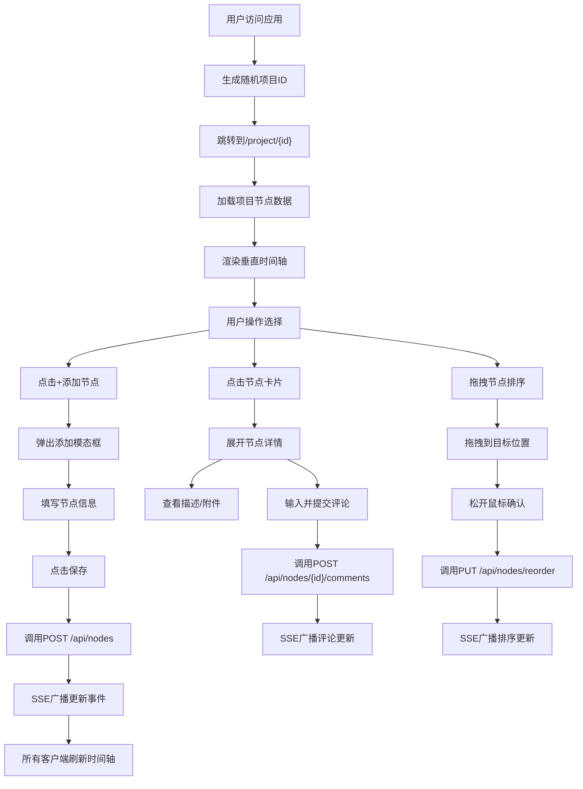

## 1. 产品概述

团队项目演化时间线是一个支持多人协作的交互式Web应用，旨在解决远程办公中项目里程碑和决策节点被淹没在聊天记录和邮件中的问题。通过直观的时间轴可视化，团队成员可以创建项目、按时间轴添加和讨论关键事件节点，并实时同步协作者的更新。

- 主要用途：项目里程碑记录、决策追踪、文档变更历史、团队协作讨论
- 目标用户：远程办公团队、项目管理者、产品研发团队
- 产品价值：让项目演化过程可追溯、可讨论、可复盘，提升团队信息同步效率

## 2. 核心功能

### 2.1 用户角色
| 角色 | 注册方式 | 核心权限 |
|------|----------|----------|
| 协作者 | 通过项目链接加入 | 创建/编辑/删除节点、添加评论、拖拽排序 |

### 2.2 功能模块
1. **项目时间轴页面**：项目标题编辑、垂直时间轴展示、节点添加按钮
2. **节点管理模块**：添加节点模态框、节点卡片展示、节点编辑/删除、拖拽排序
3. **评论系统模块**：评论列表展示、评论提交、滚动加载
4. **实时同步模块**：SSE事件推送、多标签页实时更新、动画过渡

### 2.3 页面详情
| 页面名称 | 模块名称 | 功能描述 |
|----------|----------|----------|
| 项目时间轴页面 | 标题区域 | 显示可编辑的项目标题（默认"我的项目时间线"），显示项目ID |
| 项目时间轴页面 | 添加节点按钮 | 深蓝色按钮，点击弹出添加节点模态框 |
| 项目时间轴页面 | 垂直时间轴 | 中央虚线竖线，两侧交替排列节点卡片，按时间戳排序（旧下新上） |
| 节点模态框 | 表单区域 | 标题输入、描述文本区、类型选择器（里程碑/决策/文档变更/讨论）、附件上传（最多2个） |
| 节点模态框 | 保存按钮 | 渐变蓝按钮，点击保存并关闭模态框 |
| 节点卡片 | 基础展示 | 节点图标（按类型配色）、标题、时间戳、作者头像、摘要 |
| 节点卡片 | 展开详情 | 完整描述、附件链接、评论区 |
| 评论区 | 评论列表 | 头像圆形、用户名、内容、时间（相对时间格式） |
| 评论区 | 评论输入 | 底部固定输入框+发送按钮 |
| 实时同步 | SSE推送 | 节点增删改、评论新增时自动刷新，淡入淡出动画 |
| 拖拽排序 | DnD交互 | 拖拽节点调整顺序，拖拽时阴影效果，松开后更新排序 |

## 3. 核心流程

用户访问应用 → 自动生成随机项目ID → 跳转至 /project/{id} → 加载项目数据 → 浏览时间轴节点

主要用户流程：

## 4. 用户界面设计

### 4.1 设计风格
- **主色调**：深蓝灰背景 #1E293B，时间轴区域白色 #FFFFFF
- **强调色**：深蓝 #2563EB（按钮）、#3B82F6（链接/聚焦边框）
- **节点类型色**：里程碑金 #F59E0B、决策蓝 #3B82F6、文档变更绿 #10B981、讨论紫 #8B5CF6
- **按钮风格**：圆角8px，渐变蓝按钮（#2563EB→#1D4ED8），悬停颜色加深
- **字体**：系统默认无衬线字体，标题18px加粗，正文14px，辅助文字12px
- **布局风格**：卡片式布局，时间轴居中竖线，两侧交替排列
- **图标风格**：几何图形（菱形/圆形/方形/六边形）配合类型颜色
- **时间轴竖线**：浅灰色 #D1D5DB，1px虚线

### 4.2 页面设计概述
| 页面名称 | 模块名称 | UI元素 |
|----------|----------|--------|
| 项目时间轴 | 标题区 | 可编辑输入框、项目ID标签、添加按钮、深蓝灰背景 |
| 项目时间轴 | 时间轴容器 | 白色圆角12px、内边距40px、左右各20%边距 |
| 项目时间轴 | 时间轴竖线 | 绝对定位居中、浅灰虚线、贯穿整个容器 |
| 项目时间轴 | 节点卡片 | 白色背景、圆角12px、阴影0 4px 6px、宽度320px、悬停阴影加深并上移2px、过渡0.3s |
| 项目时间轴 | 节点图标 | 32x32px圆形、类型对应颜色、居中对齐 |
| 项目时间轴 | 时间标签 | YYYY/MM/DD HH:mm格式、14px #6B7280、节点左侧 |
| 节点模态框 | 遮罩层 | rgba(0,0,0,0.5)半透明背景 |
| 节点模态框 | 模态框容器 | 宽度500px、居中、scale从0.9到1动画0.3s |
| 节点模态框 | 表单控件 | 灰色边框#E5E7EB、圆角6px、聚焦边框蓝#3B82F6 |
| 节点模态框 | 类型选择器 | 下拉菜单、配合几何图标指示 |
| 节点卡片展开 | 描述文本 | 允许换行、段落间距8px |
| 节点卡片展开 | 附件链接 | 蓝色#3B82F6超链接、点击下载 |
| 节点卡片展开 | 评论区 | 竖排列表、每条评论圆形头像36px、首字母显示 |
| 节点卡片展开 | 评论输入 | 底部固定、圆角20px发送按钮 |
| 动画效果 | 新节点插入 | 从下方平滑移动到正确位置、0.5秒 |
| 动画效果 | 实时更新 | 淡入淡出透明→不透明、0.3秒 |
| 动画效果 | 交互过渡 | 所有悬停/展开0.2-0.4秒平滑过渡 |

### 4.3 响应式
- 桌面端优先设计，时间轴两侧各留20%边距
- 节点卡片宽度固定320px，两侧交替排列
- 模态框固定宽度500px居中显示

## 4.4 性能指标
- 渲染30个节点时滚动帧率 ≥ 55fps
- SSE更新延迟 ≤ 500ms
- 拖拽排序响应延迟 ≤ 100ms
