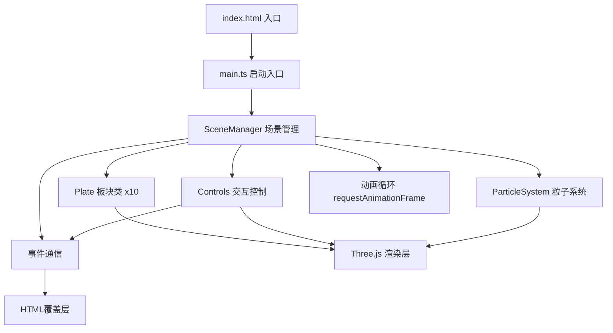

## 1. 架构设计


## 2. 技术描述
- **前端**：TypeScript + Three.js + Vite
- **3D库**：three@^0.160.0, @types/three@^0.160.0
- **UI框架**：原生HTML/CSS，lil-gui（备用调试面板）
- **构建工具**：Vite@^5.0.0
- **语言**：TypeScript@^5.3.0（严格模式，ES2020目标）
- **无后端**：纯前端WebGL应用，所有数据内置

## 3. 目录结构
```
project/
├── package.json          # 依赖配置
├── index.html            # 入口HTML
├── vite.config.js        # Vite配置（端口3000）
├── tsconfig.json         # TS配置（严格模式）
└── src/
    ├── main.ts           # 应用入口
    ├── scene.ts          # SceneManager场景管理类
    ├── plate.ts          # Plate板块类
    ├── controls.ts       # Controls交互控制类
    ├── ui.ts             # UIManager UI管理类
    ├── types.ts          # 类型定义
    └── utils.ts          # 工具函数
```

## 4. 核心模块接口

### 4.1 SceneManager (scene.ts)
```typescript
class SceneManager {
  constructor(container: HTMLElement)
  init(): Promise<void>          // 初始化场景、相机、渲染器、光源
  createEarth(): void           // 创建地球球体和海洋
  createPlates(): void          // 创建10个板块
  createParticles(): void       // 创建5000粒子系统
  update(time: number, speed: number): void  // 动画更新
  onPlateClick(callback: (plate: Plate) => void): void
  resize(): void
  dispose(): void
}
```

### 4.2 Plate (plate.ts)
```typescript
interface PlateData {
  id: number
  name: string
  color: THREE.Color
  baseSpeed: number  // cm/年
  baseElevation: number
  controlPoints: THREE.Vector3[]  // 贝塞尔曲线控制点
}

class Plate {
  constructor(data: PlateData, earthRadius: number)
  createGeometry(): THREE.BufferGeometry  // 不规则凸起多边形
  createEdgeGlow(): THREE.Line            // 半透明发光边缘
  update(progress: number): void          // 贝塞尔插值更新位置
  highlight(active: boolean): void        // 高亮切换
  getInfo(): { name: string; speed: string; elevation: string }
}
```

### 4.3 Controls (controls.ts)
```typescript
class Controls {
  constructor(camera: THREE.PerspectiveCamera, domElement: HTMLElement)
  enableOrbit(): void        // 启用OrbitControls
  enablePicking(objects: THREE.Object3D[]): void  // 启用射线拾取
  update(): void
  onPlateClick(callback: (plate: THREE.Object3D) => void): void
  dispose(): void
}
```

### 4.4 UIManager (ui.ts)
```typescript
class UIManager {
  constructor(container: HTMLElement)
  createProgressBar(): void
  createSpeedSlider(): void
  createControlButtons(): void
  createInfoPanel(): void
  showLoading(): void
  hideLoading(): void
  updateTimeLabel(progress: number): void  // 转换为"X亿年前"
  updateSpeedLabel(speed: number): void
  updateInfoPanel(data: PlateInfo): void
  onProgressChange(callback: (value: number) => void): void
  onSpeedChange(callback: (value: number) => void): void
  onPlayPause(callback: () => void): void
  onReverse(callback: () => void): void
}
```

## 5. 性能优化策略
1. **InstancedMesh**：5000粒子使用实例化渲染，单次draw call
2. **Geometry合并**：裂缝线合并为单一BufferGeometry
3. **LOD**：远距离降低板块细分程度
4. **材质复用**：相同属性的板块共享材质实例
5. **动画节流**：UI事件使用requestAnimationFrame合并
6. **视锥体剔除**：Three.js内置，确保不可见对象不渲染
7. **像素比限制**：maxPixelRatio = 2，避免高DPI设备性能损失

## 6. 动画实现
- **时间系统**：progress ∈ [0, 1]，映射到0-2亿年
- **板块运动**：三次贝塞尔曲线插值球面坐标，四元数平滑旋转
- **碰撞检测**：简化为距离检测，触发山脉隆起顶点动画
- **城市闪烁**：sin函数周期调制透明度，相位随机偏移
- **粒子动画**：逐顶点shader动画，地质年代标记点
