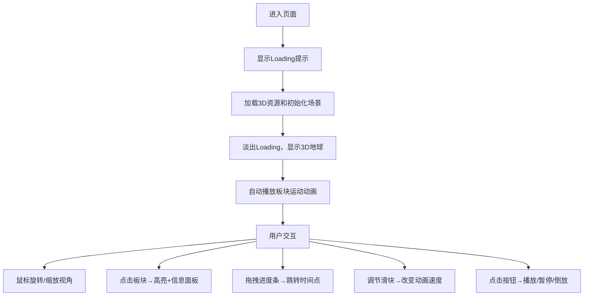

## 1. 产品概述
3D交互式地壳运动与板块碰撞模拟器，让用户通过沉浸式3D可视化观察地球板块在数百万年间的漂移、碰撞、俯冲和山脉隆起过程。
- 主要用途：科普教育、地质研究可视化、互动式学习体验
- 目标用户：学生、地理教师、地质爱好者、科普工作者
- 产品价值：将抽象的地质时间尺度转化为直观可交互的3D动画，降低地质学认知门槛

## 2. 核心功能

### 2.1 用户角色
| 角色 | 注册方式 | 核心权限 |
|------|----------|----------|
| 普通用户 | 无需注册 | 完整浏览和交互功能 |

### 2.2 功能模块
1. **3D地球场景**：分段球面地球模型、海洋纹理、10个大陆板块、裂缝线、城市标记点、5000个地质粒子
2. **板块动画系统**：板块漂移动画、碰撞挤压效果、山脉隆起模拟、贝塞尔曲线插值运动
3. **交互控制系统**：鼠标视角旋转缩放、点击板块拾取高亮、信息面板展示
4. **时间控制界面**：进度条拖拽、速度调节滑块、播放/暂停/倒放按钮
5. **信息展示面板**：板块名称、运动速度、海拔数据实时显示

### 2.3 页面详情
| 页面名称 | 模块名称 | 功能描述 |
|-----------|-------------|---------------------|
| 主页面 | 3D场景渲染 | Three.js渲染地球、板块、粒子系统，实时动画更新 |
| 主页面 | 交互控制层 | OrbitControls视角控制、Raycaster射线拾取 |
| 主页面 | UI覆盖层 | 时间进度条、速度滑块、控制按钮、信息面板 |

## 3. 核心流程
用户进入页面后看到加载动画，加载完成后展示完整3D地球场景。默认自动播放板块运动动画，用户可通过鼠标拖拽旋转视角、滚轮缩放、点击板块查看详情。通过左下角进度条可快速跳转至任意时间点，右下角滑块控制播放速度，按钮控制播放状态。

## 4. 用户界面设计

### 4.1 设计风格
- **主色调**：深空黑#0A0A14 → 深蓝#0F1A2E渐变背景
- **板块颜色**：暖色#D4A574到冷色#6B8E6B渐变，每块不同
- **高亮色**：金色#FFD700外发光
- **UI元素色**：进度条#FFFFFF→#4488FF渐变，按钮#3A3A4A背景，悬停#5A5A6A
- **字体**：现代无衬线字体，清晰科技感
- **布局**：3D Canvas全屏居中，UI元素角落布局，避免遮挡主要场景
- **动画风格**：平滑过渡（transition 0.3s ease），微交互反馈

### 4.2 页面设计概述
| 页面名称 | 模块名称 | UI元素 |
|-----------|-------------|-------------|
| 主页面 | 3D场景 | 发光球体、渐变纹理、动态板块、闪烁城市、粒子云 |
| 主页面 | 时间控制区（左下） | 时间标签（"1.2亿年前"）、200x8px进度条、圆角4px |
| 主页面 | 速度控制区（右下） | 速度标签、150x6px滑块、60x24px控制按钮 |
| 主页面 | 信息面板（右上） | 板块名称、速度、海拔数据卡片 |
| 主页面 | Loading层 | 居中加载提示，完成后淡出 |

### 4.3 响应式
- Desktop-first设计，最小适配800x600px屏幕
- Canvas自适应窗口大小，UI元素相对窗口定位
- 小屏幕下自动调整UI元素尺寸和间距

### 4.4 3D场景指导
- **环境**：深空渐变背景，无外部HDRI，模拟宇宙空间
- **光照**：环境光+定向光组合，模拟太阳光，突出板块边缘轮廓
- **相机**：PerspectiveCamera，初始距离15单位，可缩放范围8-30单位
- **构图**：地球居中，占画面主体约40%，预留UI空间
- **交互**：OrbitControls阻尼效果，旋转流畅；Raycaster精确拾取
- **后处理**：Bloom泛光效果增强发光边缘，FXAA抗锯齿
- **性能**：5000粒子InstancedMesh渲染，目标帧率≥45FPS
