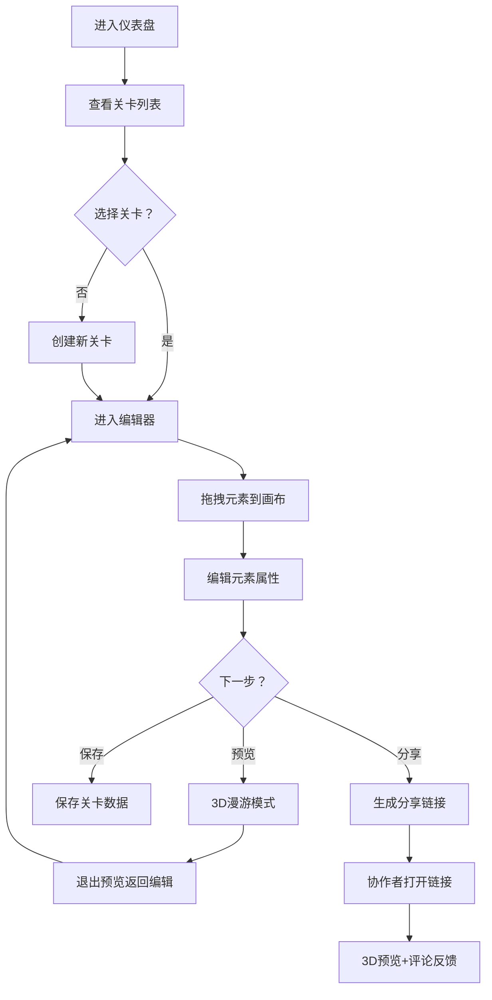

## 1. 产品概述

关卡设计草案工具（LevelDraft）——一个面向独立游戏开发者的在线关卡策划与展示平台，支持拖拽式2D俯视图编辑、3D第一人称预览漫游、元素备注标注以及链接分享与协作者评论反馈。

- 解决独立开发者缺少轻量级关卡原型设计工具的痛点，降低从构想到展示的沟通成本
- 目标用户为独立游戏开发者和小型团队，核心价值在于快速原型、直观展示、高效协作

## 2. 核心功能

### 2.1 用户角色
| 角色 | 注册方式 | 核心权限 |
|------|----------|----------|
| 关卡设计者 | 无需注册，直接使用 | 创建/编辑/预览/分享关卡 |
| 协作者 | 通过分享链接访问 | 以3D第一人称漫游查看关卡、添加评论反馈 |

### 2.2 功能模块
1. **仪表盘页面**：关卡列表侧边栏、关卡卡片管理
2. **关卡编辑器**：工具栏、网格画布、元素面板、元素详情面板
3. **3D预览模式**：Three.js第一人称漫游、元素3D可视化
4. **分享弹窗**：链接生成、一键复制
5. **评论反馈**：协作者在预览模式下添加评论（本地存储模拟）

### 2.3 页面详情
| 页面名称 | 模块名称 | 功能描述 |
|----------|----------|----------|
| 仪表盘 | 关卡列表侧边栏 | 展示所有关卡卡片（缩略图占位格+标题），悬停动画，点击进入编辑器 |
| 仪表盘 | 主区域 | 默认提示选择关卡，选择后加载编辑器 |
| 编辑器 | 工具栏 | 保存/预览/分享三个按钮，各有独立配色与交互 |
| 编辑器 | 网格画布 | 正交俯视图网格，支持从元素面板拖拽放置元素，点击选中元素 |
| 编辑器 | 元素面板 | 预设元素类型列表（平台/障碍物/敌人/奖励），拖拽到画布 |
| 编辑器 | 元素详情面板 | 编辑元素名称、颜色标签、备注文字，从右侧滑入 |
| 预览模式 | 3D场景 | Three.js渲染，元素为半透明立方体，支持鼠标旋转/滚轮缩放 |
| 预览模式 | 退出按钮 | 左上角红色按钮，返回编辑器 |
| 分享弹窗 | 链接生成 | 显示唯一链接，复制按钮，关闭按钮 |

## 3. 核心流程

用户进入页面 → 仪表盘显示关卡列表 → 点击关卡卡片或创建新关卡 → 进入编辑器 → 从右侧元素面板拖拽元素到画布 → 点击元素编辑属性（名称/颜色/备注） → 点击"预览"进入3D漫游模式查看效果 → 点击"分享"生成链接发给协作者 → 协作者打开链接进入3D预览 → 添加评论反馈

## 4. 用户界面设计

### 4.1 设计风格
- 主色调：深灰蓝 #1A202C，辅色 #2D3748、#1E293B、#0F172A
- 强调色：蓝紫 #7C3AED、亮蓝 #3B82F6
- 元素类型色：平台紫 #8B5CF6、障碍物红 #EF4444、敌人黄 #F59E0B、奖励绿 #10B981
- 按钮风格：圆角6-8px，悬停变色，点击缩放反馈
- 字体：系统无衬线字体，标题14-16px加粗，正文12-13px常规
- 布局风格：左侧固定侧边栏 + 右侧弹性主区域，暗色系沉浸感

### 4.2 页面设计概览
| 页面名称 | 模块名称 | UI元素 |
|----------|----------|--------|
| 仪表盘 | 关卡列表 | 固定240px宽，#2D3748背景，卡片悬停#4A5568+左移0.2s |
| 仪表盘 | 主区域 | 剩余宽度，#1A202C背景 |
| 编辑器 | 工具栏 | 50px高，#2D3748背景，三按钮横排 |
| 编辑器 | 画布 | 剩余空间，#0F172A背景，30px网格，#334155线 |
| 编辑器 | 元素面板 | 200px宽，#1E293B背景，8px圆角项 |
| 编辑器 | 详情面板 | 250px宽，右侧滑入0.3s缓出，#1E293B背景 |
| 预览 | 3D场景 | Three.js渲染，半透明立方体，浮动标签 |
| 分享 | 弹窗 | 居中400×300px，#1E293B背景，12px圆角 |

### 4.3 响应式
- 桌面优先设计，最低支持1280px宽度
- 侧边栏与面板在小屏下可考虑折叠，但当前版本以桌面体验为主

### 4.4 3D场景指引
- 环境：深色背景 #0F172A，无环境光贴图，保持简洁原型风格
- 灯光：环境光 + 定向光，确保立方体清晰可见
- 相机：初始位于画布中心上方5单位，看向原点；鼠标拖拽旋转0.3度/像素，滚轮缩放范围3-12单位
- 元素渲染：对应颜色半透明立方体（0.6透明度），亮色边框，上方浮动标签始终面向相机
- 交互：鼠标旋转 + 滚轮缩放，无物理碰撞
