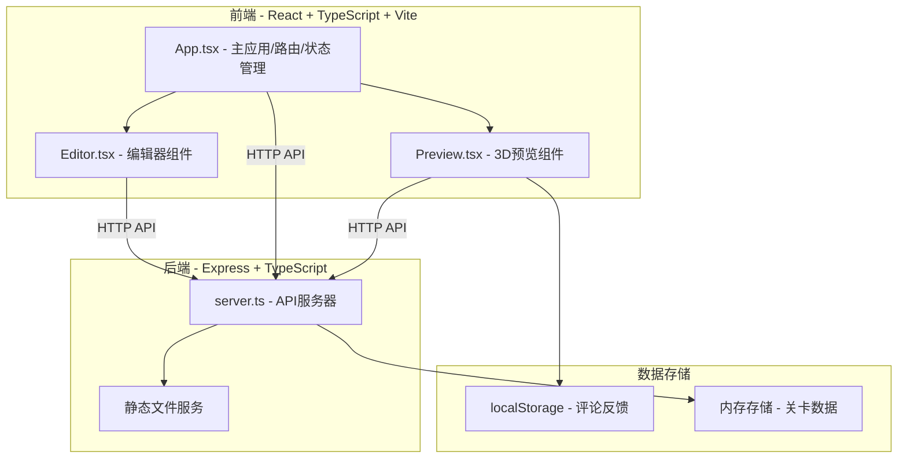
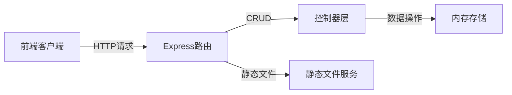
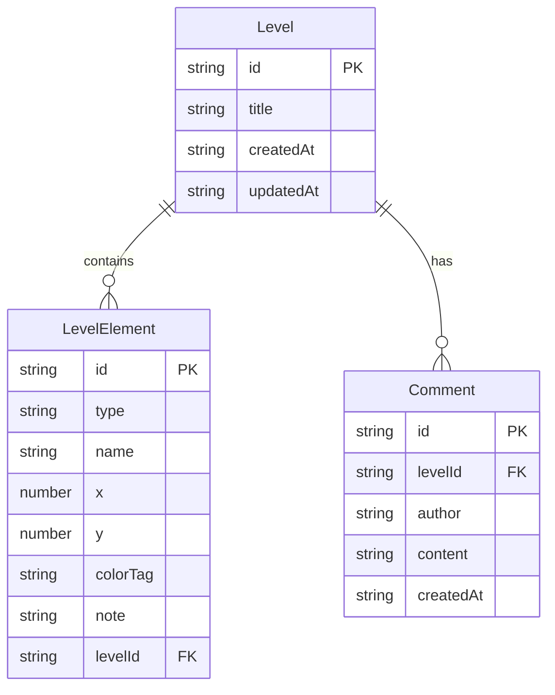

## 1. 架构设计



## 2. 技术说明
- 前端：React@18 + TypeScript + Vite（端口3000）
- 后端：Express@4 + TypeScript（端口3001）
- 3D渲染：Three.js
- 状态管理：Zustand
- 样式：Tailwind CSS
- 唯一ID生成：uuid
- 并发启动：concurrently
- 构建工具：tsc + vite build
- 初始化工具：vite-init（react-express-ts模板）

## 3. 路由定义
| 路由 | 用途 |
|------|------|
| / | 仪表盘主页面，显示关卡列表 |
| /editor/:id | 关卡编辑器（前端状态控制，非URL路由） |
| /game/:id | 分享链接的3D预览页面 |

## 4. API定义

### 类型定义
```typescript
interface LevelElement {
  id: string;
  type: 'platform' | 'obstacle' | 'enemy' | 'reward';
  name: string;
  x: number;
  y: number;
  colorTag: string;
  note: string;
}

interface Level {
  id: string;
  title: string;
  elements: LevelElement[];
  createdAt: string;
  updatedAt: string;
}

interface Comment {
  id: string;
  levelId: string;
  author: string;
  content: string;
  createdAt: string;
}
```

### API端点
| 方法 | 路径 | 请求体 | 响应 | 描述 |
|------|------|--------|------|------|
| POST | /api/create-level | { title: string } | { id: string } | 创建新关卡 |
| GET | /api/level/:id | - | Level | 获取关卡数据 |
| POST | /api/level/:id/update | { elements: LevelElement[], title?: string } | { success: boolean } | 更新关卡 |
| GET | /api/levels | - | Level[] | 获取所有关卡列表 |

## 5. 服务器架构



## 6. 数据模型

### 6.1 数据模型定义


### 6.2 数据定义
- 关卡数据存储在服务端内存中（Map结构），重启后清空
- 评论数据存储在客户端localStorage中
- 无需数据库初始化，使用uuid生成唯一ID
