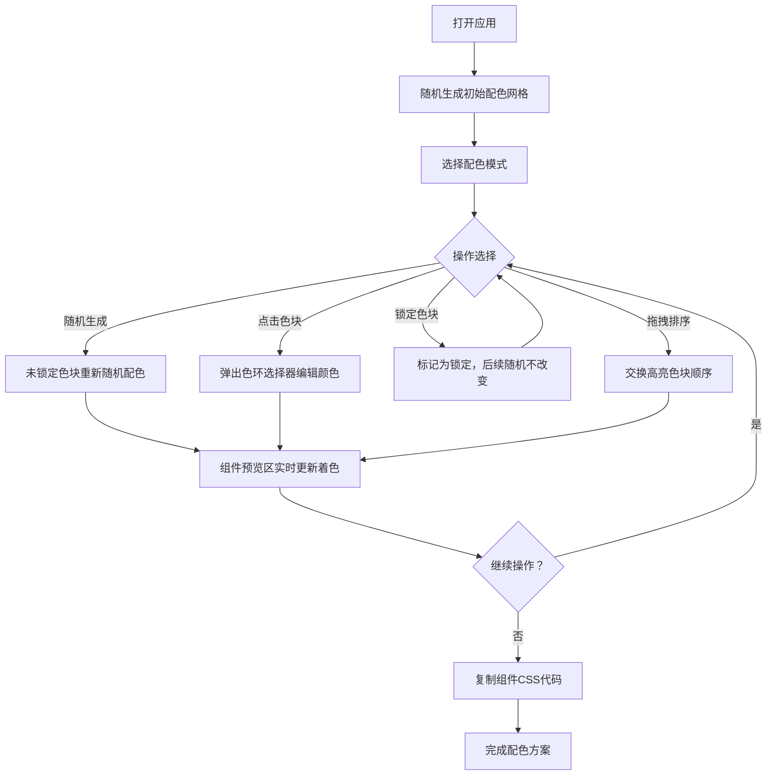

## 1. 产品概述

配色方案生成与可视化预览工具，为平面设计师和UI/UX爱好者提供浏览器内的网格化配色方案快速生成、微调及组件级实时预览能力。解决设计师在不同配色组合间反复切换比对效率低、缺乏组件级可视化反馈的痛点。

- 核心价值：将抽象的配色决策转化为直观的组件可视化，大幅缩短配色验证周期
- 目标用户：平面设计师、UI/UX设计师、前端开发者、设计爱好者

## 2. 核心功能

### 2.1 用户角色

| 角色 | 注册方式 | 核心权限 |
|------|----------|----------|
| 访客用户 | 无需注册 | 使用全部配色编辑、预览、CSS复制功能 |

### 2.2 功能模块

1. **主界面**：6x6色块网格、色环选择器、锁定机制、随机生成按钮、模式切换
2. **配色网格模块**：色块编辑、锁定/解锁、拖拽排序、高亮模式
3. **UI组件预览模块**：按钮、卡片、输入框、导航栏实时渲染、CSS复制
4. **模式切换模块**：双色/三色/四色模式切换与对应高亮规则

### 2.3 页面详情

| 页面名称 | 模块名称 | 功能描述 |
|----------|----------|----------|
| 主界面 | 6x6配色网格 | 随机生成12种主色调（色相间隔≥30°，饱和度60-80%，亮度40-60%），点击编辑颜色，锁定按钮固定颜色 |
| 主界面 | 色环选择器 | 点击色块弹出，直径160px，外圈渐变，中心显示当前色值，点击选中即时更新 |
| 主界面 | 随机生成按钮 | 未锁定色块重新随机配色，所有颜色0.4秒ease-out平滑过渡 |
| 主界面 | 模式切换按钮 | 双色/三色/四色切换，对应高亮区域不同，非高亮色块透明度0.3 |
| 主界面 | 拖拽交换 | 高亮色块支持拖拽排序，拖动上浮5px，0.3秒平滑动画归位 |
| 主界面 | UI组件预览区 | 主按钮、次按钮、卡片、输入框、导航栏5种组件实时着色预览 |
| 主界面 | CSS复制功能 | 每个组件下方复制按钮，点击复制样式代码，0.8秒"已复制"提示 |

## 3. 核心流程

用户打开应用 → 系统随机生成初始6x6配色网格 → 选择配色模式（双色/三色/四色）→ 点击随机生成或手动编辑色块 → 拖拽调整高亮色块顺序 → 实时观察右侧UI组件着色变化 → 点击组件下方复制按钮获取CSS代码 → 可锁定满意色块后继续随机探索其他组合

## 4. 用户界面设计

### 4.1 设计风格

- **整体风格**：极简扁平风，无多余装饰，强调内容聚焦
- **页面背景**：深色主题 #1A1A2E，应用主容器居中显示
- **主区背景**：浅灰白 #F7F8FA（配色网格区），纯白 #FFFFFF（组件预览区）
- **主色调**：渐变按钮 #6366F1 → #8B5CF6（靛蓝到紫色渐变）
- **文字颜色**：主要文字深灰，次要文字 #6B7280
- **边框颜色**：浅灰 #E2E4E8（1px），#E5E7EB（复制按钮背景）
- **圆角规格**：色块4px，按钮8px，卡片/预览区12px，输入框默认圆角
- **字体**：现代无衬线字体，清晰易读
- **间距规范**：色块间距4px，各模块间保持适当呼吸空间

### 4.2 页面设计概述

| 页面名称 | 模块名称 | UI元素 |
|----------|----------|--------|
| 主界面 | 布局容器 | 左右分区（60%/40%），<768px时上下堆叠，居中展示 |
| 主界面 | 配色网格区 | 6x6网格（40px色块，4px间距，4px圆角），锁定按钮位于右下角，随机生成按钮居中，模式切换按钮三枚水平排列 |
| 主界面 | 色环选择器 | 模态浮层，160px直径圆形，外圈HSV渐变，中心滑块，点击色块触发，点击外部关闭 |
| 主界面 | 高亮模式 | 双色高亮左上2x2，三色高亮左上2x3，四色高亮左上2x2+下方2色块，非高亮区域opacity:0.3 |
| 主界面 | 组件预览区 | 宽度40%最小360px，白底1px边框圆角12px，5种组件垂直排列间距均匀 |
| 主界面 | 主按钮 | 44x180px圆角8px，主色A背景白色文字，悬停变亮点击缩放0.95 |
| 主界面 | 次按钮 | 同尺寸，辅色B背景白色文字 |
| 主界面 | 卡片 | 280x160px圆角12px带阴影，背景色C，内含标题正文占位 |
| 主界面 | 输入框 | 260x40px，边框色D，聚焦时边框变主色A+0.5px内发光，0.2s过渡 |
| 主界面 | 导航栏 | 高48px水平4标签，激活标签主色A背景白色文字，非激活#6B7280文字，悬停底色加深5% |
| 主界面 | 复制按钮 | 宽100%高36px，背景#E5E7EB圆角6px13px文字，悬停#D1D5DB，点击后0.8秒显示"已复制" |

### 4.3 响应式设计

- **桌面端**（≥768px）：左右双栏布局，配色网格60%宽度，组件预览40%宽度（最小360px）
- **移动端**（<768px）：上下堆叠布局，配色网格在上全宽，组件预览在下全宽
- **触摸优化**：色块40px保证可点区域，拖拽支持触摸事件，按钮最小高度44px符合移动端规范

### 4.4 动效规范

- **颜色过渡**：统一ease-out缓动，随机生成0.4s，普通交互0.3s
- **拖拽动画**：提起上浮5px，放下0.3s平滑归位
- **悬停反馈**：按钮亮度/底色变化≤50ms延迟，点击缩放≤50ms
- **复制提示**：按钮文字切换0.8秒后恢复，无生硬闪烁
- **帧率目标**：所有动画稳定55fps以上，交互响应≤30ms
