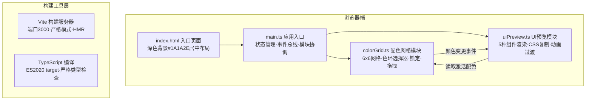

## 1. 架构设计



## 2. 技术描述

- **前端框架**：原生 TypeScript + Vanilla JavaScript（无React/Vue框架，按用户指定实现）
- **构建工具**：Vite 5.x（入口 index.html，端口3000，开启严格模式）
- **语言规范**：TypeScript 5.x（strict模式，target ES2020，模块解析node）
- **样式方案**：原生CSS + CSS变量实现主题切换与颜色过渡动画
- **状态管理**：main.ts 内集中管理全局状态（颜色数组、锁定状态、当前模式），通过自定义事件进行模块间通信
- **无后端**：纯前端应用，所有计算在浏览器端完成，无需数据库与API服务

## 3. 路由定义

| 路由 | 用途 |
|------|------|
| / | 单页应用，所有功能在主界面完成，无额外路由 |

## 4. 模块API定义（内部接口）

### 4.1 类型定义

```typescript
// 颜色数据结构
interface ColorCell {
  h: number;      // 色相 0-360
  s: number;      // 饱和度 0-100
  l: number;      // 亮度 0-100
  locked: boolean; // 是否锁定
}

// 配色模式
type PaletteMode = 'duo' | 'triple' | 'quad';

// 高亮色块索引规则
// duo:    [0,1,6,7]   → 取前2个作为A/B
// triple: [0,1,2,6,7,8] → 取前3个作为A/B/C
// quad:   [0,1,6,7,12,13] → 取前4个作为A/B/C/D
```

### 4.2 colorGrid.ts 对外接口

```typescript
class ColorGrid {
  constructor(container: HTMLElement, eventBus: EventTarget);
  generateRandomPalette(): void;       // 随机生成未锁定色块
  setMode(mode: PaletteMode): void;    // 设置高亮模式
  getActiveColors(): string[];         // 获取当前激活色（hex数组，长度=模式数）
  getLockedColors(): ColorCell[];      // 获取锁定状态的所有色块
  render(): void;                      // 渲染/重渲染网格
}
```

### 4.3 uiPreview.ts 对外接口

```typescript
class UIPreview {
  constructor(container: HTMLElement, eventBus: EventTarget);
  updateColors(colors: string[], mode: PaletteMode): void;  // 更新所有组件配色
  render(): void;                                           // 渲染组件预览区
}
```

### 4.4 事件总线协议

| 事件名 | 触发方 | 携带数据 | 用途 |
|--------|--------|----------|------|
| `palette:changed` | colorGrid | `{ colors: string[], mode: PaletteMode }` | 配色变更时通知预览区更新 |
| `mode:changed` | main | `mode: PaletteMode` | 模式切换通知 |
| `cell:edited` | colorGrid | `{ index: number, hex: string }` | 单个色块编辑完成 |

## 5. 项目文件结构

```
auto159/
├── package.json              # 依赖: typescript, vite; 脚本: dev/build
├── index.html                # 入口页面, 深色#1A1A2E背景, 挂载#app
├── vite.config.js            # Vite配置, 端口3000, 严格模式
├── tsconfig.json             # TS配置, strict, ES2020, node解析
└── src/
    ├── main.ts               # 应用入口, DOM初始化, 状态管理, 事件总线
    ├── colorGrid.ts          # 6x6网格, 色环, 锁定, 拖拽
    └── uiPreview.ts          # 5种UI组件, CSS复制, 过渡动画
```

## 6. 核心算法设计

### 6.1 随机配色生成算法

```
输入: 需要生成N种颜色 (N=12, 或未锁定色块数)
输出: HSL颜色数组, 任意两色色相差≥30°

1. 第一个色相: random(0, 360)
2. 后续色相: 在[0,360)范围内随机候选值, 验证与已有色相的最小差值≥30°
   - 计算环上距离: min(|h1-h2|, 360-|h1-h2|)
   - 如不满足, 重新抽样, 最多尝试50次
   - 仍失败则微调已有色相腾出空间
3. 饱和度: random(60, 80)
4. 亮度: random(40, 60)
```

### 6.2 HSL ↔ HEX 转换工具函数

```typescript
function hslToHex(h: number, s: number, l: number): string;
function hexToHsl(hex: string): { h:number; s:number; l:number };
```

### 6.3 拖拽交换算法

- mousedown/touchstart 记录起始位置与源色块索引
- mousemove/touchmove: 克隆DOM节点跟随鼠标（translate定位 + z-index上浮 + translateY(-5px)）
- mouseup/touchend: 根据释放位置计算目标索引，交换源与目标数据 → 触发重渲染（0.3s transition）

## 7. 性能优化策略

1. **颜色过渡**: 使用CSS `transition: background-color 0.4s ease-out` 而非JS逐帧动画，启用GPU合成
2. **拖拽性能**: 拖拽时仅操作 transform 与 opacity，避免 layout reflow
3. **事件节流**: 色环选择器的mousemove使用 rAF 节流，保证≤60次/秒
4. **批量重绘**: 随机生成时一次性更新所有色块的CSS变量，触发单次合成而非多次重排
5. **缓存转换**: HSL→HEX转换结果缓存，UI预览直接读取hex字符串
6. **will-change**: 高频动画元素添加 `will-change: transform, background-color` 提示浏览器优化
