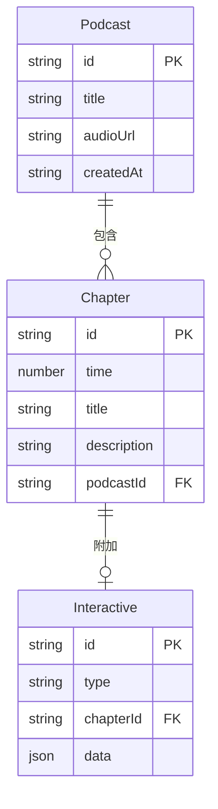

## 1. 架构设计

```mermaid
flowchart TB
    subgraph "前端 (React + Vite)"
        "App.tsx 主布局" --> "PlaybackBar.tsx 播放控制"
        "App.tsx 主布局" --> "WaveformTimeline.tsx 波形时间轴"
        "App.tsx 主布局" --> "ChapterEditor.tsx 章节侧边栏"
        "App.tsx 主布局" --> "ChapterEditPanel.tsx 章节编辑弹窗"
        "App.tsx 主布局" --> "InteractiveConfig.tsx 互动元素配置"
        "App.tsx 主布局" --> "PreviewPage.tsx 预览页面"
    end
    subgraph "后端 (Express)"
        "POST /api/upload" --> "音频文件存储"
        "POST /api/publish" --> "内存Map存储"
        "GET /api/podcast/:id" --> "内存Map读取"
    end
    "前端" --> "|API请求| 后端"
```

## 2. 技术说明
- 前端：React@18 + TypeScript + Tailwind CSS + Vite
- 初始化工具：vite-init (react-express-ts 模板)
- 后端：Express@4 + TypeScript + multer（文件上传）+ uuid（唯一ID）
- 数据库：无，使用内存Map存储
- 状态管理：Zustand

## 3. 路由定义
| 路由 | 用途 |
|------|------|
| / | 编辑器主页面，上传音频、编辑章节、发布 |
| /preview/:id | 预览页面，展示发布后的播客效果 |

## 4. API定义

### 4.1 TypeScript类型定义

```typescript
interface Chapter {
  id: string;
  time: number;
  title: string;
  description: string;
  interactive?: PollInteractive | LinkInteractive | PopupInteractive;
}

interface PollInteractive {
  type: 'poll';
  question: string;
  options: { text: string; votes: number }[];
}

interface LinkInteractive {
  type: 'link';
  url: string;
  label: string;
}

interface PopupInteractive {
  type: 'popup';
  imageUrl: string;
  text: string;
}

interface PodcastData {
  id: string;
  title: string;
  audioUrl: string;
  chapters: Chapter[];
  createdAt: string;
}
```

### 4.2 请求/响应模式

**POST /api/upload**
- Request: multipart/form-data, file字段(音频文件, MP3/WAV, ≤50MB)
- Response: `{ url: string }` — 音频文件访问URL

**POST /api/publish**
- Request: `{ title: string, audioUrl: string, chapters: Chapter[] }`
- Response: `{ id: string, shareUrl: string }` — 唯一分享链接

**GET /api/podcast/:id**
- Response: `PodcastData` — 播客完整数据

## 5. 服务器架构图

```mermaid
flowchart LR
    "Router 路由层" --> "Controller 控制层"
    "Controller 控制层" --> "Service 服务层"
    "Service 服务层" --> "内存Map 数据存储"
```

## 6. 数据模型

### 6.1 数据模型定义



### 6.2 内存存储结构
- `podcasts: Map<string, PodcastData>` — 以播客ID为键存储完整播客数据
- `audioFiles: Map<string, string>` — 以文件名为键存储音频文件路径
