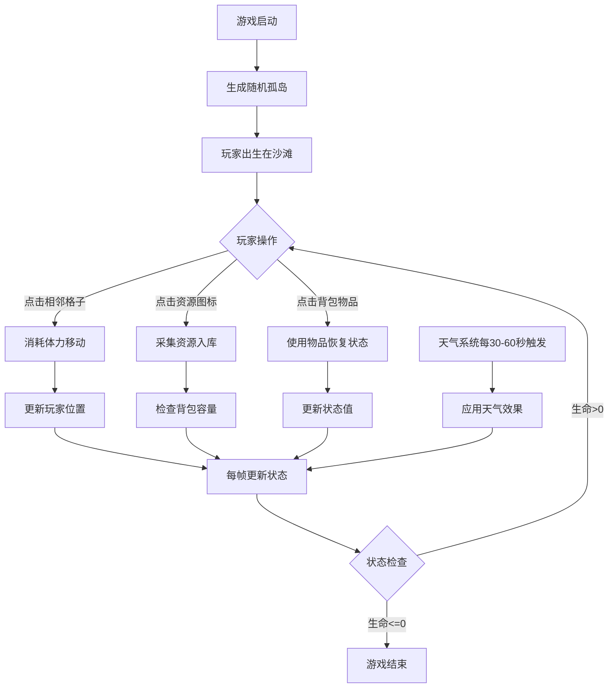

## 1. 产品概述

孤岛生存资源管理游戏是一款基于 Canvas 的网页互动游戏，玩家在随机生成的热带孤岛上通过采集资源、管理生命值来维持生存，抵御恶劣天气并最终逃离孤岛。

- 核心玩法：六边形网格地图探索、资源采集、生存状态管理、天气系统
- 目标用户：休闲游戏爱好者，喜欢策略和生存模拟类游戏的玩家

## 2. 核心功能

### 2.1 功能模块

1. **地图系统**：随机生成六边形网格孤岛，包含沙滩、草地、丛林、岩石、海洋等地形
2. **玩家系统**：角色移动、生命值/饥饿值/口渴值管理、背包系统
3. **资源系统**：资源采集（椰子、木材、石头、浆果）、资源使用
4. **天气系统**：晴天、暴雨、高温三种天气随机切换
5. **UI系统**：状态栏、背包面板、操作提示区

### 2.2 页面详情

| 页面名称 | 模块名称 | 功能描述 |
|-----------|-------------|---------------------|
| 主游戏界面 | 地图渲染 | 六边形网格地形、海洋波浪动画、玩家角色 |
| 主游戏界面 | 状态栏 | 生命值、饥饿值、口渴值实时显示 |
| 主游戏界面 | 背包面板 | 物品图标、数量显示、物品使用 |
| 主游戏界面 | 资源采集 | 资源图标显示、采集动画、资源入库 |
| 主游戏界面 | 天气系统 | 天气切换提示、视觉效果（雨滴、热浪） |
| 主游戏界面 | 操作提示 | 底部操作提示文字 |

## 3. 核心流程

玩家进入游戏后，随机生成一座孤岛并将玩家放置在沙滩上。玩家通过点击相邻格子移动角色，当停留在资源格上时可采集资源。采集到的资源存入背包，玩家可使用食物类资源恢复饥饿值和口渴值。天气系统每隔30-60秒随机切换，影响玩家状态消耗速度。当生命值降为0时游戏结束，玩家需持续管理资源以生存下去。

## 4. 用户界面设计

### 4.1 设计风格
- **主色调**：暖橙 #F4A261、珊瑚红 #E76F51、深蓝绿 #264653
- **状态色**：危险红 #E63946（生命）、饥饿橙 #F4A261（饥饿）、口渴蓝 #457B9D（口渴）
- **背景色**：热带沙滩色 #F4E4C1
- **地形色**：沙滩淡黄 #E8D5A3、草地草绿 #8FBC8F、丛林深绿 #4A7C59、岩石灰褐 #9E8C6C
- **海洋色**：深蓝渐变 #2E5B8A 到 #1A3A5C

### 4.2 页面设计概述

| 页面名称 | 模块名称 | UI元素 |
|-----------|-------------|-------------|
| 主游戏界面 | 状态栏 | 左上角，三个状态条（宽200px，高16px，圆角8px），背景深灰 #1D3557 |
| 主游戏界面 | 背包面板 | 右侧固定，宽200px，半透明黑 #000000CC，圆角8px，滑入动画0.3秒 |
| 主游戏界面 | 操作提示区 | 底部中央，半透明 #00000066，圆角12px，高60px |
| 主游戏界面 | 玩家角色 | 半径8px圆点，颜色 #FF6B35，外发光3px #FFA07A 透明度0.4 |
| 主游戏界面 | 资源图标 | 48x48px，圆角6px，食物类橙色 #F4A261，材料类灰色 #8D99AE |

### 4.3 响应式
- 桌面端优先设计，最小视口 800x600px
- 窗口缩放时UI元素保持相对位置，元素间距固定
- Canvas 游戏区域自适应视口大小

### 4.4 动画效果
- 玩家移动：平滑过渡0.15秒
- 资源采集：向外弹跳缩小消失，0.3秒
- 背包滑入：从右边缘滑入，0.3秒
- 物品悬停：缩放1.05倍，过渡0.15秒
- 物品点击：短暂缩放0.95倍
- 海洋波浪：1.2秒周期
- 雨滴粒子：最多50个
- 警告闪烁：背包已满时0.5秒频率，持续3秒
