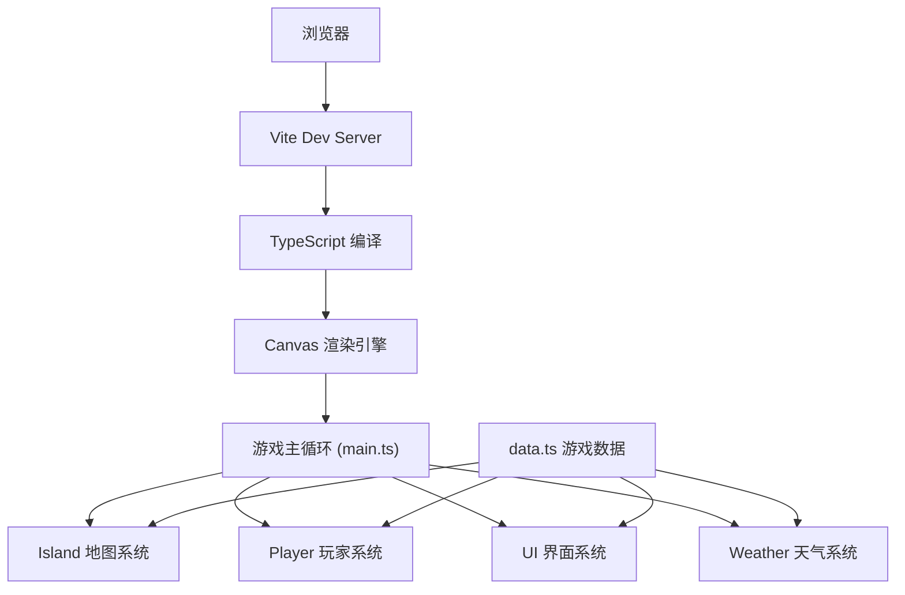

## 1. 架构设计



## 2. 技术描述

- **前端**：TypeScript + 原生 JavaScript + HTML5 Canvas
- **构建工具**：Vite 5.x
- **初始化方式**：手动配置项目结构（用户指定文件结构）

## 3. 文件结构

| 文件路径 | 用途 |
|-------|---------|
| `package.json` | 项目依赖与启动脚本 |
| `index.html` | 入口页面，Canvas 容器 |
| `vite.config.js` | Vite 构建配置（端口3000） |
| `tsconfig.json` | TypeScript 配置（严格模式，ES2020） |
| `src/main.ts` | 游戏主循环，初始化场景、管理状态和渲染帧 |
| `src/Island.ts` | 孤岛类，生成随机地形、资源点分布和天气系统 |
| `src/Player.ts` | 玩家类，管理生命值、饥饿值、口渴值、背包和交互逻辑 |
| `src/UI.ts` | 用户界面类，绘制 HUD、背包面板和建造菜单 |
| `src/data.ts` | 游戏数据常量，资源类型、建造配方和天气事件表 |

## 4. 核心数据模型

### 4.1 地形类型

```typescript
enum TerrainType {
  SAND = 'sand',
  GRASS = 'grass',
  JUNGLE = 'jungle',
  ROCK = 'rock',
  OCEAN = 'ocean'
}
```

### 4.2 资源类型

```typescript
enum ResourceType {
  COCONUT = 'coconut',
  WOOD = 'wood',
  STONE = 'stone',
  BERRY = 'berry'
}
```

### 4.3 天气类型

```typescript
enum WeatherType {
  SUNNY = 'sunny',
  RAIN = 'rain',
  HEAT = 'heat'
}
```

### 4.4 玩家状态

```typescript
interface PlayerState {
  hp: number;
  hunger: number;
  thirst: number;
  position: { q: number; r: number };
  inventory: { type: ResourceType; count: number }[];
}
```

### 4.5 六边形网格坐标系统

采用轴向坐标系 (q, r)，六边形边长 25px，间隙 2px。

## 5. 性能优化

- 主循环保持 60FPS，使用 `requestAnimationFrame`
- 天气粒子效果限制在 50 个以内
- Canvas 分层渲染：静态地形层 + 动态对象层
- 采集和背包操作响应时间 < 100ms
- 海洋波浪动画通过数学计算实现，避免频繁重绘整个画布
