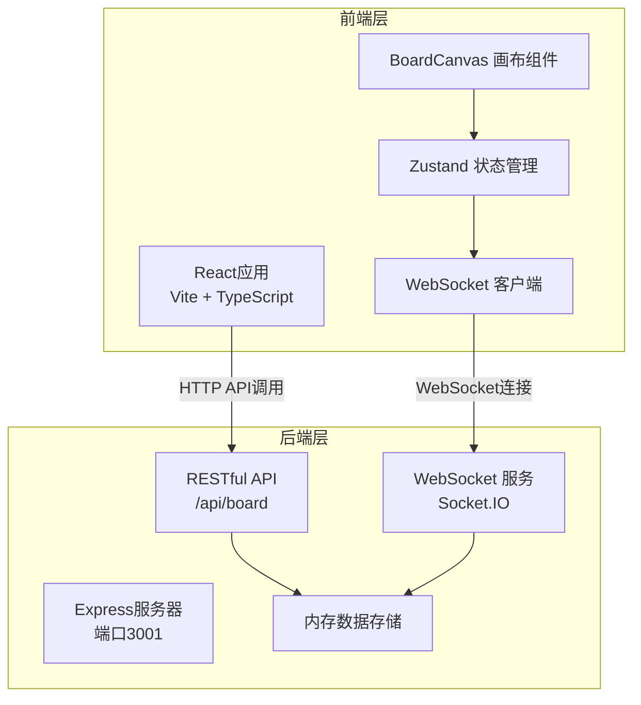
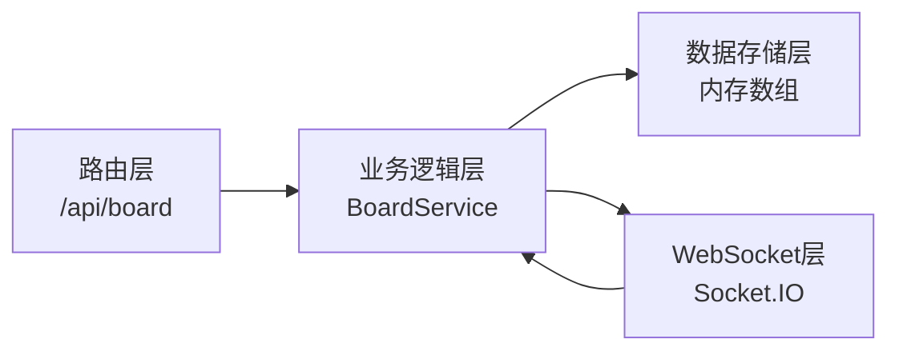
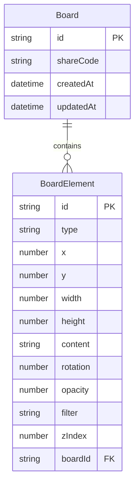

## 1. 架构设计



## 2. 技术说明

- 前端：React@18 + TypeScript + Vite + Tailwind CSS + Zustand
- 初始化工具：vite-init（react-express-ts模板）
- 后端：Express@4 + TypeScript + Socket.IO
- 数据库：内存数组暂存（无需持久化数据库）
- 实时通信：Socket.IO（WebSocket协议）
- 导出：html2canvas

## 3. 路由定义

| 路由 | 用途 |
|------|------|
| / | 主页面，情绪板画布应用入口 |

## 4. API 定义

### 4.1 RESTful API

| 方法 | 路径 | 请求体 | 响应 | 用途 |
|------|------|--------|------|------|
| GET | /api/board | - | `{ id, elements, createdAt }` | 获取情绪板数据 |
| POST | /api/board | `{ elements: BoardElement[] }` | `{ id, elements, createdAt }` | 创建情绪板 |
| PUT | /api/board | `{ id, elements: BoardElement[] }` | `{ id, elements, updatedAt }` | 更新情绪板 |
| DELETE | /api/board/:id | - | `{ success: true }` | 删除情绪板 |

### 4.2 WebSocket 事件

| 事件名 | 数据 | 方向 | 用途 |
|--------|------|------|------|
| join-board | `{ boardId, shareCode }` | 客户端→服务端 | 加入协作画布 |
| board-update | `{ boardId, elements, action }` | 客户端→服务端 | 广播元素变更 |
| board-sync | `{ boardId, elements }` | 服务端→客户端 | 同步画布状态 |
| user-joined | `{ userId, boardId }` | 服务端→客户端 | 通知用户加入 |
| user-left | `{ userId, boardId }` | 服务端→客户端 | 通知用户离开 |

### 4.3 TypeScript 类型定义

```typescript
interface BoardElement {
  id: string;
  type: 'image' | 'color' | 'text';
  x: number;
  y: number;
  width: number;
  height: number;
  content: string;
  style: {
    rotation: number;
    opacity: number;
    filter: string;
    zIndex: number;
  };
}

interface Board {
  id: string;
  shareCode: string;
  elements: BoardElement[];
  createdAt: string;
  updatedAt: string;
}
```

## 5. 服务端架构图



## 6. 数据模型

### 6.1 数据模型定义



### 6.2 文件结构与调用关系

```
项目根目录/
├── package.json              # 依赖与启动脚本
├── vite.config.js            # Vite构建配置，代理/api→后端3001端口
├── tsconfig.json             # TypeScript严格模式，target ES2020
├── index.html                # 入口页面，白色背景#FFFFFF
├── server/
│   └── index.ts              # Express后端，RESTful API + Socket.IO
├── src/
│   ├── main.tsx              # React入口
│   ├── App.tsx               # 根组件
│   ├── boardCanvas.tsx       # 核心画布组件（拖拽/缩放/选择）
│   ├── canvasItem.ts         # BoardElement类型定义 + validateElement
│   ├── components/
│   │   ├── Toolbar.tsx       # 顶部工具栏（邀请协作/导出）
│   │   ├── Sidebar.tsx       # 左侧工具栏（图片/色块/文字）
│   │   ├── CanvasElement.tsx # 画布元素渲染组件
│   │   ├── ContextMenu.tsx   # 右键菜单（层级调整）
│   │   ├── ShareModal.tsx    # 协作分享弹窗
│   │   ├── ColorPicker.tsx   # 拾色器组件
│   │   └── ExportOverlay.tsx # 导出加载动画
│   ├── hooks/
│   │   ├── useDrag.ts        # 拖拽逻辑Hook
│   │   ├── useResize.ts      # 缩放逻辑Hook
│   │   ├── useCanvasZoom.ts  # 画布滚轮缩放Hook
│   │   └── useCollaboration.ts # WebSocket协作Hook
│   ├── store/
│   │   └── boardStore.ts     # Zustand状态管理
│   └── utils/
│       └── exportBoard.ts    # html2canvas导出逻辑
└── shared/
    └── types.ts              # 前后端共享类型定义
```

**数据流向**：
1. 用户交互 → 组件事件处理 → Zustand store更新 → React重渲染
2. Store变更 → WebSocket广播 → 服务端接收 → 转发给其他客户端
3. 服务端推送 → 客户端WebSocket接收 → 更新Zustand store → React重渲染
4. 导出流程 → html2canvas捕获画布DOM → 2x分辨率渲染 → PNG下载
