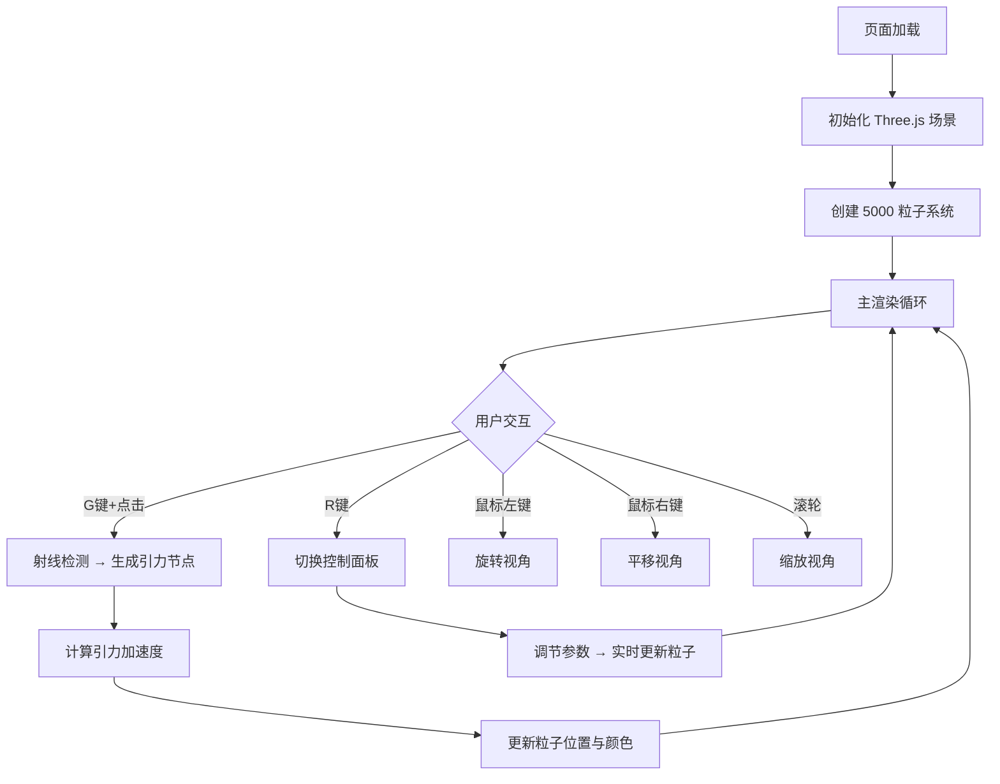

## 1. 产品概述

基于 Three.js 的 3D 交互式宇宙星云粒子生成与演化模拟器。用户在深邃的太空画布中通过鼠标拖拽放置引力节点，实时生成流淌的星云粒子流，粒子受引力影响汇聚、旋转、散开，形成绚丽的螺旋星云或絮状星云。目标用户为视觉艺术爱好者、天文模拟爱好者和创意程序员。

## 2. 核心功能

### 2.1 功能模块

1. **3D 星空场景**：全屏 3D 场景，径向渐变背景（#050510 → #0A0515），5000 个初始粒子随机分布在半径 20 的球壳内，粒子间距离 < 1.5 时连线
2. **引力节点交互**：按 G 键 + 鼠标点击在 3D 空间生成金色引力节点，节点对周围粒子施加引力，粒子靠近后进入轨道运动并产生拖尾
3. **参数控制面板**：按 R 键弹出半透明控制面板，可调节粒子密度、引力强度、颜色渐变范围
4. **实时状态栏**：底部状态栏显示粒子总数、FPS、引力节点数量，支持导出参数 JSON

### 2.2 页面详情

| 页面名称 | 模块名称 | 功能描述 |
|----------|----------|----------|
| 主场景 | 3D 星空画布 | 全屏 Three.js 场景，径向渐变背景，粒子系统渲染 |
| 主场景 | 引力节点系统 | 金色发光节点生成，脉动动画，引力场计算 |
| 主场景 | 参数控制面板 | 右侧滑出面板，粒子密度/引力强度/颜色渐变滑块 |
| 主场景 | 底部状态栏 | 实时 FPS/粒子数/节点数，JSON 导出按钮 |

## 3. 核心流程

## 4. 用户界面设计

### 4.1 设计风格

- **主色调**：深空黑 #050510，极深紫 #0A0515，蓝紫 #4422FF，粉红 #FF66AA，金色 #FFD700
- **按钮风格**：半透明玻璃拟态，圆角，微妙发光
- **字体**：等宽字体用于状态栏数据，无衬线字体用于面板标签
- **布局风格**：全屏 3D 场景，覆盖式 UI（控制面板从右侧滑入，状态栏固定底部）
- **动画风格**：缓出动画，脉动光晕，粒子拖尾淡出

### 4.2 页面设计概述

| 页面名称 | 模块名称 | UI 元素 |
|----------|----------|---------|
| 主场景 | 3D 画布 | 全屏 Canvas，径向渐变背景，5000 粒子 + 连线 |
| 主场景 | 引力节点 | 金色线框球体，脉动光晕，粒子轨道拖尾 |
| 主场景 | 控制面板 | 半透明 #111122CC 面板，280px 宽，滑入动画，粒子密度/引力强度/拾色器/重置按钮 |
| 主场景 | 状态栏 | #0A0A1ACC 底栏 40px，居中状态文字，圆形导出按钮 |

### 4.3 响应式

- 桌面优先设计，全屏自适应
- 控制面板在窄屏下缩窄至 220px

### 4.4 3D 场景引导

- **环境**：深空黑色到极深紫径向渐变背景，无环境光，无 HDRI
- **相机**：PerspectiveCamera，FOV 45°，初始位置 z=10，近裁面 0.1，远裁面 1000
- **控制器**：OrbitControls，缩放范围 2-30，阻尼 0.1
- **粒子**：Points 系统，粒径 0.02-0.08，颜色 #4422FF → #FF66AA 渐变
- **交互**：G 键生成引力节点，射线检测映射 3D 坐标
- **后处理**：无额外后处理，保持 45+ FPS
