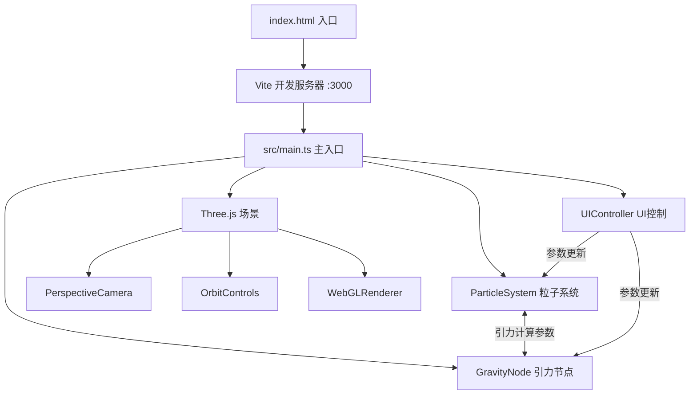

## 1. 架构设计



## 2. 技术说明

- **前端**：TypeScript + Three.js + Vite
- **初始化工具**：Vite
- **后端**：无
- **依赖**：three, @types/three, typescript, vite, lil-gui

## 3. 文件结构

```
project/
├── package.json
├── index.html
├── vite.config.js
├── tsconfig.json
└── src/
    ├── main.ts            # 场景初始化，相机/控制器/渲染器，主循环，事件绑定
    ├── particleSystem.ts  # ParticleSystem 类，粒子池/位置/颜色/引力/拖尾
    ├── gravityNode.ts     # GravityNode 类，节点位置/脉动/可视化
    └── uiControl.ts       # UIController 类，控制面板/状态栏/滑块/拾色器
```

## 4. 模块接口定义

### 4.1 ParticleSystem

```typescript
class ParticleSystem {
  constructor(scene: THREE.Scene, count: number, startColor: THREE.Color, endColor: THREE.Color)
  update(deltaTime: number, gravityNodes: GravityNode[]): void
  setDensity(count: number): void
  setGravityStrength(strength: number): void
  setColorRange(startColor: THREE.Color, endColor: THREE.Color): void
  getParticleCount(): number
  reset(): void
}
```

### 4.2 GravityNode

```typescript
class GravityNode {
  constructor(position: THREE.Vector3, scene: THREE.Scene)
  update(deltaTime: number): void
  getPosition(): THREE.Vector3
  getInfluenceRadius(): number
  dispose(): void
}
```

### 4.3 UIController

```typescript
class UIController {
  constructor(particleSystem: ParticleSystem, scene: THREE.Scene)
  toggle(): void
  updateStatus(particleCount: number, fps: number, nodeCount: number): void
  isVisible(): boolean
}
```

## 5. 性能约束

- 目标 FPS：≥ 45
- 每帧最多重新计算 200 个粒子的颜色和位置
- 粒子连线仅在距离 < 1.5 时渲染（使用 BufferGeometry + LineSegments）
- 拖尾保留前 10 帧位置
- 缩放范围 2-30 单位，阻尼系数 0.1
