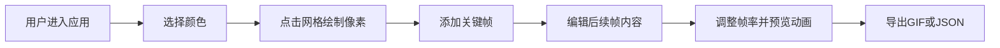

## 1. 产品概述

像素艺术表情符号生成与动效编辑Web应用，让用户像像素画师一样在16x16网格上逐像素绘制表情符号，并添加帧动画效果（如眨眼、微笑、心跳），支持导出为GIF动画或JSON动画数据。

- 面向像素艺术爱好者、表情包创作者、游戏开发者
- 提供零门槛的像素绘画体验，结合动效编辑，创造生动的像素表情

## 2. 核心功能

### 2.1 用户角色
| 角色 | 注册方式 | 核心权限 |
|------|----------|----------|
| 普通用户 | 无需注册，直接使用 | 像素绘画、动画编辑、导出作品 |

### 2.2 功能模块
1. **像素编辑模块**：16x16网格画布、颜色选择器、点击绘/擦除像素
2. **关键帧动画模块**：最多6个关键帧、帧复制、帧切换、帧缩略图
3. **动画播放模块**：帧率控制、播放/暂停、像素融化过渡效果
4. **预览模块**：实时放大预览、光标坐标显示
5. **导出模块**：GIF导出、JSON数据导出
6. **工具模块**：清空画布、确认对话框

### 2.3 页面详情
| 页面名称 | 模块名称 | 功能描述 |
|----------|----------|----------|
| 主界面 | 像素编辑区 | 16x16网格，点击切换像素透明度，支持颜色填充 |
| 主界面 | 颜色面板 | 20种预设颜色，点击选中，选中状态有发光效果 |
| 主界面 | 帧控制区 | 帧滑块、添加帧按钮、帧缩略图列表 |
| 主界面 | 播放控制区 | 帧率滑块、播放/暂停按钮 |
| 主界面 | 预览区 | 200x200放大预览、光标坐标显示 |
| 主界面 | 导出区 | 导出GIF按钮、导出JSON按钮 |
| 主界面 | 工具区 | 清空网格按钮、确认对话框 |

## 3. 核心流程

## 4. 用户界面设计

### 4.1 设计风格
- **主色调**：深色赛博朋克风格，背景#2C2C2C，面板#3D3D3D
- **强调色**：橙色#FF851B、蓝色#0074D9、绿色#2ECC40、紫色#B10DC9、红色#FF4136
- **按钮风格**：渐变背景、圆角、悬停提升亮度10%、点击缩放0.95倍
- **字体**：等宽字体（Consolas, Monaco），14px正文，12px标签
- **布局**：左侧编辑区 + 右侧预览和控制面板，响应式flex布局
- **视觉效果**：像素格子点击放大动画、帧切换像素融化过渡、按钮悬停微动画

### 4.2 页面设计概述
| 页面名称 | 模块名称 | UI元素 |
|----------|----------|--------|
| 主界面 | 像素编辑区 | 16x16网格（每格28px，间距1px）、黑色背景、灰色网格线 |
| 主界面 | 颜色面板 | 20个32x32px色块、间距4px、圆角4px、选中白色外发光 |
| 主界面 | 帧控制区 | 滑块（高6px宽200px）、添加帧按钮（渐变蓝）、60x60px缩略图 |
| 主界面 | 播放控制区 | 帧率滑块、圆形播放按钮（40px直径，绿色） |
| 主界面 | 预览区 | 200x200px画布（圆角8px）、坐标显示文字 |
| 主界面 | 导出区 | 导出GIF（渐变紫）、导出JSON（渐变灰）、圆角8px |
| 主界面 | 工具区 | 红色清空按钮、半透明确认对话框 |

### 4.3 响应式
- 桌面端：左侧编辑区 + 右侧面板并排布局
- 窄屏（<800px）：右侧面板折叠到下方，预览窗口缩小为150x150px
- 触控优化：增大点击区域，支持触摸绘制

### 4.4 动效设计
- 像素点击：0.15秒放大1.1倍再恢复
- 按钮悬停：亮度提升10%，上移2px（0.2秒）
- 按钮点击：缩放0.95倍回弹
- 帧切换：像素颜色线性插值融化过渡
- 滑块悬停：颜色变为#FFDC00
- 提示框：2秒淡出效果
