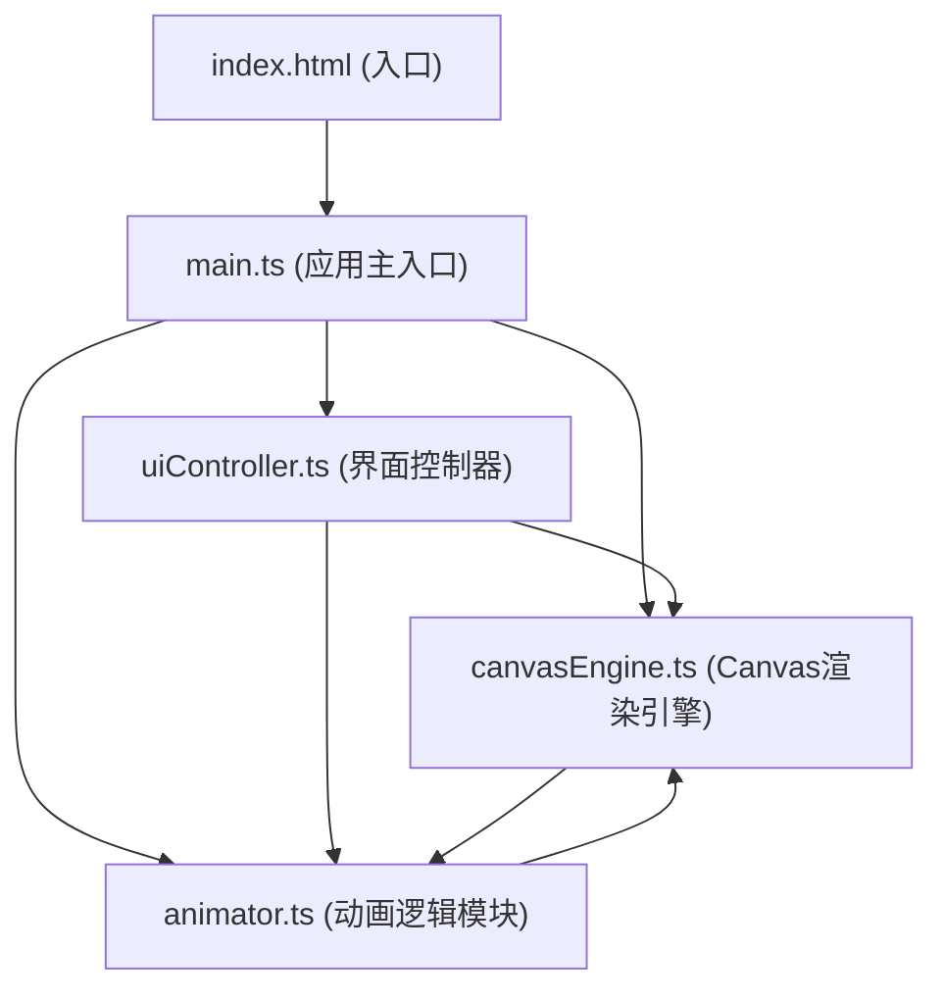

## 1. 架构设计



## 2. 技术描述
- **前端**：TypeScript + 原生JavaScript + Canvas API
- **构建工具**：Vite 5.x
- **开发语言**：TypeScript（严格模式，target ES2020）
- **第三方库**：无额外依赖，使用原生Canvas API实现GIF导出
- **初始化方式**：手动创建项目结构，不使用React/Vue框架

## 3. 文件结构

```
project-root/
├── package.json          # 依赖：typescript, vite
├── index.html            # 入口页面
├── vite.config.js        # 构建配置
├── tsconfig.json         # TypeScript配置
└── src/
    ├── main.ts           # 应用主入口，初始化UI和事件绑定
    ├── canvasEngine.ts   # Canvas渲染引擎，网格绘制、像素着色、帧动画循环
    ├── animator.ts       # 动画逻辑，关键帧管理、插值计算、播放控制
    └── uiController.ts   # 界面控制器，事件绑定、状态反馈
```

## 4. 数据模型

### 4.1 类型定义

```typescript
// 像素点
interface Pixel {
  x: number;
  y: number;
  color: string; // 十六进制颜色，透明为null
  transparent: boolean;
}

// 帧数据
interface Frame {
  id: number;
  pixels: string[][]; // 16x16颜色数组，透明为'null'
  timestamp: number;
}

// 动画数据
interface AnimationData {
  frameCount: number;
  frameRate: number;
  width: number;
  height: number;
  frames: Frame[];
}

// 应用状态
interface AppState {
  currentFrame: number;
  totalFrames: number;
  frameRate: number;
  isPlaying: boolean;
  selectedColor: string;
  gridSize: number;
  pixelSize: number;
}
```

### 4.2 核心常量

```typescript
const GRID_SIZE = 16;
const PIXEL_SIZE = 28;
const GRID_GAP = 1;
const MAX_FRAMES = 6;
const DEFAULT_FRAME_RATE = 8;
const MIN_FRAME_RATE = 2;
const MAX_FRAME_RATE = 12;

const COLOR_PALETTE = [
  '#FF4136', '#FF851B', '#FFDC00', '#2ECC40', '#39CCCC',
  '#0074D9', '#B10DC9', '#F012BE', '#8B4513', '#FFFFFF',
  '#AAAAAA', '#111111', '#FF6B9D', '#01FF70', '#7FDBFF',
  '#85144b', '#3D9970', '#FFDAB9', '#87CEEB', '#DDA0DD'
];
```

## 5. 模块接口

### 5.1 canvasEngine.ts
```typescript
class CanvasEngine {
  constructor(canvas: HTMLCanvasElement, gridSize: number, pixelSize: number);
  setPixel(x: number, y: number, color: string, transparent: boolean): void;
  getPixel(x: number, y: number): { color: string; transparent: boolean };
  renderFrame(frameData: string[][]): void;
  renderInterpolatedFrame(frameA: string[][], frameB: string[][], progress: number): void;
  clearCanvas(): void;
  getMousePosition(e: MouseEvent): { x: number; y: number };
  getGridPosition(e: MouseEvent): { gridX: number; gridY: number };
  drawGrid(): void;
}
```

### 5.2 animator.ts
```typescript
class Animator {
  constructor(maxFrames: number, gridSize: number);
  addFrame(copyFromCurrent: boolean): boolean;
  deleteFrame(frameId: number): boolean;
  setFrameData(frameId: number, pixels: string[][]): void;
  getFrameData(frameId: number): string[][];
  getCurrentFrameData(): string[][];
  setCurrentFrame(frameId: number): void;
  getCurrentFrame(): number;
  getTotalFrames(): number;
  setFrameRate(fps: number): void;
  getFrameRate(): number;
  play(): void;
  pause(): void;
  isPlaying(): boolean;
  stop(): void;
  onFrameChange(callback: (frameData: string[][], frameIndex: number) => void): void;
  clearAllFrames(): void;
  exportJSON(): string;
  exportGIF(): Promise<Blob>;
}
```

### 5.3 uiController.ts
```typescript
class UIController {
  constructor(mainApp: MainApp);
  bindEvents(): void;
  updateFrameLabel(frame: number, total: number): void;
  updateFrameRateLabel(fps: number): void;
  updateColorSelection(color: string): void;
  updateFrameThumbnails(frames: string[][], currentFrame: number): void;
  updatePlayButton(isPlaying: boolean): void;
  updateCoordinateDisplay(x: number, y: number): void;
  showToast(message: string): void;
  showConfirmDialog(message: string): Promise<boolean>;
  showLoading(button: HTMLElement): void;
  hideLoading(button: HTMLElement): void;
  animatePixelClick(cell: HTMLElement): void;
}
```

## 6. 性能优化

### 6.1 渲染优化
- 使用离屏Canvas进行帧数据预渲染
- 只重绘变化的像素区域，而非整个画布
- 动画循环使用requestAnimationFrame，避免掉帧
- 像素插值计算使用缓存，重复利用计算结果

### 6.2 内存管理
- 及时释放离屏Canvas资源
- 限制最大帧数为6，控制内存占用
- 像素数据使用二维数组存储，避免冗余

### 6.3 响应性能
- 鼠标移动事件使用节流（throttle），确保响应时间<50ms
- 点击事件使用防抖（debounce），避免重复触发
- 预览窗口使用独立Canvas，不影响主编辑区性能

## 7. 导出实现

### 7.1 GIF导出
- 使用原生Canvas API逐帧绘制
- 实现LZW压缩算法减小文件体积
- 目标文件体积<100KB
- 导出尺寸16x16像素

### 7.2 JSON导出
- 序列化帧数据和元数据
- 使用剪贴板API复制到剪贴板
- 包含完整的像素颜色数组（十六进制字符串）
