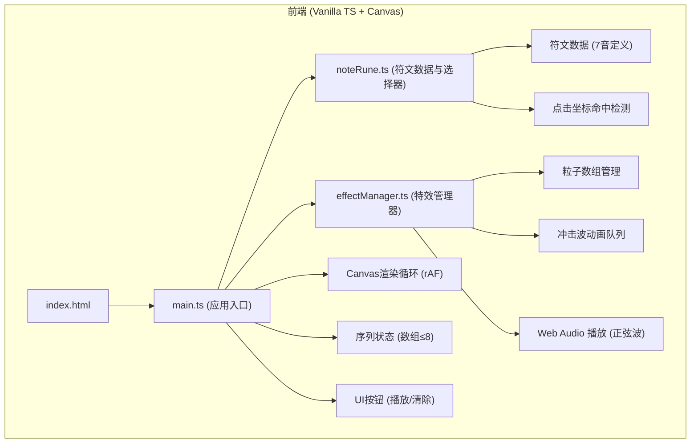
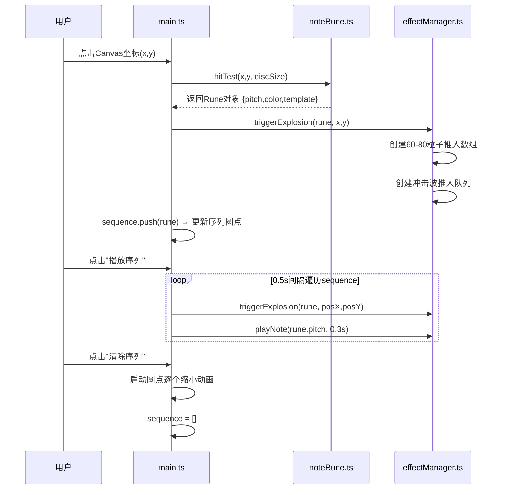

## 1. 架构设计



## 2. 技术说明
- **前端**：TypeScript@5 + Vite@5 原生实现，无UI框架
- **渲染**：HTML5 Canvas 2D API，requestAnimationFrame驱动
- **音频**：Web Audio API (OscillatorNode + GainNode 正弦波)
- **构建配置**：vite.config.js 端口3000，入口index.html
- **TypeScript配置**：严格模式(strict:true)，target ES2020，module ESNext

## 3. 文件结构与职责

| 文件路径 | 职责 | 输入/输出 | 调用关系 |
|---------|------|-----------|---------|
| package.json | 依赖声明(typescript, vite)，启动脚本(npm run dev) | - | npm入口 |
| vite.config.js | Vite构建配置，server.port=3000，入口index.html | - | Vite读取 |
| tsconfig.json | TS编译配置，strict模式，target=ES2020 | - | tsc读取 |
| index.html | DOM骨架，#app容器(含canvas+UI)，深紫黑背景，样式内联 | - | 浏览器入口 |
| src/main.ts | **应用主控制器**：初始化Canvas/符文盘/特效管理器；绑定交互事件；主循环调度；序列状态管理 | 输入:用户点击/按钮事件<br>输出:调用rune选择器+effectManager | 引入 noteRune.ts + effectManager.ts |
| src/noteRune.ts | **符文模块**：7音符文数据(音高/颜色/粒子模板)；符文盘位置计算；点击命中检测；古文字符路径绘制 | 输入:点击坐标<br>输出:Rune对象/null | 被 main.ts 调用 |
| src/effectManager.ts | **特效管理器**：粒子创建/帧更新/销毁；冲击波队列管理；尾迹渲染；Web Audio音符播放 | 输入:Rune对象+触发位置<br>输出:每帧粒子绘制指令 | 被 main.ts 调用 |

## 4. 数据流向



## 5. 关键数据结构

### Rune (符文对象)
```typescript
interface Rune {
  id: string;           // 'do'|'re'|'mi'|'fa'|'sol'|'la'|'ti'
  pitch: number;        // 60-71 MIDI半音
  color: string;        // 十六进制颜色
  symbol: SymbolPath[]; // 古文字符几何路径
  particleTemplate: ParticleKeyframe[]; // 3关键帧模板
}
```

### Particle (粒子)
```typescript
interface Particle {
  x: number; y: number;
  vx: number; vy: number;
  size: number;         // 4→0衰减
  life: number;         // 0→1.2秒
  maxLife: number;      // 1.2
  color: string;        // 起始颜色
  trail: {x,y}[];       // 尾迹点队列
}
```

### Shockwave (冲击波)
```typescript
interface Shockwave {
  x: number; y: number;
  radius: number;       // 60→120
  life: number;         // 0→0.3秒
  maxLife: number;      // 0.3
}
```

### 序列状态 (在main.ts中)
```typescript
let sequence: Rune[] = [];  // length ≤ 8
let isPlaying = false;
```

## 6. 性能约束实现策略

| 约束 | 实现方案 |
|-----|---------|
| 粒子峰值≤600 | effectManager维护池计数，超过阈值时拒绝新建或回收最老粒子 |
| FPS≥55 | 使用requestAnimationFrame + 帧差值(deltaTime)统一更新所有粒子/冲击波；避免GC使用对象池；减少每帧Canvas状态切换 |
| 内存稳定 | 粒子寿命结束立即从数组splice；尾迹用固定长度队列(3点)而非无限追加 |
