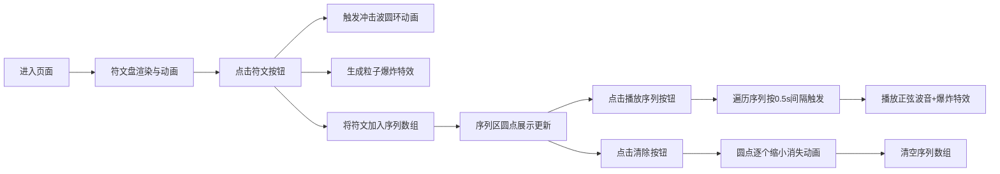

## 1. 产品概述
一款基于Canvas的交互式符文音符组合与元素爆炸特效生成应用。音乐创作者通过点击七音符文盘选择音符组合，触发绚丽粒子爆炸特效并生成可序列播放的"魔法音节"表演。

- 主要用途：奇幻风格的音乐可视化创作，音符与魔法元素结合的交互体验
- 目标用户：音乐创作者、视觉艺术爱好者、互动体验用户
- 产品价值：提供直观的音符-特效联动体验，使抽象音高转化为视觉粒子爆炸

## 2. 核心功能

### 2.1 用户角色
无需登录的单页应用，所有用户享有完整功能权限。

### 2.2 功能模块
1. **符文音符盘**：7个do-re-mi-fa-sol-la-ti符文按钮的圆形布局展示与交互
2. **粒子爆炸系统**：根据符文音高和颜色生成带有尾迹的粒子爆炸特效
3. **音节序列记录**：按点击顺序记录最多8个符文，可视化展示序列
4. **序列播放引擎**：按0.5秒间隔依次触发符文爆炸与Web Audio正弦波音
5. **序列清除动画**：圆点逐个缩小消失的清空动画
6. **环境装饰动画**：旋转星点环、符文脉动光晕、悬停浮动、冲击波圆环

### 2.3 页面详情
| 页面名称 | 模块名称 | 功能描述 |
|-----------|-------------|---------------------|
| 主界面 | 符文音符盘 | 400px直径圆形盘，7个符文按钮按51°均匀分布，响应式缩小 |
| 主界面 | 粒子特效层 | Canvas渲染粒子爆炸、冲击波、尾迹线条 |
| 主界面 | 序列展示区 | 符文盘上方120px高度区，彩色圆点+连接线展示 |
| 主界面 | 操作按钮区 | 序列右侧：播放序列按钮（渐变紫色）、清除按钮（红色圆形） |
| 主界面 | 环境装饰层 | 50个星点的缓慢旋转环、符文脉动光晕、悬停上浮效果 |

## 3. 核心流程
用户进入页面 → 中央符文盘展示与动画 → 点击符文 → 冲击波+粒子爆炸+记录序列 → 重复选择（最多8个）→ 点击播放序列 → 依次触发爆炸+正弦波音 → 或点击清除 → 圆点逐个消失动画

## 4. 用户界面设计

### 4.1 设计风格
- **主色调**：深紫黑色背景（#0D0A16 → #1A1530径向渐变），神秘魔幻氛围
- **符文颜色**：do=#FF4466, re=#FF8844, mi=#FFCC44, fa=#44CC88, sol=#44AAFF, la=#8844FF, ti=#FF44AA
- **按钮风格**：播放按钮渐变（#A855F7→#7C3AED）圆角8px，清除按钮圆形30px红色
- **字体**：使用Google Fonts的Cinzel（装饰性标题）搭配JetBrains Mono（等宽细节），营造神秘古卷感
- **布局**：垂直水平居中的圆形符文盘为核心，上方序列+按钮条带
- **古文字符**：用Canvas几何线条绘制每个符文的独特符号

### 4.2 页面设计概述
| 页面名称 | 模块名称 | UI元素 |
|-----------|-------------|-------------|
| 主界面 | 符文盘 | 径向渐变圆形、半透明、400px直径、边框发光感 |
| 主界面 | 符文按钮 | 60px圆形、对应颜色背景、内部古文字符、2s脉动光晕、hover上浮-4px |
| 主界面 | 粒子特效 | 50-80粒子/爆炸、随机方向、颜色渐变到白、10px尾迹、1.2s寿命 |
| 主界面 | 序列区 | 20px彩色圆点、8px间距、淡白色连接线、最多8个 |
| 主界面 | 星点环 | 50个2px白点、透明度0.2、30s周期顺时针旋转 |
| 主界面 | 冲击波 | 白色圆环、60px→120px扩展、0.8→0透明度衰减、0.3s |

### 4.3 响应式
桌面优先，视口宽度<600px时：符文盘直径280px，符文按钮40px，序列区缩放适配。所有交互元素支持touch事件。

### 4.4 动画规范
- 符文脉动：2s周期，透明度0.3↔0.6循环
- 悬停浮动：translateY(-4px)，0.2s ease-out
- 点击放大：scale(1.2)瞬间触发
- 冲击波：0.3s半径+透明度过渡
- 粒子更新：requestAnimationFrame帧差值更新
- 序列播放：0.5s间隔依次触发
- 清除动画：0.05s间隔逐个圆点缩小消失
