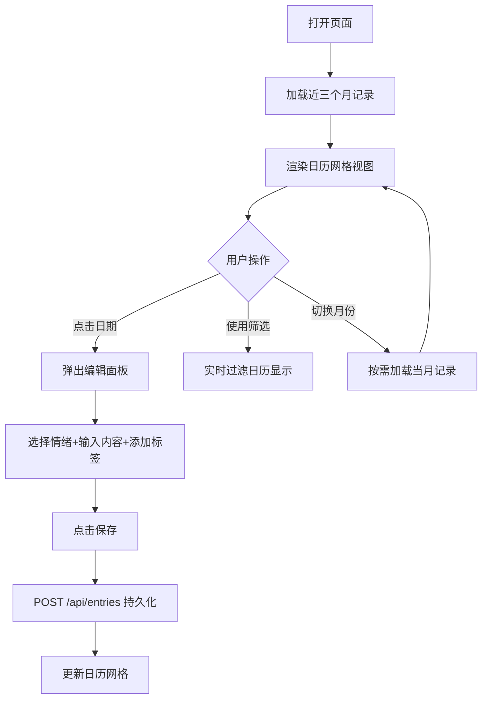

## 1. 产品概述

数字手帐是一款面向独立插画师与手帐爱好者的浏览器端记录应用，解决传统纸质手帐修改困难、检索不便、无法标签筛选的痛点。用户可通过日历视图快速记录每日心情、内容与标签，支持时间轴浏览、情绪分类与标签检索，让回忆的管理更加轻松高效。

## 2. 核心功能

### 2.1 功能模块
1. **主界面**：月份导航栏、日历网格视图、顶部筛选栏、情绪统计侧边栏
2. **编辑面板**：情绪选择、多行文本输入、标签管理、保存/取消操作
3. **数据管理**：按月份按需加载记录、实时筛选、API数据持久化

### 2.2 页面详情
| 页面名称 | 模块名称 | 功能描述 |
|---------|---------|---------|
| 主界面 | 月份导航栏 | 12个月份卡片，点击翻页动画切换，选中高亮显示 |
| 主界面 | 日历网格 | 7列布局，显示当月日期，记录情绪圆点标识，非当前月降透明度 |
| 主界面 | 筛选栏 | 搜索框+标签/年份/月份下拉筛选，实时更新日历 |
| 主界面 | 侧边栏 | 情绪统计横条进度图、热门标签TOP3快速筛选 |
| 编辑弹窗 | 情绪选择 | 5种情绪圆形图标，选中扩散光环动画 |
| 编辑弹窗 | 文本输入 | 多行文本框，聚焦边框变色过渡 |
| 编辑弹窗 | 标签输入 | 回车添加药丸标签，悬停删除按钮变红 |
| 编辑弹窗 | 操作按钮 | 渐变保存按钮、边框取消按钮，点击缩放反馈 |

## 3. 核心流程

用户打开页面 → 自动加载近三个月记录 → 浏览日历视图 → 点击日期格 → 弹出编辑面板 → 选择情绪、输入内容、添加标签 → 点击保存 → 数据通过API持久化 → 日历网格实时更新 → 使用筛选栏/侧边栏标签检索记录

## 4. 用户界面设计

### 4.1 设计风格
- **主色调**：柔和米白 #FDF8F0
- **辅助色**：浅茶色 #E8D5B7、淡暖黄背景 #F5ECD7
- **文字色**：深褐 #5D4037
- **情绪色**：开心#FFD54F、平静#81D4FA、难过#CE93D8、激动#FF8A65、疲惫#B0BEC5
- **按钮**：圆角矩形，保存按钮渐变 #D4A574→#C4956A，取消按钮白色描边
- **字体**：采用思源宋体/衬线体营造手帐质感，标题18px，正文14px
- **布局**：左侧200px月份导航、中央日历网格、右侧220px统计侧边栏（可折叠）
- **质感**：纸纹理噪点背景、柔和阴影、圆角卡片

### 4.2 页面设计概览
| 页面名称 | 模块名称 | UI元素 |
|---------|---------|---------|
| 主界面 | 月份导航栏 | 200px宽 #F5ECD7背景，圆角月份卡片，翻页淡入动画0.3s，选中高亮#E8D5B7 |
| 主界面 | 日历网格 | 7列布局，日期格80×80px，白底极浅阴影，圆角6px，情绪圆点8px右上角 |
| 主界面 | 筛选栏 | 50px高 #F5ECD7背景，搜索框圆角20px，三个下拉筛选器 |
| 主界面 | 侧边栏 | 220px宽，向左滑动显隐动画0.3s，5条情绪横条进度图，大号药丸标签 |
| 编辑弹窗 | 面板容器 | 520×420px，圆角12px，#FFFEF8背景+纸纹理噪点，遮罩层0.3透明度黑色 |
| 编辑弹窗 | 情绪选择 | 36px圆形图标，选中扩散光环动画，≥50fps |
| 编辑弹窗 | 文本框 | 120px高，边框#D7CCC8，聚焦变#D4A574平滑过渡0.2s |
| 编辑弹窗 | 标签区 | 药丸形#E8E0D0背景，删除叉号悬停变红 |
| 编辑弹窗 | 按钮 | 保存渐变、取消描边，悬停亮度变化，点击0.95倍缩放0.1s |

### 4.3 响应式
桌面端优先设计，固定三栏布局。性能指标：弹窗打开≤200ms，筛选重绘≤300ms，情绪动画≥50fps。
