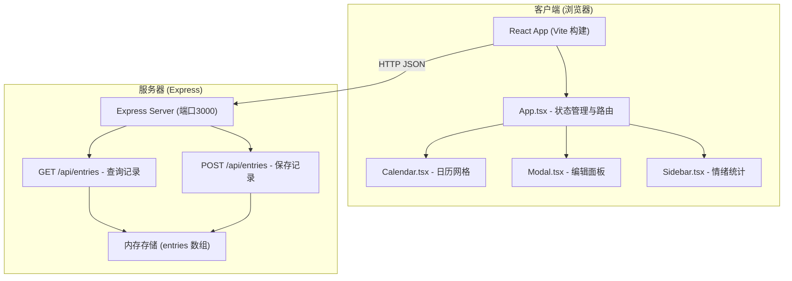
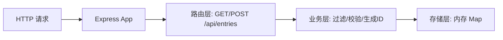
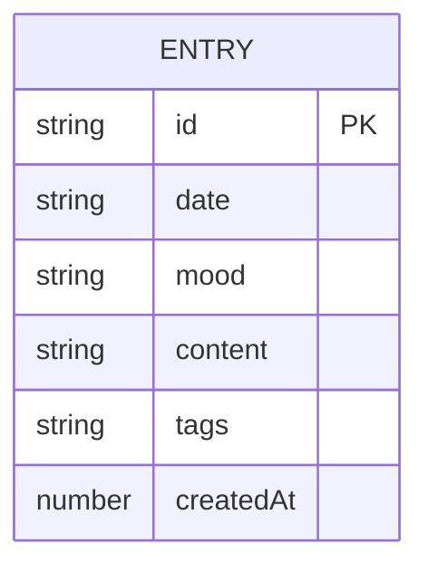

## 1. 架构设计



## 2. 技术说明

- **前端**：React 18 + TypeScript 5 + Vite 5
- **构建工具**：Vite @vitejs/plugin-react，端口3000，代理 /api 到 Express
- **后端**：Express 4 + TypeScript，同一开发端口通过 Vite proxy 转发
- **数据存储**：内存数组（entries），进程重启数据丢失
- **样式方案**：原生 CSS Modules + CSS 变量，零第三方 UI 库

## 3. 路由定义

| 路由 | 用途 |
|------|------|
| / | 主界面（单页应用，无前端路由） |

## 4. API 定义

### 类型定义
```typescript
interface Entry {
  id: string;
  date: string;           // YYYY-MM-DD
  mood: 'happy' | 'calm' | 'sad' | 'excited' | 'tired';
  content: string;
  tags: string[];
  createdAt: number;
}

interface MoodStats {
  happy: number;
  calm: number;
  sad: number;
  excited: number;
  tired: number;
}
```

### GET /api/entries
- **Query 参数**：`month?` (1-12)、`year?` (YYYY)、`tags?` (逗号分隔)、`search?` (关键词)
- **响应**：`{ entries: Entry[], moodStats: MoodStats, topTags: string[] }`

### POST /api/entries
- **请求体**：`{ date: string, mood: Mood, content: string, tags: string[] }`
- **响应**：`{ success: true, entry: Entry }`

## 5. 服务器架构图



## 6. 数据模型

### 6.1 数据模型定义


### 6.2 内存数据结构
```
Map<date: string, Entry>  // 按日期主键存储，一天一条记录
```
