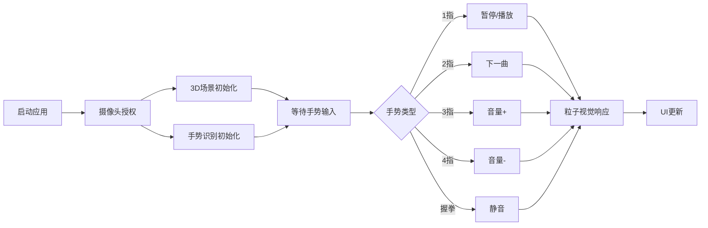

## 1. 产品概述

基于手势识别的3D音乐可视化播放器，通过摄像头捕捉用户手势控制动态粒子音乐系统，实现零接触交互体验。

- 目标用户：音乐爱好者、科技发烧友、展示场景用户
- 产品价值：将音乐、视觉艺术与手势交互结合，打造沉浸式音乐体验

## 2. 核心功能

### 2.1 功能模块

1. **3D粒子可视化场景**：3000+悬浮粒子，随音频频率动态变化颜色和运动
2. **手势识别控制**：MediaPipe Hands实时识别手势，触发音乐操作
3. **音乐播放系统**：内置播放列表，Web Audio API频谱分析
4. **UI覆盖层**：歌曲信息、进度条、音量、手势图标显示
5. **主题切换系统**：3种视觉主题平滑过渡

### 2.2 页面详情

| 页面名称 | 模块名称 | 功能描述 |
|-----------|-------------|---------------------|
| 主页面 | 3D粒子场景 | Three.js渲染3000+粒子，颜色运动随音频变化 |
| 主页面 | 手势识别 | 摄像头捕捉，识别1-5指及握拳手势 |
| 主页面 | 音乐播放器 | 5首本地MP3播放、进度跳转、音量控制 |
| 主页面 | UI覆盖层 | 歌曲信息/进度条/音量(左上)、手势图标(右上) |
| 主页面 | 主题切换 | 3种预设主题平滑过渡(1秒渐变) |

## 3. 核心流程

用户启动应用 → 授权摄像头权限 → 3D场景加载+音频就绪 → 摄像头实时捕捉手势 → 识别出手势类型 → 触发对应操作(播放/切歌/音量) → 粒子系统视觉响应 → UI更新显示

## 4. 用户界面设计

### 4.1 设计风格

- **主色调**：深空蓝紫渐变背景(#0a0a2e → #1a1a3e)
- **粒子颜色**：
  - 低频(鼓点)：红色大粒子爆发
  - 中频：绿色波纹扩散
  - 高频：蓝色闪烁光点
- **UI元素**：半透明白色 + 发光效果(box-shadow: 0 0 10px rgba(255,255,255,0.5))
- **按钮交互**：悬停放大1.1倍 + 发光增强
- **字体**：现代无衬线字体，数字使用等宽字体

### 4.2 页面设计概览

| 页面名称 | 模块名称 | UI元素 |
|-----------|-------------|-------------|
| 主页面 | 背景 | 深空蓝紫垂直渐变 |
| 主页面 | 粒子系统 | 3000+彩色粒子，球形分布，音频动态响应 |
| 主页面 | 左上角UI | 歌曲名称、进度条(可拖拽)、音量百分比 |
| 主页面 | 右上角UI | 手势图标(SVG)，弹性动画过渡(0.2s) |
| 主页面 | 主题切换按钮 | 底部主题选择器，悬停放大效果 |

### 4.3 响应式设计

- 桌面端优先：全屏Canvas + 固定定位UI覆盖层
- 粒子数量自适应：低性能设备自动降级粒子数量
- 摄像头画面：右下角小窗预览

### 4.4 3D场景指导

- **环境**：无HDRI，纯深空渐变背景，营造宇宙悬浮感
- **光照**：环境光为主，粒子自发光，无需额外光源
- **相机**：PerspectiveCamera，轻微浮动动画，中心聚焦粒子球
- **构图**：粒子球体居中，占屏幕60%视觉空间，UI环绕四周
- **交互**：手势触发时粒子爆发/冻结/扩散动画
- **后处理**：轻微Bloom发光效果增强粒子视觉
- **性能预算**：Draw call < 50，粒子使用BufferGeometry + ShaderMaterial批量渲染
