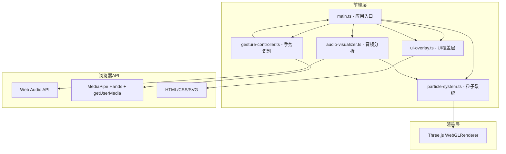

## 1. 架构设计



## 2. 技术说明

- **前端框架**：原生 TypeScript (无React/Vue)，用户指定文件结构
- **构建工具**：Vite 5.x，入口index.html
- **3D渲染**：Three.js 0.160+，BufferGeometry + Points + ShaderMaterial
- **音频处理**：Web Audio API (AudioContext, AnalyserNode, FFT分析)
- **手势识别**：@mediapipe/hands 0.4.x + webcam视频流
- **UI层**：原生HTML + CSS + 内联SVG

## 3. 目录结构

```
auto17/
├── package.json
├── index.html
├── tsconfig.json
├── vite.config.js
└── src/
    ├── main.ts              # 应用入口，模块协调
    ├── audio-visualizer.ts  # 音频解码、频谱分析、节拍检测
    ├── particle-system.ts   # 3000粒子系统，音频驱动视觉
    ├── gesture-controller.ts # MediaPipe Hands封装
    └── ui-overlay.ts        # UI元素管理与动画
```

## 4. 核心模块定义

### 4.1 类型定义

```typescript
// 手势类型
type GestureType = 'none' | '1-finger' | '2-finger' | '3-finger' | '4-finger' | '5-finger' | 'fist';

// 音频频率数据
interface AudioData {
  lowFrequency: number;    // 0-1 低频能量
  midFrequency: number;    // 0-1 中频能量
  highFrequency: number;   // 0-1 高频能量
  isBeat: boolean;         // 是否节拍点
  overallVolume: number;   // 0-1 整体音量
  frequencyData: Uint8Array; // FFT原始数据
}

// 主题配置
interface ColorTheme {
  name: string;
  lowColor: [number, number, number];   // RGB
  midColor: [number, number, number];
  highColor: [number, number, number];
  bgTop: string;
  bgBottom: string;
}

// 播放列表项
interface PlaylistItem {
  title: string;
  artist: string;
  src: string; // URL或Base64
  duration?: number;
}
```

### 4.2 模块接口

**AudioVisualizer**
- `loadAudio(src: string): Promise<void>`
- `play(): void`
- `pause(): void`
- `setVolume(v: number): void`
- `getCurrentTime(): number`
- `getDuration(): number`
- `seek(time: number): void`
- `getAudioData(): AudioData`
- `onEnded(callback: () => void): void`

**ParticleSystem**
- `constructor(scene: THREE.Scene, count: number = 3000)`
- `update(audioData: AudioData, gesture: GestureType, delta: number): void`
- `setTheme(theme: ColorTheme, smooth: boolean = true): void`
- `dispose(): void`

**GestureController**
- `init(videoElement: HTMLVideoElement): Promise<void>`
- `start(): void`
- `stop(): void`
- `onGestureChange(callback: (g: GestureType, fingerCount: number) => void): void`
- `getLastGesture(): GestureType`

**UIOverlay**
- `constructor(container: HTMLElement)`
- `setSongInfo(title: string, artist: string): void`
- `setProgress(current: number, duration: number, onSeek?: (t: number) => void): void`
- `setVolume(percent: number): void`
- `setGestureIcon(gesture: GestureType): void`
- `setThemes(themes: ColorTheme[], activeIndex: number, onSelect: (i: number) => void): void`

## 5. 性能优化策略

1. **粒子渲染**：使用 `THREE.BufferGeometry` + 单 `THREE.Points` 对象，避免3000个Mesh
2. **ShaderMaterial**：颜色/大小计算在GPU顶点着色器完成，减少CPU开销
3. **手势防抖**：手势识别结果使用滑动窗口平滑(5帧)，避免误触触发
4. **音频分析**：FFT size = 256，每帧读取一次AnalyserNode数据
5. **requestAnimationFrame**：统一主循环，所有模块update在同一帧调用
6. **手势节流**：MediaPipe结果回调throttle到60FPS，处理超时跳过

## 6. 主题预设

| 主题名称 | 低频色 | 中频色 | 高频色 | 背景渐变 |
|----------|--------|--------|--------|----------|
| 霓虹赛博朋克 | #ff0066 (255,0,102) | #00ffcc (0,255,204) | #0066ff (0,102,255) | #0a0a2e→#1a0a3e |
| 日落暖色调 | #ff4500 (255,69,0) | #ffd700 (255,215,0) | #ff69b4 (255,105,180) | #1a0a0a→#3e1a1a |
| 极光冷色调 | #00bfff (0,191,255) | #7fffd4 (127,255,212) | #dda0dd (221,160,221) | #0a1a2e→#1a2e3e |
