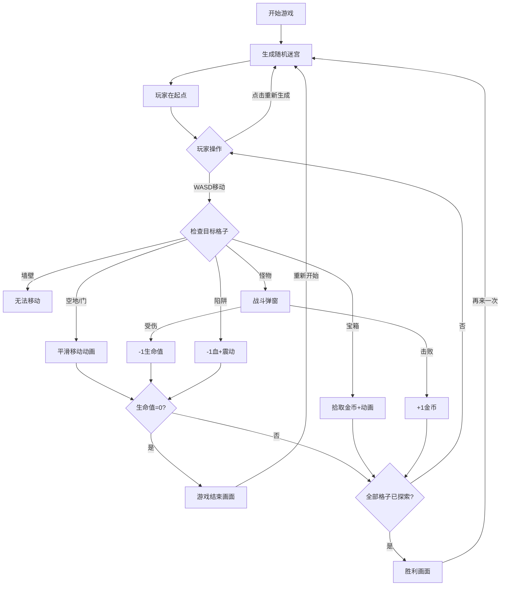

## 1. 产品概述
基于Canvas的交互式程序化地牢迷宫生成与探索Web应用，为奇幻角色扮演桌游玩家提供随机生成的迷宫探索体验。
- 主要目的：让玩家以俯视视角在随机生成的迷宫房间中移动，翻找宝箱、触发陷阱并遭遇怪物，每次生成的地图都独一无二
- 目标用户：地下城主、TRPG爱好者、休闲游戏玩家
- 产品价值：解决手动绘制地图耗时且缺乏随机性与可探索性的问题

## 2. 核心功能

### 2.1 功能模块
1. **游戏主界面**：Canvas渲染迷宫、玩家、怪物、宝箱、陷阱，HUD信息栏显示生命值、金币、房间名称
2. **迷宫生成系统**：递归回溯法生成包含房间、走廊、门和死路的二维迷宫网格
3. **玩家控制系统**：WASD键盘控制，平滑移动动画，事件触发检查
4. **交互系统**：宝箱拾取（金币奖励+动画）、门开启（旋转动画）、怪物战斗（50%胜率）、陷阱触发（扣血+震动）
5. **游戏状态系统**：生命值、金币、背包、游戏开始/胜利/失败状态管理
6. **视野系统**：玩家周围5格范围内可见，外部黑色雾效覆盖，边缘渐变
7. **重新生成功能**：点击按钮生成全新随机迷宫

### 2.2 页面详情
| 页面名称 | 模块名称 | 功能描述 |
|-----------|-------------|---------------------|
| 游戏主界面 | HUD信息栏 | 显示生命值（❤️）、金币（★）、当前房间名称，半透明深色背景 |
| 游戏主界面 | Canvas画布 | 16:9自适应，渲染迷宫、玩家、怪物、宝箱、陷阱、雾效 |
| 游戏主界面 | 重新生成按钮 | 深灰色圆角按钮，悬停变红，点击缩放 |
| 游戏主界面 | 战斗弹窗 | 深色半透明背景，显示战斗结果 |
| 游戏主界面 | 游戏结束画面 | 全屏暗红色背景，显示"你死了"文字和重新开始按钮 |
| 游戏主界面 | 胜利画面 | 全屏金色背景，显示探索完成提示、统计数据和再来一次按钮 |

## 3. 核心流程
1. 玩家进入游戏 → 自动生成随机迷宫（至少5个房间）→ 玩家在起始位置
2. 玩家使用WASD移动 → 系统检查目标格子 → 
   - 墙壁：无法移动
   - 空地/走廊：平滑移动
   - 门：开门动画后通过
   - 宝箱：拾取金币+动画
   - 怪物：触发战斗弹窗（50%击败获金币，50%受伤）
   - 陷阱：扣血+屏幕震动，陷阱变为已触发状态
3. 玩家探索全部格子 → 触发胜利画面
4. 玩家生命值归零 → 触发游戏结束画面
5. 玩家点击"重新生成"按钮 → 生成全新迷宫

## 4. 用户界面设计

### 4.1 设计风格
- **主色调**：深棕（#2A1E1E）、暗灰（#3A3A3A）、暗红（#8B0000）
- **辅助色**：金色（#FFD700）、亮蓝（#00BFFF）、灰色（#888888）
- **按钮风格**：深灰色#4A4A4A矩形，圆角8px，悬停#8B0000，点击缩放0.95倍
- **字体**：无衬线字体，白色#FFFFFF文字，16px基础字号
- **布局**：居中显示游戏主界面，全屏自适应，16:9宽高比Canvas
- **图标/emoji**：❤️表示生命值，★表示金币，🎉用于胜利画面

### 4.2 页面设计概述
| 页面名称 | 模块名称 | UI元素 |
|-----------|-------------|-------------|
| 游戏主界面 | HUD信息栏 | 半透明深色背景#000000(0.3)，圆角8px，上下8px内边距 |
| 游戏主界面 | 地板纹理 | 棋盘格深灰#3A3A3A和暗灰#4A4A4A交替，24px格子 |
| 游戏主界面 | 墙壁纹理 | 深棕色#2A1E1E带粗糙石纹线条#1E1414 |
| 游戏主界面 | 玩家角色 | 亮蓝色#00BFFF小圆点，白色#FFFFFF呼吸光圈（1.5秒周期，透明度0.2-0.6） |
| 游戏主界面 | 宝箱 | 金色#FFD700，旋转开启动画，拾取时6个金色粒子飞散 |
| 游戏主界面 | 怪物 | 红色圆点闪烁（0.5秒周期，亮度0.3-0.8） |
| 游戏主界面 | 陷阱 | 灰色八角星#888888，中心旋转尖刺（2秒周期），触发后暗红色#8B0000 |
| 游戏主界面 | 雾效 | 黑色覆盖，距离越远透明度从0渐变到1，渐变半径3格 |
| 游戏主界面 | 战斗弹窗 | #000000(0.7)背景，白色"战斗！"文字和怪物图标 |
| 游戏主界面 | 游戏结束 | 全屏#8B0000，白色"你死了"文字，重新开始按钮 |
| 游戏主界面 | 胜利画面 | 全屏#FFD700，🎉提示文字，统计数据，再来一次按钮 |

### 4.3 响应式
- Desktop-first设计，移动端自适应
- Canvas尺寸随窗口变化自动调整，保持16:9宽高比
- 最小尺寸600x338，最大尺寸1600x900
- 使用devicePixelRatio适配物理像素分辨率
