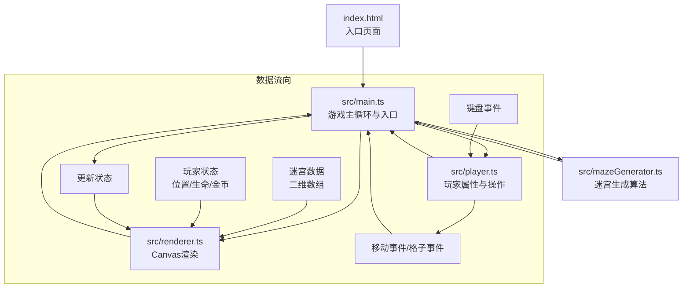

## 1. 架构设计


## 2. 技术描述
- **前端**：TypeScript + 原生JavaScript（无框架） + Canvas 2D API
- **构建工具**：Vite 5.x
- **语言版本**：TypeScript严格模式，target ES2020
- **开发服务器端口**：3000

**模块调用关系与数据流向说明：**
1. `index.html` → 引入并启动 `main.ts`，提供Canvas容器和DOM结构
2. `main.ts` → 初始化游戏循环，协调各模块
   - 调用 `mazeGenerator.ts` 生成迷宫数据（二维数组）
   - 持有 `player.ts` 实例，管理玩家状态
   - 调用 `renderer.ts` 渲染当前游戏状态
   - 监听键盘事件，转发移动请求给 `player.ts`
   - 处理玩家移动后的格子事件（宝箱、怪物、陷阱）
3. `mazeGenerator.ts` → 纯算法模块，输入种子/参数，输出迷宫二维数组
4. `player.ts` → 纯逻辑模块，管理玩家属性，提供移动方法，返回新坐标和事件类型
5. `renderer.ts` → 纯渲染模块，接收迷宫数据、玩家状态、动画进度，绘制到Canvas

## 3. 文件结构
```
project-root/
├── package.json              # 项目依赖与脚本
├── vite.config.js            # Vite构建配置
├── tsconfig.json             # TypeScript配置
├── index.html                # 入口HTML
└── src/
    ├── main.ts               # 游戏主循环、入口、状态管理
    ├── mazeGenerator.ts      # 递归回溯迷宫生成算法
    ├── renderer.ts           # Canvas渲染器
    └── player.ts             # 玩家属性与操作
```

## 4. 数据模型

### 4.1 格子类型枚举
```typescript
enum CellType {
  FLOOR = 0,      // 空地
  WALL = 1,       // 墙壁
  DOOR = 2,       // 门
  CHEST = 3,      // 宝箱
  MONSTER = 4,    // 怪物
  TRAP = 5,       // 陷阱（未触发）
  TRAP_TRIGGERED = 6, // 陷阱（已触发）
  CHEST_OPENED = 7,   // 宝箱（已开启）
  MONSTER_DEFEATED = 8 // 怪物（已击败）
}
```

### 4.2 迷宫数据结构
```typescript
interface Room {
  x: number;
  y: number;
  width: number;
  height: number;
  name: string;
}

interface MazeData {
  grid: CellType[][];      // 二维网格
  width: number;           // 迷宫宽度（格子数）
  height: number;          // 迷宫高度（格子数）
  rooms: Room[];           // 房间列表
  startX: number;          // 玩家起点X
  startY: number;          // 玩家起点Y
  totalExplorable: number; // 可探索格子总数
}
```

### 4.3 玩家数据结构
```typescript
interface InventoryItem {
  id: string;
  name: string;
  type: string;
  value: number;
}

interface PlayerState {
  x: number;              // 当前格子X坐标
  y: number;              // 当前格子Y坐标
  renderX: number;        // 渲染用X（动画插值）
  renderY: number;        // 渲染用Y（动画插值）
  hp: number;             // 生命值
  maxHp: number;          // 最大生命值
  gold: number;           // 金币数
  inventory: InventoryItem[]; // 背包物品
  exploredCells: Set<string>; // 已探索格子 "x,y"
  monstersDefeated: number;   // 击败怪物数
}
```

### 4.4 游戏状态
```typescript
interface GameState {
  maze: MazeData;
  player: PlayerState;
  isMoving: boolean;
  isFighting: boolean;
  isGameOver: boolean;
  isVictory: boolean;
  animationTime: number;       // 全局动画时间（毫秒）
  doorAnimations: Map<string, number>; // 门开启动画进度 0-1
  chestAnimations: Map<string, number>; // 宝箱开启动画进度 0-1
  particles: Particle[];       // 金币粒子
  screenShake: number;         // 屏幕震动剩余时间
  messageStack: GameMessage[]; // 游戏消息队列
}

interface Particle {
  x: number;
  y: number;
  vx: number;
  vy: number;
  life: number;
  maxLife: number;
  color: string;
  size: number;
}

interface GameMessage {
  text: string;
  duration: number;
  startTime: number;
}
```

## 5. 性能约束
- 迷宫规模：约30x30格
- 内存占用：≤ 200MB
- 动画帧率：≥ 30fps
- 迷宫生成时间：≤ 100ms
- 动画实现：全部使用 requestAnimationFrame
- Canvas分辨率：使用 devicePixelRatio 适配物理像素
