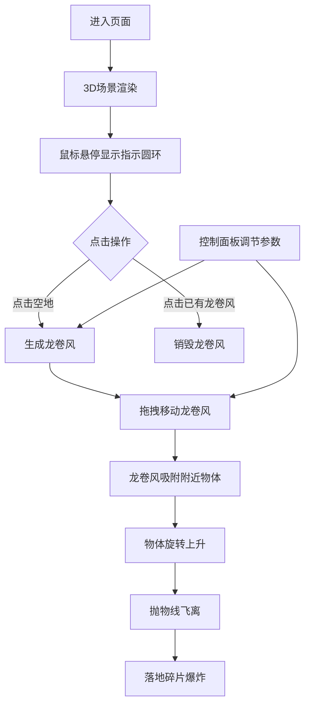

## 1. 产品概述

基于Three.js的3D交互式龙卷风粒子与天气模拟器，用户可在平坦的草原场景中通过鼠标交互生成并操控龙卷风，观察粒子运动、天气效果及对场景物体的破坏。

- 面向对物理模拟、3D可视化感兴趣的用户，提供沉浸式的天气现象交互体验
- 通过直观的鼠标操作和参数调节，让用户理解龙卷风的形成与运动原理

## 2. 核心功能

### 2.1 用户角色

| 角色 | 注册方式 | 核心权限 |
|------|----------|----------|
| 普通用户 | 无需注册 | 体验龙卷风模拟全部交互功能 |

### 2.2 功能模块

1. **3D场景渲染模块**: 翠绿渐变草地、网格地面、树木、房屋环境
2. **龙卷风粒子系统**: 数千个动态粒子组成的螺旋上升龙卷风
3. **物体物理交互**: 树木和房屋被龙卷风吸附、旋转、飞离、碎片爆炸
4. **控制面板UI**: 风口强度、粒子密度、旋转速度参数调节
5. **鼠标交互**: 点击生成/销毁龙卷风、拖拽移动、悬停指示

### 2.3 页面详情

| 页面名称 | 模块名称 | 功能描述 |
|----------|----------|----------|
| 主页面 | 3D场景渲染 | 全屏展示100x100单位草地场景，包含20棵树和5座房屋 |
| 主页面 | 龙卷风粒子系统 | 2000-5000个动态粒子，螺旋上升运动，颜色渐变 |
| 主页面 | 物体交互 | 物体被龙卷风吸附、旋转飞起、抛物线飞离、落地碎片爆炸 |
| 主页面 | 控制面板 | 三个滑块调节风口强度、粒子密度、旋转速度 |
| 主页面 | 鼠标交互 | 点击生成/销毁、拖拽移动、悬停圆环指示 |

## 3. 核心流程

用户进入页面后看到3D草原场景，鼠标悬停显示青色圆环指示位置，点击地面生成龙卷风，拖拽可移动龙卷风位置。龙卷风靠近物体时将其吸附旋转飞起，最终抛物线飞离并产生碎片爆炸。用户可通过左侧控制面板实时调节参数。

## 4. 用户界面设计

### 4.1 设计风格

- **主色调**: 草地绿(#4A7C59)、泥土棕(#5C4033)、风暴灰(#555555)、青色亮点(#4FC3F7)
- **按钮/滑块风格**: 深色主题，滑块轨道#333333，手柄#4FC3F7，悬停放大1.2倍
- **字体**: 14px 无衬线字体，#E0E0E0
- **布局**: 全屏3D场景 + 左侧半透明控制面板(移动端底部栏)
- **动画过渡**: 0.2-0.5s 平滑过渡

### 4.2 页面设计概述

| 页面名称 | 模块名称 | UI元素 |
|----------|----------|--------|
| 主页面 | 3D场景 | 渐变草地、网格、树木(棕色树干+绿色树冠)、棕色木屋、深灰蓝背景(#0B0E14) |
| 主页面 | 龙卷风粒子 | 底部深灰(#555555)→顶部亮白(#E0E0E0)+青色(#4FC3F7)旋转气流，大小0.08-0.15 |
| 主页面 | 控制面板 | 半透明深色背景(#1A1A2ECC)、圆角10px、宽度220px、三个参数滑块 |
| 主页面 | 悬停指示 | 半透明青色圆环(#4FC3F7, 透明度0.4) |

### 4.3 响应式设计

- 桌面端: 左侧固定控制面板(220px宽)，3D场景全屏填充
- 移动端: 控制面板折叠为底部栏，3D场景全屏显示
- 所有交互支持触摸操作

### 4.4 3D场景指导

- **环境**: 翠绿到暖黄渐变草地(#4A7C59→#B8A87A)，深灰蓝天空背景(#0B0E14)
- **灯光**: 环境光+方向光，模拟自然日光
- **相机**: 初始位置z轴20，y轴10，视角45度
- **交互**: 鼠标悬停指示、点击生成/销毁、拖拽移动龙卷风
- **性能**: 60FPS，粒子超4000时自动启用视锥裁剪
