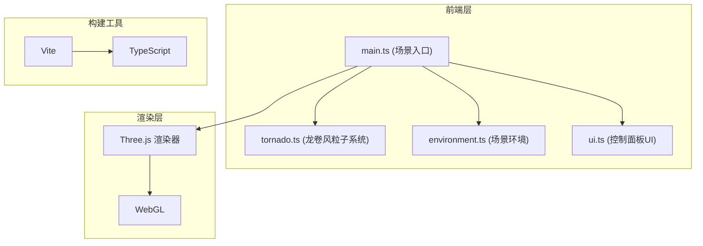

## 1. 架构设计



## 2. 技术描述

- **前端框架**: 原生TypeScript + Three.js (无React/Vue框架)
- **构建工具**: Vite 5.x，支持热更新和类型检查
- **3D引擎**: Three.js (three + @types/three)
- **UI组件**: lil-gui 或原生DOM滑块
- **包管理器**: npm
- **开发服务器**: Vite dev server，端口3000

## 3. 项目结构

```
auto173/
├── index.html           # 入口HTML
├── package.json         # 依赖与脚本
├── vite.config.js       # Vite构建配置
├── tsconfig.json        # TypeScript配置
└── src/
    ├── main.ts          # 主入口：场景、相机、渲染器、灯光、事件管理
    ├── tornado.ts       # Tornado类：粒子生成、更新、运动算法
    ├── environment.ts   # 环境模块：草地、网格、树木、房屋、风力效果
    └── ui.ts            # UI模块：控制面板、滑块绑定
```

## 4. 核心模块说明

### 4.1 Tornado类 (tornado.ts)

```typescript
interface TornadoParams {
    windStrength: number;    // 风口强度 0.1-2.0
    particleDensity: number; // 粒子密度 500-5000
    rotationSpeed: number;   // 旋转速度 0.5-3.0
}

class Tornado {
    constructor(position: THREE.Vector3, params: TornadoParams)
    update(deltaTime: number): void
    setPosition(target: THREE.Vector3): void
    setParams(params: Partial<TornadoParams>): void
    dispose(): void
}
```

### 4.2 Environment模块 (environment.ts)

```typescript
interface SceneObject {
    mesh: THREE.Group;
    type: 'tree' | 'house';
    destroyed: boolean;
}

function addGround(scene: THREE.Scene): THREE.Mesh
function addGrid(scene: THREE.Scene): THREE.GridHelper
function addTrees(scene: THREE.Scene, count: number): SceneObject[]
function addHouses(scene: THREE.Scene, count: number): SceneObject[]
function applyWindEffect(
    objects: SceneObject[],
    tornadoPos: THREE.Vector3,
    tornadoRadius: number,
    deltaTime: number
): void
```

### 4.3 UI模块 (ui.ts)

```typescript
interface ControlCallbacks {
    onWindStrengthChange: (value: number) => void
    onParticleDensityChange: (value: number) => void
    onRotationSpeedChange: (value: number) => void
}

function createControlPanel(callbacks: ControlCallbacks): HTMLElement
```

## 5. 性能优化策略

1. **粒子系统**: 使用THREE.Points + BufferGeometry，减少draw call
2. **视锥裁剪**: 粒子数>4000时，自动启用frustumCulled
3. **材质复用**: 树木、房屋共享几何体和材质实例
4. **内存管理**: 对象销毁时调用dispose()释放GPU资源
5. **帧率控制**: requestAnimationFrame + deltaTime平滑更新
