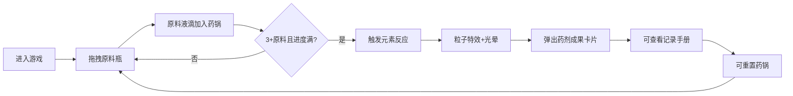

## 1. 产品概述

本产品是一个基于Canvas的交互式魔法药剂调配与元素反应模拟Web游戏。玩家扮演炼金术士，通过拖拽和混合不同颜色的魔法药水原料，观察元素反应（冒泡、变色、发光、爆炸），合成具有特定功效的魔法药剂。

- 目标用户：休闲游戏爱好者、魔法主题内容粉丝
- 产品价值：提供沉浸式的炼金体验，视觉化呈现化学/元素反应原理，兼具娱乐性与教育性

## 2. 核心功能

### 2.1 功能模块

1. **主游戏界面**：居中显示药锅区域、左侧原料瓶、顶部控制按钮、底部记录按钮、右上角成分显示、反应成果卡片
2. **药锅调配系统**：原料拖放、液滴混合、碰撞检测、混合进度条、饱和度管理
3. **元素反应引擎**：6种预设反应规则匹配、反应属性计算、药剂生成
4. **粒子特效系统**：气泡、闪光、烟雾、火花等粒子动画、光晕效果
5. **历史记录系统**：药剂成果卡片、记录手册面板、配方存档、最多50条记录

### 2.2 页面详情

| 页面名称 | 模块名称 | 功能描述 |
|---------|---------|---------|
| 主游戏页 | 药锅区域 | 直径320px圆形铜色锅体、发光纹理、底部进度条、液滴渲染与碰撞 |
| 主游戏页 | 原料瓶区 | 6种颜色原料瓶竖排展示、鼠标长按拖拽、液滴释放动画 |
| 主游戏页 | 成分指示器 | 三个弧形进度条显示自然元素/魔法能量/黑暗物质比例 |
| 主游戏页 | 成果卡片 | 反应后弹出药剂卡片（名称/图标/星级），3秒后淡出 |
| 主游戏页 | 重置按钮 | 左上角圆形红色按钮，清除所有原料，涟漪动画 |
| 主游戏页 | 记录手册 | 底部心形按钮，滑出历史记录面板，倒序显示合成记录 |
| 主游戏页 | 反应特效 | 粒子爆发、光晕闪烁、颜色变化动画 |

## 3. 核心流程

用户进入页面 → 查看深紫黑渐变背景与中央药锅 → 从左侧拖拽原料瓶到药锅 → 原料液滴散开并混合 → 进度条随原料增加逐渐填充 → 达到3种以上原料且进度条满格 → 触发元素反应 → 粒子特效爆发+光晕闪烁 → 右上角弹出药剂成果卡片 → 可点击"记录手册"查看历史 → 可点击"重置"清空药锅继续游戏

## 4. 用户界面设计

### 4.1 设计风格

- 主背景色：深紫黑渐变 #1A0A2E → #0D0515
- 辅助色：#2D1B4E（面板背景）、#9B59B6（魔法紫）、#E67E22（炼金橙）
- 按钮风格：圆形/圆角，悬停上浮5px+投影加深，点击弹性缩放 0.95→1.05→1.0
- 原料瓶色：红#FF3333、蓝#3366FF、绿#33CC66、紫#9933FF、黄#FFCC00、黑#333333
- 药锅：渐变铜色 #B87333 → #8B5A2B，发光纹理透明度0.2
- 进度条：#4A90D9 → #FF6B6B 渐变
- 图标风格：Canvas原生绘制的简约魔法主题图标

### 4.2 页面设计

| 页面 | 模块 | UI元素 |
|-----|-----|-------|
| 主游戏页 | 整体布局 | 居中药锅（对称结构）、左右控制栏 |
| 主游戏页 | 药锅 | 320px直径圆形、铜色渐变边框、内部液滴、底部进度条 |
| 主游戏页 | 原料瓶 | 40×80px竖排，瓶身半透明，液体颜色区分 |
| 主游戏页 | 成分指示器 | 三个150度弧形，半径20px，三色渐变 |
| 主游戏页 | 成果卡片 | 160×100px，半透明白，圆角12px，发光边框 |
| 主游戏页 | 记录手册 | 底部心形按钮，面板50%视窗高度，顶部圆角20px |

### 4.3 响应式设计

- 桌面优先（Desktop-first）
- 宽度 < 768px 时：上下布局，药锅缩小至240px，原料瓶横向滚动条
- 触摸屏优化：拖拽手势、点击区域增大

### 4.4 动画与特效

- 悬停：按钮上浮5px + 投影加深
- 点击：弹性缩放（0.95→1.05→1.0，0.1秒）
- 重置：放射状涟漪动画（0→40px，透明度0.5→0）
- 液滴混合：颜色融合动画（0.5秒）
- 反应特效：粒子爆发（150个，2-3秒）、光晕闪烁（1秒）
- 成果卡片：右侧滑入（ease-out 0.4秒）→ 3秒显示 → 缩小淡出
- 记录面板：底部向上滑入
- 弧形进度条：从右向左填充动画（0.3秒）
