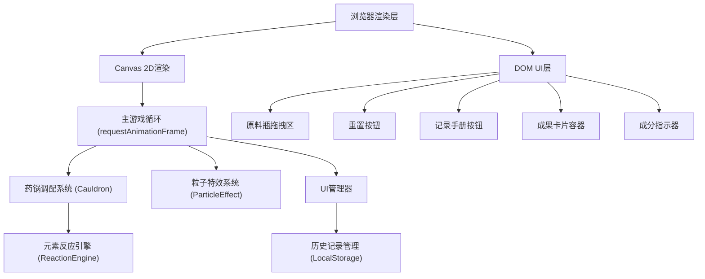

## 1. 架构设计



## 2. 技术栈说明

- 前端：TypeScript + 原生Canvas API + Vite
- 构建工具：Vite 5.x
- 语言版本：ES2020
- 类型系统：TypeScript 严格模式
- 数据持久化：LocalStorage（历史记录）
- 无后端依赖，纯前端运行

## 3. 项目文件结构

```
.
├── package.json              # 依赖与脚本
├── index.html                # 入口页面
├── vite.config.js            # Vite配置（端口3000）
├── tsconfig.json             # TypeScript配置（严格模式）
└── src/
    ├── main.ts               # 主入口：初始化画布、事件绑定、UI管理
    ├── cauldron.ts           # 药锅调配系统
    ├── reactionEngine.ts     # 元素反应引擎
    └── particleEffect.ts     # 粒子特效模块
```

## 4. 核心模块定义

### 4.1 类型定义

```typescript
interface Ingredient {
  id: string;
  color: string;
  name: string;
  elementType: 'nature' | 'magic' | 'darkness';
}

interface Droplet {
  x: number;
  y: number;
  vx: number;
  vy: number;
  color: string;
  ingredientId: string;
  radius: number;
  life: number;
  blendingWith?: string;
}

interface ReactionRule {
  id: string;
  name: string;
  requiredIngredients: string[];
  reactionType: 'explosion' | 'heal' | 'shadow' | 'light' | 'storm' | 'love';
  color: string;
  glowColor: string;
  potionName: string;
  effect: string;
  rarity: 1 | 2 | 3 | 4 | 5;
  particleParams: ParticleParams;
}

interface ParticleParams {
  count: number;
  duration: number;
  motionType: 'outward' | 'upward' | 'spiral' | 'twinkle';
  colors: string[];
  particleType: 'spark' | 'bubble' | 'smoke' | 'light';
}

interface PotionRecord {
  id: string;
  name: string;
  ingredients: string[];
  rarity: number;
  timestamp: number;
}
```

### 4.2 药锅调配系统 (Cauldron)

职责：管理原料液滴、碰撞检测、混合进度、渲染

主要方法：
- `addIngredient(ingredient: Ingredient, x: number, y: number): void`
- `update(deltaTime: number): void`
- `render(ctx: CanvasRenderingContext2D): void`
- `getIngredients(): Ingredient[]`
- `getSaturation(): number` (0~1)
- `reset(): void`
- `getElementRatio(): {nature: number, magic: number, darkness: number}`

### 4.3 元素反应引擎 (ReactionEngine)

职责：匹配反应规则、生成药剂属性

主要方法：
- `matchReaction(ingredients: Ingredient[]): ReactionRule | null`
- `getReactions(): ReactionRule[]`

预设6种反应：
1. 红+蓝 → 紫色爆炸（爆炸弹）
2. 绿+黄 → 金色治愈（治愈药水）
3. 紫+黑 → 暗影烟雾（隐身烟雾）
4. 红+黄 → 火焰光芒（烈焰药剂）
5. 蓝+绿 → 风暴涟漪（风暴药水）
6. 红+紫+黄 → 爱情魔药（终极药剂）

### 4.4 粒子特效系统 (ParticleEffect)

职责：创建/管理粒子、动画渲染、性能控制

主要方法：
- `triggerReaction(params: ParticleParams, centerX: number, centerY: number): void`
- `update(deltaTime: number): void`
- `render(ctx: CanvasRenderingContext2D): void`
- `setPaused(paused: boolean): void`

性能约束：
- 粒子上限200个
- 超过200时降低生成速率
- 目标帧率60fps

### 4.5 UI管理器

职责：DOM交互、成果卡片、记录手册面板、按钮事件

主要功能：
- 绑定拖拽事件（mousedown/mousemove/mouseup + touch事件）
- 药剂成果卡片动画
- 记录手册面板显示/隐藏
- 成分弧形进度条动画
- LocalStorage历史记录读写

## 5. 性能约束

- 主循环帧率 ≥ 55fps
- 粒子总数 ≤ 200
- 液滴数量 ≤ 10
- 单次动画时长 ≤ 3秒
- 历史列表渲染 ≤ 10ms
- 记录面板打开时暂停粒子刷新

## 6. 数据持久化

- LocalStorage Key: `alchemy_potion_records`
- 结构：`PotionRecord[]` JSON数组
- 上限：50条，超出自动删除最早记录
