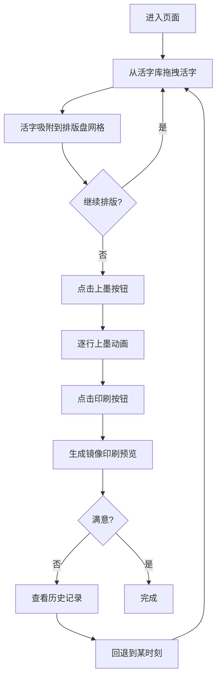

## 1. 产品概述

活字印刷模拟器是一款基于浏览器的交互式教育应用，旨在让用户亲身体验中国古代活字印刷的完整流程——从活字捡选、排版、上墨到印刷。面向历史教学课堂和博物馆数字展陈场景，解决传统展示中观众无法动手操作、难以理解活字排列与印刷效果对应关系的痛点。

## 2. 核心功能

### 2.1 功能模块

1. **排版工作台页面**：活字库面板、排版盘区域、印刷预览区、工具栏、历史记录面板

### 2.2 页面详情

| 页面名称 | 模块名称 | 功能描述 |
|---------|---------|---------|
| 排版工作台 | 活字库面板 | 左侧240px宽面板，包含可拖拽的活字块，每块40px深灰木纹色方块刻白色楷体字，悬停上移2px加投影 |
| 排版工作台 | 排版盘区域 | 600x400px浅褐底色区域，含凹槽引导线，支持拖入活字自动吸附45px网格，点击选中/删除活字 |
| 排版工作台 | 印刷预览区 | 模拟白纸效果，显示排版盘内容的镜像反转印刷结果，含渗墨毛边效果 |
| 排版工作台 | 上墨/印刷按钮 | 上墨按钮触发逐行墨色渐变动画；印刷按钮生成镜像印刷结果 |
| 排版工作台 | 工具栏 | 字号滑块(12-36pt,步长2pt)、行距滑块(1.0-2.0倍,步长0.1)，实时同步更新 |
| 排版工作台 | 历史记录面板 | 右下角可收起面板，记录每步操作含缩略图，支持回退到历史状态 |

## 3. 核心流程

用户进入页面 → 从活字库拖拽活字到排版盘 → 活字自动吸附网格 → 可选中/删除活字 → 调整字号行距 → 点击"上墨"按钮（逐行上墨动画）→ 点击"印刷"按钮（镜像+渗墨效果呈现）→ 查看印刷预览 → 可回退历史操作

## 4. 用户界面设计

### 4.1 设计风格

- **主色调**：宣纸白(#F7F1E3)、木纹褐(#8B4513)、墨黑(#1A0A00)
- **辅助色**：浅褐(#D2B48C)、深灰木纹(#6B5B4F)、暗红(#8B0000)
- **按钮风格**：渐变木纹色按钮，圆角6px，悬停亮度变化0.2s，点击缩放0.95倍0.15s
- **字体**：宋体/楷体
- **布局风格**：仿古木刻风格，左活字库+右排版盘+下预览区，木纹装饰分隔线
- **动画**：磁吸吸附0.15s ease-out、上墨逐行0.2s间隔、删除散开淡出0.3s、参数调整平滑过渡0.3s

### 4.2 页面设计概览

| 页面名称 | 模块名称 | UI元素 |
|---------|---------|--------|
| 排版工作台 | 整体布局 | 宣纸色背景#F7F1E3，顶部工具栏50px，左侧活字库240px，中央排版盘600x400px，下方印刷预览区 |
| 排版工作台 | 活字库面板 | 背景#E8DCCA，活字块40px#6B5B4F，白色楷体字，悬停上移2px+投影0.2s |
| 排版工作台 | 排版盘 | 背景#D2B48C，凹槽引导线，45px网格吸附，选中边框#8B0000 2px |
| 排版工作台 | 印刷预览区 | 背景#FEFEFE，镜像文字#1A0A00，渗墨毛边1px半径 |
| 排版工作台 | 工具栏 | 背景#D2B48C，滑块轨迹#8B4513，圆形#F5DEB3 |
| 排版工作台 | 历史记录 | 收起/展开，展开200x300px，背景#E8DCCA，可滚动，缩略图64x40px |

### 4.3 响应式设计

- 桌面优先设计
- 屏幕宽度<768px时：活字库折叠为顶部横向滚动活字条(高度60px)，排版盘和印刷预览区上下堆叠

### 4.4 性能要求

- 拖拽和吸附动画帧率≥30FPS
- 支持200个活字(100排版+100库中)流畅交互
- 历史缩略图生成≤200ms
